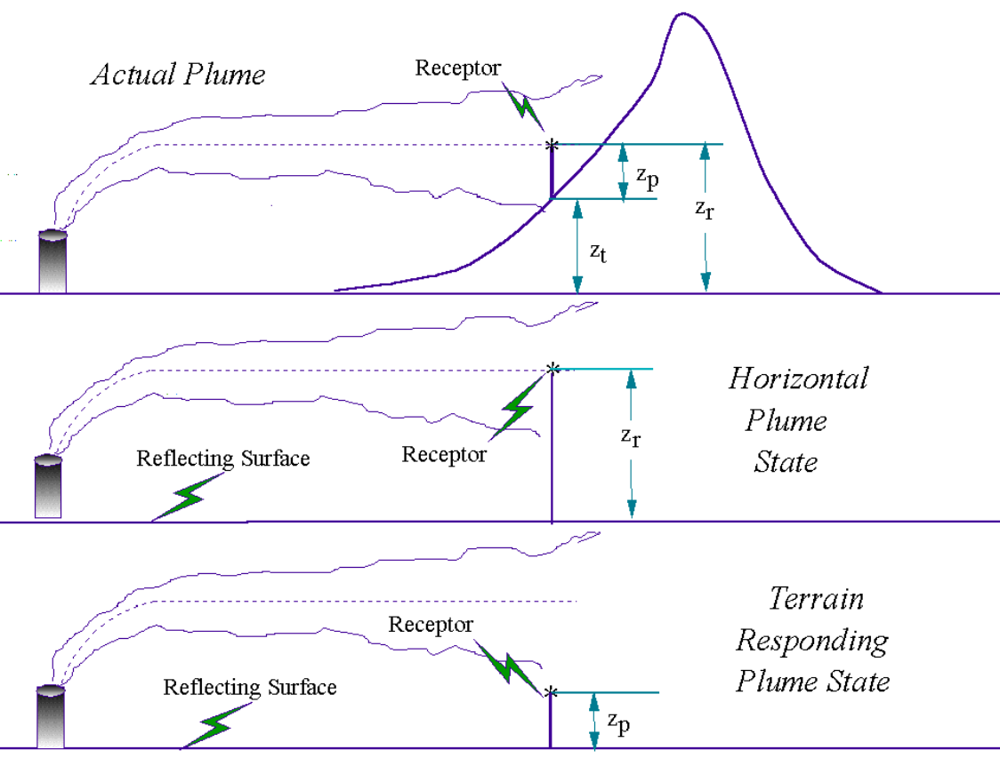
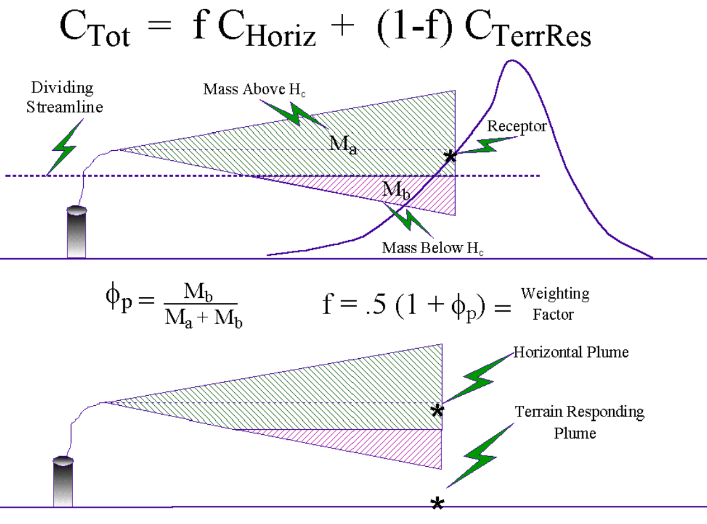

layout: true

background-image: url(img_css/logo_arpav.jpeg)
background-position: 98% 2%
background-size: 20%

---

```{r setup, include=FALSE}

options(htmltools.dir.version = FALSE)

knitr::opts_chunk$set(fig.retina = 3,
                      warning = FALSE, 
                      message = FALSE,
                      comment = NA)
library(knitr)

```

##sorgente

fonderia di getti in ghisa: forno fusorio ('cubilotto')

- parametri geometrici camino
  - altezza = 25 m
  - raggio  = 0.635 m

- parametri fisico e chimici di esercizio
  - NOx = 0.369 g/s
  - portata = 37500 Nm3/h
  - temperatura = 100.5 °C
  - velocità = 11.9 m/s

- ratei emissione
  - costanti e continui 24/7 (ipotesi cautelativa) 

## inquadramento urbanistico/territoriale

cfr. file:  [00_regione_veneto_map_anemometri_cmt.html](./00_regione_veneto_map_anemometri_cmt.html)

???
zona collinare prealpina, densamente popolata che alterna aree residenziali, agricole, industriali secondo il tipico schema (letale) di insediamento diffuso caratteristico di tutta la pianura padana
zona interessante anche dal punto di vista geomorfologico, rilievo del montello e paleoalveo del piave

---
class: center, bottom

background-image: url(img_css/pianezze1.jpeg)
background-position: center
background-size: contain

.white[***2011-01-18 11:00, vista da Pianezze (~1000 m slm), M.te Cesen, TV***]

???

una di quelle giornate in cui laggiù nella ridente e rigogliosa pianura del nord-est si sguazza nell'aerosol

hmix esiste!

lente larga 5km, lunga 13 km, 
montello, punto max altitudine è in località Colesel Val dell'Acqua, 371 m slm,
l’altezza media rispetto la pianura si aggira intorno ai 100 m

---
class: center, top

background-image: url(img_css/montello_altimetria.png)
background-position: bottom
background-size: contain

# altimetria del Montello

---
class: center, bottom

background-image: url(img_css/pianezze2.jpeg)
background-position: center
background-size: contain

.white[***2011-01-18 11:00, vista da Pianezze (~1000 m slm), M.te Cesen, TV***]

???

è possibile fare un piccolo calcolo 'a spanne' di hmix, per quella determinata ora e per quel determinato giorno 

max altezza montello 371
base altezza circa 100 m slm

dislivello circa 250, approssimando...

quindi, a occhio, hmix sicuramente meno di 100 m...

ricordiamoci di questi numeri per dopo: da verificare sui grafici, teorici...

---

name: calpuff
layout: false
class: inverse, center, middle

# CALPUFF

## 'stima base'

## periodo riferimento: 01/10/17 – 31/03/18

## cfr. file: [01_calpuff.html](./01_calpuff.html)

[(vai a lapmod)](#lapmod)
---
layout: true

background-image: url(img_css/logo_arpav.jpeg)
background-position: 98% 2%
background-size: 20%

---
## CALPUFF v. 5.8.5 - 'stima base' (specifiche)

approccio 'no obs', semestre 'invernale'

COSMO-LAMI 7 

- velocità e direzione vento, temperatura, umidità relativa
- passo griglia: 5 * 5, 7 km
- dominio: 35 km * 35 km

CALMET (v. 5.8.5, EPA approved)

- orografia e uso suolo: DTM 250 m
- griglia regolare: 51 * 51, 250 m
- dimensione dominio: 12.75 km * 12.75 km

CALPUFF (v. 5.8.5, EPA approved)

- cella di campionamento: 60 m, nesting factor MESHDN = 4
- coeff. disp. da variabili micro-meteo, MDISP = 2
- no reazioni chimiche, no deposizione secca e umida
- n. puffs 'da seguire' - to track -,  NPFDEB = 10
- min vv per 'non calma': 0.5 m/s

---
## CALMET - rosa venti (camino)

```{r calmet, include = FALSE}

mypath<-'./01_calpuff_stima_iniziale/prtmet/'
myfile<-paste0(mypath,'prtmet.dat')
met<-read.delim(myfile, header=FALSE, sep='', skip=4)
names(met)<-c('y','m','d', 'h', 'ws', 'wd', 't', 'w', 'pg', 'u_', 'lmo', 'wstar', 'prec', 'mixh')
met$date<-as.POSIXct(strptime(paste0(met$y,'-',met$m,'-',met$d, ' ', met$h),'%Y-%m-%d %H'))

#delete last row (april)
met<-met[-nrow(met),]

library(openair)
library(dplyr)
library(ggplot2)
library(knitr)

#define factor
myfac<-cut(met$ws,
           c(0, 0.5, 1, 2, 3, 6, max(met$ws)),
           labels=c('< 0.5','[ 0.5, 1 )','[ 1, 2 )','[ 2, 3 )','[ 3, 6 )','>= 6'),
           include.lowest=TRUE, right=FALSE)

#frequency distribution of wind classes
wsfd<-met %>%
    mutate(recs_all=n())%>%
    group_by(class=myfac) %>%
    summarise(recs=n(),
              perc=recs/first(recs_all)*100)

#stat for wind speed by month
ws_month<-met %>%
  group_by(month=factor(format(date, '%B %Y'),
                              levels = c('October 2017',
                                         'November 2017',
                                         'December 2017',
                                         'January 2018',
                                         'February 2018',
                                         'March 2018')
                        )
           ) %>%
  
  summarise(n=n(),
            mean=mean(ws), 
            median=median(ws),
            sd=sd(ws),
            min=min(ws),
            max=max(ws)
            )

#stat for wind calm
calm_month<-met %>%
    filter(ws<0.5)%>%
    group_by(month=factor(format(date, '%B %Y'),
                        levels = c('October 2017',
                                   'November 2017',
                                   'December 2017',
                                   'January 2018',
                                   'February 2018',
                                   'March 2018')
                        )
           ) %>%
  
  summarise(n=n(),
            mean=mean(ws), 
            median=median(ws),
            sd=sd(ws),
            min=min(ws),
            max=max(ws)
            )


```

vv media = `r round(mean(met$ws),1)` m/s; calme <0.5 m/s = `r round(sum(met$ws<0.5)/length(met$ws)*100,1)`%

```{r calmet-windrose-month, fig.width=10, fig.height=6.5, fig.align='left',  echo=FALSE}

windRose(met, 
         paddle=FALSE, 
         cols='jet', 
         ws.int=0.5, 
         breaks=5,
         #c(0,0.5,2,4,max(met$ws)),
         angle=22.5,
         key.position = 'right', 
         annotate =FALSE, 
         type='monthyear'
         )
```
---
## CALMET - rosa venti (camino)

stratificazione dì / notte (alba e tramonto da: data-ora, long e lat)

```{r calmet-windrose-nightday, fig.width=10, fig.height=5, fig.align='left', echo=FALSE}

windRose(met, 
         paddle=FALSE, 
         cols='jet', 
         ws.int=0.5, 
         breaks=5,
         angle=22.5,
         key.position = 'right', 
         annotate =FALSE, 
         type='daylight',
         latitude=45.7,
         longitude=12.1
         )
    
```

---
## CALMET - classi vv (camino)

```{r calmetws-class, fig.width=10, fig.height=7, fig.align='left',  echo=FALSE}

ggplot(wsfd, aes(x=class, y=perc, fill=class))+
  geom_col()+
  geom_text(aes(label=round(perc,1)), vjust=-0.3, size=3.5)+
  ylim(0,100)+
  #scale_y_continuous('%', limits=c(0,100))+
  labs(title='distribuzione di frequenza classi velocità vento', 
       y='frequenza %',
       x='classi',
       fill = "m/s")

```

---
## CALMET - stat vv (camino)

tutte le osservazioni

```{r echo=FALSE}
kable(ws_month, format='markdown', digits=1)
```

solo calme

```{r echo=FALSE}
kable(calm_month, format='html', digits=1)
```
---

## CALMET - hmix (camino)

```{r calmet-hmix, fig.width=10, fig.height=7, fig.align='left',  echo=FALSE}
ggplot(met, aes(x=factor(format(date, '%H')), y=mixh)) +
  geom_point(alpha=0.3)+
  stat_summary(aes(group=1), # dummy group all points
               fun.y='mean', colour='red', size=0.75, geom='line')+
  facet_grid(~factor(format(date, '%B %Y'), levels = c('October 2017',
                                                       'November 2017',
                                                       'December 2017',
                                                       'January 2018',
                                                       'February 2018',
                                                       'March 2018')))+
  xlab('ora')+
  ylab('Hmix [m]')+
  ylim(0,2500)+
  scale_x_discrete(breaks=c('00','04','08','12','16','20'))

```

---
layout: false
class: inverse, center, middle

# AERMOD

## 'stazione cmt'
## .red[(segue files mappe)]

---
layout: true

background-image: url(img_css/logo_arpav.jpeg)
background-position: 98% 2%
background-size: 20%

---

## AERMOD v. 18081 - 'stazione cmt' (specifiche)

stima speditiva ('esplorativa'), approccio 'obs - no obs'

- cmt castelfranco v. (anemometro 10 m): temp, vv, dv, prec, srad, rhu + lami: tcc, press +  radiosondaggio: san pietro capofiume 16144

- risoluzione griglia: 250 m, elevated terrain ('receptors.rec'), altimetria (orografia) DTM regione Veneto (geotiff) con risoluzione x, y = 30 m

- parametri superficiali (landuse 1 km): albedo 0.15, roughness length 0.5, bowen ratio 0.25


- no elevazione base sorgente, optional parameter, default = 0, .red[nb: caso ELEV è un errore !]

cfr. file: [02_aermod.html](./02_aermod.html)  

- la quota di base della sorgente determina la differenza di elevazione tra sorgente e recettori e l'elevazione del pennacchio rispetto al terreno

- .red[con elevazione di base della sorgente (90 m)], stima che che evidenzia altre 'problematiche' (trattate in casi seguenti)      

cfr. file: [02_aermod_base90m.html](./02_aermod_base90m.html)  

---

## AERMET - rosa venti (cmt - castelfranco v.)

```{r aermet, include=FALSE}

mypath2<-'./02_aermod_speditiva/aermet/'
myfile2<-paste0(mypath2,'AERMET.SFC')

sfc<-read.table(myfile2, skip=1)

names(sfc)<-c('year','month','day','jday','hour','H','ustar','wstar','VPTG',
  'Zic', 'Zim', 'L', 'z0', 'B0','r','ws','wd','zref','temp','ztemp',
  'ipcode','pamt', 'rh', 'pres', 'ccvr', 'wsadj','dsf')

#deal with missing values
sfc[sfc$ws==999,"ws"]<-NA
sfc[sfc$wd==999,"wd"]<-NA

#create date string
str_date<-with(sfc, paste0(20, year, '-', 
                           sprintf('%02d',month), '-', 
                           sprintf('%02d',day), ' ', 
                           sprintf('%02d',hour)
                           )
               )

#add new variable
sfc$date<-as.POSIXct(strptime(str_date, "%Y-%m-%d %H"))

#delete last row (april)
sfc<-sfc[-nrow(sfc),]

library(openair)
library(dplyr)

myfac<-cut(sfc$ws,
           c(0, 0.5, 1, 2, 3, 6, max(sfc$ws)),
           labels=c('< 0.5','[ 0.5, 1 )','[ 1, 2 )','[ 2, 3 )','[ 3, 6 )','>= 6'),
           include.lowest=TRUE, right=FALSE)

#frequency distribution of wind classes
wsfd<-sfc %>%
  mutate(recs_all=n())%>%
  group_by(class=myfac) %>%
  summarise(recs=n(),
            perc=recs/first(recs_all)*100)


#stat for wind by month
ws_month<-sfc %>% 
  group_by(month=factor(format(date, '%B %Y'),
                        levels = c('October 2017',
                                   'November 2017',
                                   'December 2017',
                                   'January 2018',
                                   'February 2018',
                                   'March 2018')
                        )
           ) %>%
  
  summarise(n=n(),
            mean=mean(ws), 
            sd=sd(ws),
            min=min(ws),
            max=max(ws),
            median=median(ws)
  )

#stat for wind calm
calm_month<-sfc %>% 
  filter(ws<0.5)%>%
  group_by(month=factor(format(date, '%B %Y'),
                        levels = c('October 2017',
                                   'November 2017',
                                   'December 2017',
                                   'January 2018',
                                   'February 2018',
                                   'March 2018')
  )
  ) %>%
  
  summarise(n=n(),
            mean=mean(ws), 
            sd=sd(ws),
            min=min(ws),
            max=max(ws),
            median=median(ws)
  )

#calculate mixing height with function pmax
sfc$mixh<-ifelse(pmax(sfc$Zic,sfc$Zim)==-999,NA,pmax(sfc$Zic,sfc$Zim))

```
vv media = `r round(mean(sfc$ws),1)` m/s; calme <0.5 m/s = `r round(sum(sfc$ws<0.5)/length(sfc$ws)*100,1)`%

```{r aermet-cmt-windrose-month, fig.width=10, fig.height=6.5, fig.align='left',  echo=FALSE}

windRose(sfc, 
         paddle=FALSE, 
         cols='jet', 
         ws.int=0.5, 
         breaks=5,
         angle=22.5,
         key.position = 'right', 
         annotate =FALSE, 
         type='monthyear'
         )
```


---
## AERMET - rosa venti (cmt - castelfranco v.) 

stratificazione dì / notte (alba e tramonto da data-ora, long e lat)

```{r aermet-cmt-windrose-nightday, fig.width=10, fig.height=5, fig.align='left',  echo=FALSE}

windRose(sfc, 
         paddle=FALSE, 
         cols='jet', 
         ws.int=0.5, 
         breaks=5,
         angle=22.5,
         key.position = 'right', 
         annotate =FALSE, 
         type='daylight',
         latitude=45.7,
         longitude=12.1
         )
    
```
---
## AERMET - classi vv (cmt - castelfranco v.)

```{r aermet-cmt-class-vv, fig.width=10, fig.height=7, fig.align='left',  echo=FALSE}

ggplot(wsfd, aes(x=class, y=perc, fill=class))+
  geom_col()+
  geom_text(aes(label=round(perc,1)), vjust=-0.3, size=3.5)+
  ylim(0,100)+
  #scale_y_continuous('%', limits=c(0,100))+
  labs(title='distribuzione di frequenza classi velocità vento', 
       y='frequenza %',
       x='classi',
       fill = "m/s")

```
---

## AERMET - stat vv (cmt - castelfranco v.)

tutte le osservazioni

```{r echo=FALSE}
kable(ws_month, format='markdown', digits=1)
```

solo calme

```{r echo=FALSE}
kable(calm_month, format='html', digits=1)
```

---
## AERMET - hmix (cmt - castelfranco v.)

NB: molti NA + alcuni 'spikes' a 4000 m (fuori scala, dic 2017 e feb 2018)

```{r aermet-cmt-hmix, fig.width=10, fig.height=6.5, fig.align='left',  echo=FALSE, warning=FALSE}

ggplot(sfc, aes(x=factor(format(date, '%H')), y=mixh)) +
  geom_point(alpha=0.3)+
  stat_summary(aes(group=1), # dummy group all points
               fun.y='mean', colour='red', size=0.75, geom='line')+
  facet_grid(~factor(format(date, '%B %Y'), levels = c('October 2017',
                                                       'November 2017',
                                                       'December 2017',
                                                       'January 2018',
                                                       'February 2018',
                                                       'March 2018')))+
  xlab('ora')+
  ylab('Hmix [m]')+
# ylim(0,2500)+ #dropping some observations
  coord_cartesian(ylim=c(0,2500))+ #this is not dropping obs, it's like a magnifying glass
  scale_x_discrete(breaks=c('00','04','08','12','16','20'))

```
---

class: inverse, center, middle
layout: false

# AERMOD

## 'punto lami'

## .red[(segue files mappe)]

---
layout: true

background-image: url(img_css/logo_arpav.jpeg)
background-position: 98% 2%
background-size: 20%

---
## AERMOD v. 18081 - 'punto lami' (specifiche)

- approccio 'no obs'

- punto 'più vicino': centro abitato di Montebelluna (... è perfetto!?)  

- 'tutto il resto' come nella stima 'stazione cmt'  

- in varie configurazioni rispetto all'elevazione base sorgente:

  - default 0, optional parameter .red[(!! attenzione, errore  con ELEV)]<sup>*<sup/>
     - cfr. file: [03_aermod_base000m_default.html](./03_aermod_base000m_default.html)  

  - input utente, 90 m (come per stima 'base' calpuff)
      - cfr. file [03_aermod_base090m_user.html](./03_aermod_base090m_user.html)

  - calcolata da AERMAP su DTM Regione, 114 m
      - cfr. file [03_aermod_base114m_aermap.html](./03_aermod_base114m_aermap.html)

.footnote[[*] in file "ERRORS.OUT": "SOLOCA No Option Parameter Setting, Forced by Default to ZS = 0.0"]
---
## AERMET - rosa venti (punto lami)

```{r aermet-lami, include=FALSE}

mypath3<-'./03_aermod_punto_lami_varie_configurazioni/aermet/'
myfile3<-paste0(mypath3,'AERMET.SFC')

sfc<-read.table(myfile3, skip=1)

names(sfc)<-c('year','month','day','jday','hour','H','ustar','wstar','VPTG',
  'Zic', 'Zim', 'L', 'z0', 'B0','r','ws','wd','zref','temp','ztemp',
  'ipcode','pamt', 'rh', 'pres', 'ccvr', 'wsadj','dsf')

#deal with missing values
sfc[sfc$ws==999,"ws"]<-NA
sfc[sfc$wd==999,"wd"]<-NA

#create date string
str_date<-with(sfc, paste0(20, year, '-', 
                           sprintf('%02d',month), '-', 
                           sprintf('%02d',day), ' ', 
                           sprintf('%02d',hour)
                           )
               )

#add new variable
sfc$date<-as.POSIXct(strptime(str_date, "%Y-%m-%d %H"))

#delete last row (april)
sfc<-sfc[-nrow(sfc),]

library(openair)
library(dplyr)

myfac<-cut(sfc$ws,
           c(0, 0.5, 1, 2, 3, 6, max(sfc$ws)),
           labels=c('< 0.5','[ 0.5, 1 )','[ 1, 2 )','[ 2, 3 )','[ 3, 6 )','>= 6'),
           include.lowest=TRUE, right=FALSE)

#frequency distribution of wind classes
wsfd<-sfc %>%
  mutate(recs_all=n())%>%
  group_by(class=myfac) %>%
  summarise(recs=n(),
            perc=recs/first(recs_all)*100)


#stat for wind by month
ws_month<-sfc %>% 
  group_by(month=factor(format(date, '%B %Y'),
                        levels = c('October 2017',
                                   'November 2017',
                                   'December 2017',
                                   'January 2018',
                                   'February 2018',
                                   'March 2018')
                        )
           ) %>%
  
  summarise(n=n(),
            mean=mean(ws), 
            sd=sd(ws),
            min=min(ws),
            max=max(ws),
            median=median(ws)
  )

#stat for wind calm
calm_month<-sfc %>% 
  filter(ws<0.5)%>%
  group_by(month=factor(format(date, '%B %Y'),
                        levels = c('October 2017',
                                   'November 2017',
                                   'December 2017',
                                   'January 2018',
                                   'February 2018',
                                   'March 2018')
  )
  ) %>%
  
  summarise(n=n(),
            mean=mean(ws), 
            sd=sd(ws),
            min=min(ws),
            max=max(ws),
            median=median(ws)
  )

#calculate mixing height with function pmax
sfc$mixh<-ifelse(pmax(sfc$Zic,sfc$Zim)==-999,NA,pmax(sfc$Zic,sfc$Zim))


```

vv media = `r round(mean(sfc$ws),1)` m/s; calme <0.5 m/s = `r round(sum(sfc$ws<0.5)/length(sfc$ws)*100,1)`%

```{r aermet-lami-windrose-month, fig.width=10, fig.height=6.5, fig.align='left',  echo=FALSE}

windRose(sfc, 
         paddle=FALSE, 
         cols='jet', 
         ws.int=0.5, 
         breaks=5,
         angle=22.5,
         key.position = 'right', 
         annotate =FALSE, 
         type='monthyear'
         )

```
---
## AERMET - rosa venti (punto lami) 

stratificazione dì / notte (alba e tramonto da: data-ora, long e lat)

```{r aermet-lami-windrose-nightday, fig.width=10, fig.height=5, fig.align='left', echo=FALSE}

windRose(sfc, 
         paddle=FALSE, 
         cols='jet', 
         ws.int=0.5, 
         breaks=5,
         angle=22.5,
         key.position = 'right', 
         annotate =FALSE, 
         type='daylight',
         latitude=45.7,
         longitude=12.1
         )

```
---
## AERMET - classi vv (punto lami)

```{r aermet-lami-class-ws, fig.width=10, fig.height=7, fig.align='left',  echo=FALSE}

ggplot(wsfd, aes(x=class, y=perc, fill=class))+
  geom_col()+
  geom_text(aes(label=round(perc,1)), vjust=-0.3, size=3.5)+
  ylim(0,100)+
  #scale_y_continuous('%', limits=c(0,100))+
  labs(title='distribuzione di frequenza classi velocità vento', 
       y='frequenza %',
       x='classi',
       fill = "m/s")


```
---

## AERMET - stat vv (punto lami)

tutte le osservazioni

```{r echo=FALSE}
kable(ws_month, format='markdown', digits=1)
```

solo calme

```{r echo=FALSE}
kable(calm_month, format='html', digits=1)
```
---
## AERMET - hmix (punto lami)

```{r aermet-lami-hmix, fig.width=10, fig.height=7, fig.align='left',  echo=FALSE, warning=FALSE}

ggplot(sfc, aes(x=factor(format(date, '%H')), y=mixh)) +
  geom_point(alpha=0.3)+
  stat_summary(aes(group=1), # dummy group all points
               fun.y='mean', colour='red', size=0.75, geom='line')+
  facet_grid(~factor(format(date, '%B %Y'), levels = c('October 2017',
                                                       'November 2017',
                                                       'December 2017',
                                                       'January 2018',
                                                       'February 2018',
                                                       'March 2018')))+
  xlab('ora')+
  ylab('Hmix [m]')+
# ylim(0,2500)+ #dropping some observations
  coord_cartesian(ylim=c(0,2500))+ #this is not dropping obs, it's like a magnifying glass
  scale_x_discrete(breaks=c('00','04','08','12','16','20'))


```
---

## AERMOD - plume (refs)

- **terrain-following: .red[above Hc, height of critical dividing streamline]**    
- **terrain-impacting (horizontal): .red[below Hc**]  

```{r  aermod-plume, echo=FALSE, out.width = '70%', out.height='75%', fig.align='center'}

 


```

.small[
AERMOD Model formulation and Evaluation. EPA-454/R-18-003.
]

???
two state approach: terrain impacting vs. following

---

## AERMOD - dividing streamline (refs)

the actual plumes is a weighted sum of two limiting plume states<sup>*<sup/>

```{r  aermod-streamline, echo=FALSE, out.width = '70%', out.height='70%', fig.align='center'}

 


```
.footnote[
[*] AERMOD Model formulation and Evaluation. EPA-454/R-18-003.
]

---

## AERMOD - two state approach (refs)

Relative weighting of two states (horizontal vs. terrain) depends on: 
1. the degree of atmospheric stability,
1. the wind speed, 
3. plume height relative to terrain.  

- in **stable** conditions, the horizontal plume *'dominates'* and is given greater weight. 

- in **neutral** and **unstable** conditions, the plume travelling over the terran is *'more heavily'* weighted (half way between the horizontal state and the terrain responding state).

The total concentration predicted by AERMOD is the weighted sum of the two extreme possible plume states. 

In the AERMOD approach, plume height, receptor elevation and $H_c$ will determine how much plume material resides in each plume state.

$H_c$ = level in the stable atmosphere where the flow has sufficient kinetic energy to overcome the stratification and rise to the height of terrain.

---

## AERMOD - receptor flagpole heigth (refs)

.pull-left[
**FLAT** (non regulatory) $Z_t = 0$

  $$Z_p = Z_r$$  
  
]

.pull-right[
**ELEV** (regulatory) $Z_t > 0$
  
  $$Z_p = Z_r - Z_t$$
]

<br/>

$Z_p = height\ above\ local\ ground\ (flagpole\ receptor\ heigth)$<br/>
$Z_r = height\ of\ a\ receptor\ (relative\ to\ stack\ base\ elevation)$<br/>
$Z_t = height\ of\ terrain\ at\ a\ receptor$<br/> 

<br/>
**for any concentration calculations all heights are referred to the stack base elevation**

$Z_p$
.red[**= 'flagpole receptor height', i.e. the height above terrain where concentration is calculated according to the terrain following state**]


in a flat terrain $Z_t=0$ the concentration calculation is referred to the form of a single horizontal plume, i.e. the terrain responding state sees the receptor on the hill as a ground-level receptor

???
in qualsiasi calcolo di concentrazione tutte le altezze sono riferite all'elevazione di base della sorgente

---

class: inverse, center, middle
layout: false

# AERMOD

## 'punto calmet'
## varie configurazioni
##.red[(segue files mappe)]

---

layout: true

background-image: url(img_css/logo_arpav.jpeg)
background-position: 98% 2%
background-size: 20%

---

## AERMOD v. 18081 - 'punto calmet' (specifiche)

- approccio 'no obs'

- CALMET interpolazione e 'correzione' per uso suolo ed orografia variabili meteo da 'punti LAMI': temp, ws, wd, prec, srad, rhu, tcc, press

- estrazione CALMET su punto camino (come per stima base CALPUFF)

- 'tutto il resto' come nella stima 'stazione cmt' (castelfranco v.)

in particolare rimangono invariati...   

- parametri superficiali (landuse 1 km):
  - albedo 0.15
  - roughness length 0.5
  - bowen ratio 0.25

- elevazione base sorgente, user input 90 m (= stima base CALPUFF)  
cfr. file: [04_aermod_calmet_250m_00_old_param_sup.html](./04_aermod_calmet_250m_00_old_param_sup.html)

---
## AERMOD - 'punto calmet' (variazione)

tutto come prima... 

ma rispetto alla precedente configurazione cambiano  

- parametri superficiali (su punto camino, landuse 250 m)

  - albedo  0.16
  - roughness lenght 0.94 (~ “urban” = 1)
  - bowen ratio 0.87  

cfr. file: [04_aermod_calmet_250m_01_new_param_sup.html](./04_aermod_calmet_250m_01_new_param_sup.html)

---
name: roughness

## AERMOD - 'punto calmet' (roughness)

tutto come prima... 

ma rispetto alla configurazione precedente si valuta sensitività rispetto a .red[roughness length]<sup>1<sup>

stima con due casi 'estremi 'di roughness ('land use')<sup>2<sup/>

  - roughness 0.1 ('grassland')
    - cfr. file: [04_aermod_calmet_250m_02_rough01.html](./04_aermod_calmet_250m_02_rough01.html)

  - roughness 1 ('urban')
    - cfr. file: [04_aermod_calmet_250m_02_rough1.html](./04_aermod_calmet_250m_02_rough1.html)

.footnote[
[1] per brevità si omette l'analisi di sensitività rispetto ad 'albedo e 'bowen ratio' perchè significa verificare tutte le varie 'combinazioni' [(cfr. slide 'sensitivity')](#sensitivity_refs)

[2] il range riportato nel manuale AERMOD è più ampio, cfr. p. 4-59
]

---
name: sensitivity_refs

## AERMOD - sensitivity (refs)
####"Sensitivity of the AEMOD air quality model to the selection of land use parameters"<sup>*<sup/>

Articolo datato, però sembra ben centrare il problema...   
(alcuni estratti)

- “only the surface roughness lenght affects the concentrations significantly” 

- “albedo and Bowen ratio have little or no effect” 

- .red[“effects these parameters have on modeled concentrations are sufficiently complex [...] it cannot be accurately anticipated what effect any changes [...] will have on concentrations for a given source configuration”]

- “modeled design concentrations can vary substantially due to normal ranges of variations in the albedo, Bowen ratio, and surface roughness length”

.footnote[
[*] Grosh T.G. and Russel F.L., 1999. Transaction on ecology and the Environment, 29: 803-812.

[(torna a roughness)](#roughness)
]

---
## AERMOD - 'punto calmet' (sensitività griglia)

tutto come prima ... 


... ma rispetto alla  configurazione precedente cambia

.red[la risoluzione di griglia computazionale]

- 125 m (‘metà’ rispetto al caso precedente)
  - cfr. file: [04_aermod_risoluzione_125m.html](./04_aermod_risoluzione_125m.html)

- 62 m (ancora ‘dimezzamento’, per una risoluzione di calcolo pari a quella della 'stima base' CALPUFF – ma non è esattamente lo stesso approccio!)<sup>*<sup/>
  - cfr. file: [04_aermod_risoluzione__62m.html](./04_aermod_risoluzione__62m.html)

.footnote[
[*] attenzione: i tempi di calcolo (AERMAP) si dilatano molto! (> 12 h)
]

---
## Conclusioni su applicazione AERMOD  
### in forma di alcune semplici indicazioni operative

- valutare con attenzione effetti dovuti a condizioni di 'terreno complesso' 

- inserire sempre (ed in modo accurato!) quota base di sorgente nel caso *‘regulatory ELEV'* (non influente nel caso *‘non-regulatory FLAT’*)

- scegliere accuratamente input meteo (varie possibilità, non c'è una ricetta 'unica' e sempre valida!) e considerare eventuali effetti dovuti a calma di vento (approccio gaussiano!)

- definire molto attentamente parametri superficiali *roughness, bowen, albedo* ('site-specific sensitivity analysis', 'methods for determining surface characteristics', *AERMOD implementation guide, p. 3.1.1-2*)

- leggere bene i manuali (tutti!), anche se non sempre chiari ed esaustivi 

- valutare ‘trade-offs’ accuratezza/precisione dei risultati e tempi complessivi di elaborazione dello studio 

- confrontare i risultati rispetto a differenti approcci modellistici (molto utile ma altrettanto ‘dispendioso’ e quindi non sempre fattibile)

---
name: lapmod

##...e per il futuro? (ipotesi di lavoro!)

c’è anche [**LAPMOD**](https://www.enviroware.it/lapmod/) ...
 
gratuito (no costi acquisto licenza) e libero (codice fortran ‘in chiaro’)

lagrangiano a particelle, tridimensionale, non stazionario, possibile utilizzazione per dispersione sostanze odorigene (trattazione *peak-to-mean*)

questo caso studio con parametrizzazione ‘default’ (è da rivedere!)

- cfr. file: [05_lapmod_default_media1h_vs_max1h.html](./05_lapmod_default_media1h_vs_max1h.html)


obiettivo:  
acquisire maggiore consapevolezza e sensibilità dei risultati in funzione delle configurazioni modellistiche (assunzioni di stima, parametrizzazioni, etc.)

.footnote[.left[[(torna calpuff)](#calpuff)]]

---
class: inverse, center, middle
layout: false

# Grazie!  

### massimo.bressan@arpa.veneto.it

