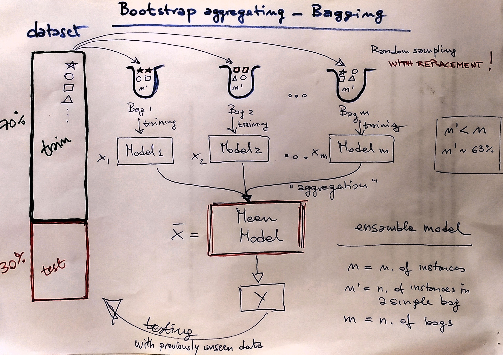

```{r setup, include=FALSE}

knitr::opts_chunk$set(echo = TRUE)

```

# Introduzione

Random Forest ('RF') è un algoritmo proposto da L. Breiman (University of California, Berkeley) che costruisce un modello predittivo rappresentato dall'aggregazione ('mediazione') dei risultati di una collezione di alberi (foresta). 

L'algoritmo è capce di affrontare sia compiti di classificazione che di regressione superando alcune limitazioni tipiche dell'analoga tecnica di 'Bagging' (bootstrap aggregating regression trees). 

Per i probelmi di tipo regressivo si adatta molte volte lo stesso albero di regressione su un numero di campioni bootstrap (bags) del dataset  di training e si calcola la media dei risultati ottenuti. Invece, per i problemi di cassificazione si adatta un “comitato” di alberi ognuno dei quali "esprime un voto" per la classe in esame.

Rispetto alla tecnica di 'Bagging', 'RF' introduce un ulteriore elemento di casualità nell'algortimo che contribuisce a ridurre significativamente i successivi problemi di overfitting: infatti, viene proposto l'utilizzo di una selezione casuale (subset) delle variabili predittive utilizzate in ciascun nodo dell'albero ('RF' coincide con Bagging quando il numero di variabili predittive utilizzate nel modello è pari al numero totale di variabili esplicative, cioè in ogni nodo dell'albero sono utilizzate tutte le covariate presenti nel dataset).

L'algorimo di 'RF' ha acquisito negli anni recenti molta popolarità per le sue caratteristiche di ottime performance predittive 'out-of-the-box', cioè senza la necessità di dover ricorrere ad un ecessivo lavoro di parametrizzazione. 

Rispetto ai 'classici' metodi di regressione ad albero (regression trees) che risentono di problemi dovuti alla generazione di alberi tra loro 'correlati', 'RF' utilizza una tecnica di ulteriore 'iniezione' di casualità nel processo di generazione/crescita degli alberi del modello. 

Questa caratteristica è ottenuta implementando due tecniche specifiche:

- 'bootstrap': analogamente alla tecnica prevista nell'algoritmo 'Bagging', ogni albero è 'cresciuto' su un sotto-campione casuale di osservazioni del datset (con l'effetto di 'crescere' alberi tra loro de-correlati);

- 'split-variable randomization': ogni volta che viene affrontato un nodo (split) dell'albero, la ricerca della variabile di ripartizione per lo specifico nodo in esame è limitata ad un subset di variabili (m) rispetto al totale delle variabili predittive (p) che sono presenti nel dataset. Per il caso limite in in cui m = p, 'RF' rientra nei presupposti della tecnica di 'Bagging'. Intuitivamente, la riduzione di m produrrà una riduzione della correlazione tra coppie di alberi e quindi ridurrà la varianza della media (stima finale). 

Considerato che l'algoritmo 'RF' seleziona casualmente un sottocampione (bootstrap sample) per l'addestramento del modello e una selezione casuale delle variabili predittive da utilizzare ad ogni 'split', si ottiene il risultato di generare un set di alberi differenti che risultano tra loro meno correlati di quanto avviene nell'algoritmo di 'Bagging', con il risultato finale di un aumento significativo delle capacità predittive del modello. 

L'algoritmo di un modello regressivo 'RF' può essere descritto in termini generali con il seguente 'pseudo-codice':

1.  | considerato un dataset
2.  | seleziona il numero di alberi (ntrees) da generare 
3.  | for i = 1 to ntrees do
4.   _ _| seleziona un campione casuale dei dati originali (a bootstrap sample)
5.   _ _| genera un albero di regressione sulla base del campione casuale (bootstrapped data)
6.   _ _| for each split (nodo dell'albero) do
7.   _ _ _| seleziona casualmente m variabili da tutte le variabili p nel dataset originario
8.   _ _ _| utilizza per lo split la variabile/nodo "migliore" tra tutte le m selezionate
9.   _ _ _| dividi il nodo in 2 nodi figli
10.  _ _| end
11.  _| utilizza un criterio predefinito di arresto quando l'albero è completo (no pruning)
12. | end


In sintesi, rispetto a quanto sopra riportato in modo schematico, ogni singolo caso (osservazione) presente nel dataset è passato attraverso ('drop down') tutti gli alberi della foresta ciascuno dei quali produce una previsione individuale: la previsione finale della 'foresta' è rappresentata dalla 'media' delle previsioni dei singoli alberi di regressione.

'RF' è un algoritmo che dal punto di vista dell'inquadramento sistematico nell'ambito della classificazione dei modelli statistici può essere deinito come una tecnica di *machine learning* di tipo *ensemble supervised*.

Segue qualche utile definizione (di primo livello):

- https://en.wikipedia.org/wiki/Machine_learning

- https://en.wikipedia.org/wiki/Supervised_learning

- https://en.wikipedia.org/wiki/Ensemble_learning

Per avere una presentazione più completa e rigorosa si rimanda al classico  [libro](https://web.stanford.edu/~hastie/ElemStatLearn/printings/ESLII_print12_toc.pdf
) di:

- Hastie, T., Tibshirani, R., and Friedman, J., The Elements of Statistical Learning, 2nd edition, Springer, 2009.

Sinteticamente (e solo superficialmente) rispetto agli obiettivi di questo esercizio.

Il termine *machine learning* ('apprendimento automatico') intende un campo molto variegato di attività legate all'intelligenza artificale che può essere sinteticamente riassunto nei 4 seguenti passaggi logici:

1. seleziona un un dataset 'noto' del quale conosci già le 'risposte'; 

2. addestra l'algorimto di calcolo sul dataset (training); 

3. seleziona un dataset 'non noto' del quale vuoi conoscere le 'risposte'; 

4. applica l'algoritmo di calcolo al dataset (testing) e trova i risultati finali.

Il termine *supervised learning* si applica ad un dataset con una variabile 'risposta' (label), che può essere sia di tipo 'categorico' (per risolvere un problema di tipo classificatorio) che 'continuo' (per risolvere un problema di tipo regressivo): l'algoritmo di apprende (viene istruito) in riferimento alla variabile 'risposta' contro le variabili predittive (covariate)

Il termine *ensemble learning* presuppone l'utilizzo di più algortimi per ottenere delle performance predittive migliori rispetto a quelle ottenibili con un singolo algoritmo (due is meglio che one!). Da qui si apre poi il problema di risolvere la dimensione dell'insieme degli algoritmi e di definre un efficiente ed efficace criterio di aggregazione/mediazione predittiva.

Nel caso specifico, l'esercizio qui considerato rientra sempre nel caso generale di un *esamble learning* perchè:

- viene utilizzato un unico tipo di modello (gli alberi di regressione);
- ...MA...
- gli alberi di regressione sono addestrati ogni volta su un differente subset di dati (bagging) e successivamente aggregati in un unico modello (la media).

Nella figura seguente una mia schematizzazione del procedura di 'bootstap aggegating' (Bagging) e conseguente 'ensamble modeling'.
\




Per chiudere questa parte, un breve approfondimento su 'out-of-bag error' (OOB error).

Nell'algoritmo 'RF' il dataset di trainnig vine campionato in modo casuale con ripetizione (o estrazione bernoulliana), generando così tanti piccoli subset, noti come 'bootstrap samples' che vengono poi 'passati' al modello RF per il training.
I campioni 'fuori sacco', OOB samples, sono le osservazioni *non utilizzate* per l'addestramento del modello. Nel caso ideale (numero di osservazioni infinto) circa il 36.8% dei dati costruisce il set OOB.

Si può dimostrare che, se esistono N righe da campionare allora la probabilità di *non campionare* una specifica riga del dataset in una estrazione casuale è pari a:

$$ \frac {N-1}{N}$$

Utilizzando la tecnica di campionamento casuale con ripetizione (il campione estratto viene sempre rimesso dentro il dataset iniziale), la probabilità di *non campionare* un numero di righe (records) pari a N è uguale a:

$$ \left(\frac {N-1}{N}\right)^n $$

nel caso limite con N tendente ad infinito:

$$\displaystyle \lim_{n \to \infty}  \left(1 - \frac {1}{N}\right)^n = e^{-1} = 0.3679$$
da cui si deduce che circa il 36.8% del dataset di training risulta non campionato e quindi risulta 'disponibile' come campione OOB (fuori sacco) su cui effettuare la 'validazione' del modello RF.

nb: il calcolo del limite implica una serie di passaggi di sostituzione e di derivazione che per brevità non sono qui presentati; un simpatico video esplicativo dei principali passaggi matematici è disponibile [qui](https://www.youtube.com/watch?v=z-w_W_VJbIY).


# Dataset 'Boston housing'

Il dataset è derivato dalle infomrazioni raccolte da 'U.S. Census Service' e contiene osservazioni relative a 506 abitazioni nell'area di Boston descritte attraverso 14 variabili caratteristiche. Fu originariamente pubblicato da:

- Harrison, D. and Rubinfeld, D.L. `Hedonic prices and the demand for clean air', J. Environ. Economics & Management, vol.5, 81-102, 1978. 

L'ipotesti dello studio originario aveva l'obiettivo di verificare e misurare l'attitudine della popolazione residente a pagare di più per vivere in una casa in un ambiente meno inquinato attraverso la vautazione del 'prezzo edonico' (valore monetario che la popolazione assegna a fattori non specificatamente inerenti la proprietà ma piuttosto ad una serie di elementi 'esterni').

Elenco delle variabili presenti nel dataset:

1. crim: Per capita crime rate by town
1. zn: Proportion of residential land zoned for lots over 25,000 square feet
1. indus: Proportion of non-retail business acres per town
1. chas: Charles River dummy variable ( = 1 if tract bounds river; 0 otherwise)
1. nox: Nitric oxides concentration (parts per ten million)
1. rm: Average number of rooms per dwelling
1. age: Proportion of owner-occupied units built prior to 1940
1. dis: Weighted distances to five Boston employment centers
1. rad: Index of accessibility to radial highways
1. tax: Full-value property-tax rate per $10,000
1. ptratio: Pupil-teacher ratio by town
1. black: 1000(B k - 0.63)^2 where B k is the proportion of blacks by town
1. lstat: Percent of the lower status of the population
1. medv: Median value of owner-occupied homes in $1000

Per maggiori informazioni, anche sui 'limiti e difetti' di questo dataset ormai datato si rimanda al [seguente sito](https://towardsdatascience.com/things-you-didnt-know-about-the-boston-housing-dataset-2e87a6f960e8), ed in seconda battuta anche a [questo sito](https://nowosad.github.io/spData/reference/boston.html) per il datset 'corretto' rispetto ad alcune variazioni successive che, per brevità e semplicità, nell'esercizio qui presentato non sono state considerate.


# Obiettivi

L'obiettivo del presente esercizio è costruire tramite la tecnica 'RF' un modello predittivo di tipo regressivo del valore mediano delle case occupate nell'area di Boston (variabile risposta 'mdev') sulla base delle 13 variabili esplicative (covariate) sopra elencate.

Sarà interessante notare che, sulla base dei risultati del modello predittivo 'RF', la variabile esplicativa ('covariata') che più direttamente ci si aspetterebbe poter essere 'naturalmente correlata' al valore mediano delle abitazioni (sempre restando nell'approccio valutativo originale dell'articolo sopra descritto) in realtà non compare come mai come una delle variabili a maggiore contenuto esplicativo. E questo aspetto rende conto del carattere eminentemente 'stocastico' dell'approccio 'RF' e della difficoltà (impossibilità, di fatto!) nel fornire un'interpretazione 'causale' dei risultati ottenuti.


# Analisi esplorativa

Carichiamo il dataset 'Boston housing', e diamo uno squardo preliminare alla dimensionalità ed alle principali statistiche di tipo descrittivo.

La variabile 'target' è 'mdev' (valore mediano delle case occupate espresso in k$) mentre le restanti variabili sono le 'covariate' (variabili esplicative) che saranno utilizzate nel modello predittivo.


```{r echo=TRUE, message=FALSE, warning=FALSE}

# load pkg with Boston housing dataset
library(MASS) 

dim(Boston)

# summary of data
summary(Boston)

```

Viene di seguito proposta una rappresentazione grafica relativa alla matrice di correlazione (lineare) tra le variabili presenti nel dataset al fine di ottenere una indicazione preliminare sul possibile grado di 'interazione' tra la variabile risposta (mdev) e le altre variabili predittive (covariate). 

In via speditiva è sufficiente analizzare l'ultima riga della matrice grafica di correlazione (i colori differenti indicano il segno della correlazione: positivo - blu - oppure negativo - rosso -) per notare subito che le variabili maggiormente correlate al 'target' (mdev) sono: 'lstat', 'rm', 'ptratio', etc.

C'è da precisare in modo chiaro che questo tipo di valutazione serve solo per avere un ritorno immediato sul possibile grado di legame tra la variabile 'target' e le variabili predittive (covariate), senza per questo voler implicare alcun grado di parentela o capacità di intepretazione del risultato che otterremo dall'approccio 'RF' (rispetto al quale non vi è effettivamente alcun punto in comune).

Sarà istruttivo verificare a posteriori se la selezione delle variabili più importanti utilizzate dal modello predittivo 'RF' è in qualche modo sovrapponibile (anche se in via del tutto casuale) con il risultato dell'analisi di correlazione. Ricordiamo, ancora una volta, che il modello predittivo risultatnte dalla crescita di una 'foresta' ('RF') non ha alcuna possibile interpretazione di tipo 'causa-effetto' essendo un processo esclusivamente di tipo stocastico (casuale).


```{r echo=TRUE, message=FALSE, warning=FALSE}

library(corrplot)

corBoston<-cor(Boston)

corrplot(corBoston, method = "pie", type="lower", order='original')

```

E per concludere un grafico del tipo 'scatter plot' della variabile target (medv) rispetto alle altre variabili predittive (covariate).

```{r echo=TRUE, message=FALSE, warning=FALSE}

library(tidyverse)

Boston %>%
  pivot_longer(!medv, names_to = "variable", values_to = "value")%>%
  # leaving out some categorical variabile
  #filter(variable != "chas" & variable != 'rad') %>%
  ggplot(aes(x = value, y = medv)) +
  geom_point() +
  stat_smooth() +
  facet_wrap(.~variable, scales = "free")

```

# Training- vs. Testing dataset

Dividiamo il dataset originario in due subset distinti: "training", per addestrare il modello e "testing", per verificare l'accuratezza della previsione su un dataset non precedentemente 'visto' dal modello.

Utilizziamo alcune funzioni dedicate tratte dal pacchetto 'rsample'. Il 70% delle osservazioni (train dataset) viene riservato per l'addestramento mentre il restante 30% (test dataset) per la previsione e verifica dei risultati.

```{r echo=TRUE, message=FALSE, warning=FALSE}

# here some preliminary data tweaking
#Boston$chas <- factor(Boston$chas, levels = 0:1, labels = c("no", "yes"))
#Boston$rad <- factor(Boston$rad, ordered = TRUE)

library(rsample)

set.seed(123456)

boston_split <- initial_split(Boston, prop = 0.7)

boston_train <- training(boston_split)

boston_test  <- testing(boston_split)

dim(boston_train)

dim(boston_test)

```

In alternativa, secondo un appproccio 'base' la ripartizione del dataset può essere effettuata con l'utilizzo della semplice funzione 'sample()'.

```{r echo=TRUE, message=FALSE, warning=FALSE}

set.seed(123456)

id<-sample(x= 1:nrow(Boston), size = ceiling(nrow(Boston) * 0.7))

boston_train2<-Boston[id,]

boston_test2<-Boston[-id,]

dim(boston_train2)

dim(boston_test2)

```

Da notare che i dataset risultanti dai differenti approcci di 'splitting' pur avendo  uguale dimensionalità non saranno mai perfettamente identici (perchè si tratta di un campionamento di tipo casuale).

# Intermezzo: cos'è un albero di regressione?

Gli alberi di regressione 'classici', nella loro implementazione di base, ripartiscono il dataset in vari sotto-gruppi (rami) più piccoli. Per ciascuno di questi sotto-gruppi adattano (fitting) un 'modello descrittivo semplice' che corrisponde ad un valore costante all'interno del gruppo.

Un singolo albero di regressione tende però ad essere 'instabile' e quindi fornire una previsione con accuratezza e precisione limitata. 
La possibilità di crescere alberi su differenti campioni 'bootstapping' appartenenti allo stesso dataset e successivamente aggregare i risultati dei vari alberi secondo la tecnica di 'bagging' permette di rendere il modello regressivo molto più potente e performante: questo tipo di approccio rappresenta la base fondamentale per il modello 'RF' (oltre  rappresentare il riferimento per altri tipi di modelli regressivi quali, ad esempio, 'gradient boosting machines' - caso qui non trattato).

Ci sono molti appprocci per costruire gli alberi di regressione 'classici' ma uno dei più 'consolidati e noti' è il 'classification and regression tree' (CART). sviluppato da Breiman et al. (1984). 

Gli alberi di regressione ripartiscono il dataset in modo ricorsivo in sottogruppi più piccoli e fittano un valore costante per ciascuna osservazione nel sottogruppo di appartenenza. 

La ripartizione è attuata tramite una divisione binaria sulla base di differenti variabili predittive: il valore costante di predizione all'interno di ciascun gruppo è la media dei valori della variabile risposta stimata per tutte le osservazioni che rientrano in uno specifico sottogruppo.

Il modello di regressione inizia il calcolo sull'intero dataset (radice) e, sulla base della 'ricerca' effettuata su ogni singola osservazione (valore) e per ogni singola variabile predittiva, lo divide in due rami figli (R1 e R2) rispetto ad un valore costante di 'split', in modo tale da minimizzare la somma complessiva dei quadrati degli scostamenti (errori).

$$min \left[SSE = \sum_{i \in R_1} (y_i-c_1)^2+\sum_{i \in R_2} (y_i-c_2)^2\right]$$
Considerato un determinato nodo (cioè livello di approfondimento) dell'albero e individuato lo 'split' migliore sulla base del criterio di minimizzazione dell'errore sopra descritto,  l'algoritmo di calcolo ripartisce il dataset in due rami e reitera il processo di ripartizionre in modo ricorsivo sui due rami risultanti e su tutti i successivi.
Il processo viene reiterato fino al punto in cui viene verificato un 'criterio di arresto', precedentemente definito, sulla base di un parametro caratteritico che varia a seconda del tipo di modello utilizzato. 

Il risultato di un albero di regressione 'classico' è tipicamente un 'albero' molto profondo e complesso che riesce a descrivere molto bene il 'training' dataset ma inevitabilmente produce un 'overfitting' (sovradattamento) che porta ad una performance del modello molto limitata sul testing dataset (non precedentemente 'visitato'). Per ovviare a queste limitazioni si introduce così la necessità di 'potare' (prune) i rami dell'abero predittivo secondo un qualche criterio di scelta ( differente a seconda del modello modello considerato).

Per disporre di una metrica di giudizio 'obiettivo' rispetto alle performance dei modelli verrà utilizzata la media dei quadrati degli errori (scostamenti valore osservazione vs. valore modello), che viene sinteticamente definita come MSE (Mean Squared Error) secondo la formula di seguito riportata:

$$MSE = \frac {1}{n} \sum_{i=1}^n (y_i - \hat y_i)^2$$

Segue una implementazione di questi concetti utilizzando due dei differenti pacchetti di 'regresssion trees' disponibili in R (con risultati finali praticamente identici).

## Libreria "tree"

Carichiamo ed utilizzaimo il pacchetto di R "tree" per 'crescere' un albero regressivo di tipo 'classico'.

```{r echo=TRUE, message=FALSE, warning=FALSE}

library(tree)

# tree training dataset
t_train<-tree(medv~., data=boston_train)

# this is the tree model before pruning
t_train

# plot the tre on training dataset
plot(t_train)
text(t_train, cex=0.8)

summary(t_train)

```

La potatura dell'albero cresciuto con l'algoritmo "tree" è stata effettuata attraverso una convadida incroiata c(10-fold cross-validation") che ha permesso di ridurre i nodi terminali a 4 (evidente sulla base dell'analisi del grafico che mostra una significativa riduzione della devianza senza che via sia la necessità di incrementare la complessità del modello).

Per un approfondimento dei concetti di validazione incrociata si rimanda ai seguenti riferimenti di 'primo livello':

- https://it.wikipedia.org/wiki/Convalida_incrociata

- https://machinelearningmastery.com/k-fold-cross-validation/

```{r echo=TRUE, message=FALSE, warning=FALSE}

# 10-fold cross-validation
set.seed(123456)
t_train_cv<-cv.tree(t_train, FUN=prune.tree, K=10, method='deviance')
 
# plot for detrmining size of the tree against deviance
plot(t_train_cv)

# pruned tree with 4 leaves, it seems fine from the chart
t_train_p<-prune.tree(t_train, best=4)

t_train_p
summary(t_train_p)
 
# plot pruned tree
plot(t_train_p)
text(t_train_p, cex=0.8)

```

La previsione sul dataset di testing con l'utilizzo dell'albero 'potato' ha restituito un errore pari a quanto riportato sotto con il parametro MSE.

```{r echo=TRUE, message=FALSE, warning=FALSE}

# predict against test data set
set.seed(123456)
t_predict_test<-predict(t_train_p, newdata=boston_test)

# calculate MSE mean squared error (predicted vs. actual data)
t_mse<- mean((t_predict_test - boston_test$medv)^2)

t_mse


```


## Libreria "rpart"

Carichiamo ed utilizzaimo il pacchetto di R "rpart" per 'crescere' un albero regressivo di tipo 'classico'.


```{r echo=TRUE, message=FALSE, warning=FALSE}

library(rpart)
library(rpart.plot)

# tree rpart
tr_train <-rpart(medv ~., data=boston_train)

tr_train

# plotting the tree
rpart.plot(tr_train)

```

La potatura dell'albero cresciuto con l'algoritmo 'rpart' fino ai 4 nodi terminali sotto rappresentati è stata effettuata sulla base di una metrica definita “complexity parameter”.

Per la definizione della metrica *cp* cfr. [manuale rpart](https://cran.r-project.org/web/packages/rpart/vignettes/longintro.pdf).

Sintetica definizione *cp*, tratta dal manuale (p.24):

- "if any split does not increase the overall R2 of the model by at least cp (where R2 is the usual linear-models definition) then that split is decreed to be, a priori, not worth pursuing. The program does not split said branch any further, and saves considerable computational effort."

```{r echo=TRUE, message=FALSE, warning=FALSE}

# plot complexity parameter
plotcp(tr_train)

# pruning based on complexity parameter
# cp is set by visual inspection of the chart plotcp
tr_train_p <- prune(tr_train, cp=0.05)

tr_train_p

# plot the pruned tree
rpart.plot(tr_train_p)

```

La previsione sul dataset testing con l'utilizzo dell'albero potato ha restituito un errore pari a quanto riportato sotto con il parametro MSE.

```{r echo=TRUE, message=FALSE, warning=FALSE}

set.seed(123456)
tr_predict_test<-predict(tr_train_p, newdata=boston_test)

# calculate test MSE
tr_mse<- mean((tr_predict_test - boston_test$medv)^2)

tr_mse

```

# Addestramento

Segue il processo di addestramento del modello 'RF' sulla base del dataset 'training'.
Cosiderato quanto già detto riguardo il campionamento casuale sia delle osservazioni che delle variabili esplicative si attende un gradi di correlazione tra gli alberi significativamente ridotto rispetto alle altre tecniche (sia di regressione ad albero 'classica' che di tipo 'bagging').

Ricordiamo che il criterio di ripartizione dei rami (nodi) per la crescita degli alberi nella foresta generata dall'algoritmo regressivo 'RF' consiste per ciascun nodo nella scelta della combinazione di variabili predittive (mtry) che minimizzano il valore SSE (cioè la somma dei quadrati delle differenze tra ciascuna osservazione e la media del gruppo di appartenenza).


```{r echo=TRUE, message=FALSE, warning=FALSE}

library(randomForest)

set.seed(123456)

# using default parameters, among others:
# ntree = 500, n. of trees to grow
# mtry = p/3 = 13/3 = 4 n. of variables randomly sampled at each split
train_rf <- randomForest(medv ~ ., boston_train, importance=TRUE)

train_rf

```

Analizziamo brevemente l'output dell'algoritmo 'RF' su dataset 'training': 

- media dei quadrati dei residui (mean of squared residuals, MSE);
- varianza spiegata (espressa in percentuale).

Prima richiamiamo il concetto 'classico' di varianza spiegata:

$$R^2 = 1 - \frac{\sum_{i=1}^n (y_i - \hat y_i)^2}{\sum_{i=1}^n (y_i - \overline{y})^2}$$

cioè il rapporto tra la varianza dei residui (numeratore) e la varianza della variabile stimata (denominatore), sottratto ad 1 (espresso in percentuale).

E poi ripercorriamo i calcoli dell'output modellistico sopra riportati: 

```{r message=FALSE, warning=FALSE}

#mean of squared residuals MSE
mse_t<-mean((boston_train$medv-train_rf$predicted)^2)
mse_t

# variance explained 
evar_t<-1-(sum((boston_train$medv-train_rf$predicted)^2) /
             sum((boston_train$medv-mean(boston_test$medv))^2))

evar_t

```

Sulla base dei risultati ottenuti il modello 'RF' sembra funzionamre molto bene (e per certi aspetti inaspettamente bene, considerato che si tratta di un algoritmo di tipo casuale, cioè che non presuppune alcun tipo di interpretazione funzionale tra variabili predittive e la variabile risposta).

E' stato ottenuto un valore di MSE pari a circa `r round(mse_t, 1)` che è significativamente inferiore a quanto stimato con i modelli regressivi ad albero di tipo classico cresciuti con i pacchetti 'tree' e 'rpart' (cfr. MSE alberi di regressione 'classici').

Con il modello 'RF' circa `r sprintf("%.1f %%", round(evar_t*100,1))` della variabilità riferibile al target 'mdev' risulta speigata dall'utilizzo casuale delle 13 variabili covariate  selezionate (4 variabili per ogni nodo) per crescere la foresta predittiva (costituita complessivamnte da 500 alberi).

Nel grafico seguente viene riprodotto l'errore complessivo dell'algoritmo 'RF' in funzione del numero di alberi che sono stati 'cresciuti' nella foresta casuale. 

```{r message=FALSE, warning=FALSE}

# plot trained random forest
plot(train_rf)

```

Dal grafico si nota che l'errore tende a stabilizzarsi su valori pressochè costanti già a partire da 200 alberi (per cui si desume che i 500 alberi cresciuti di default sono ampiamente sufficienti a minimizzare l'errore e in termini di efficienza di calcolo possono essere ridotti considerevolmente senza significativa perdita di capacità predittiva).

L'errore riportato nel grafico precedente è basato su l'errore OOB e può essere direttamente accessibile tramite 'train_rf$mse'. 

In questo modo possiamo individuare precisamente il numero di alberi richiesti per ottenere l'errore di stima più basso:

```{r message=FALSE, warning=FALSE}

# number of trees with lowest MSE
which.min(train_rf$mse)

# RMSE of this optimal random forest
sqrt(train_rf$mse[which.min(train_rf$mse)])

```

Che conferma in altri termini, più rigorosi, la valutazione già fatta 'a vista' sul grafico precedente.

Tra i parametri restituiti dal modello l'importanza delle variabili predittive assume particolare rilevanza: 'RF' è quindi un metodo per avere un ritorno informativo sull'importanza relativa delle variabili predittive e quindi sulla possibilità di una loro selezione 'ex post'.

```{r echo=TRUE, message=FALSE, warning=FALSE}

# show table of variable importance
var_imp<-importance(train_rf)

var_imp<-as.matrix(var_imp[order(var_imp[,1], decreasing = TRUE),])

var_imp

```

Analogamente, un modo efficace per analizzare l'importanza delle variabili è rappresentato dall'utilizzo della funzione dedicata varImpPlot() o della funzione vip() nell'omonimo pacchetto 'vip', che riproduce il grafico seguente.

```{r message=FALSE, warning=FALSE}

library(vip)           # for variable importance plots

# check for any eventual conflicts with dplyr
# variable importance plot (compare to randomForest::varImpPlot(train_rf))
vip(train_rf, geom='point', horiz= FALSE)

```

Dal grafico si deduce che le due variabili predittive 'lstat' e 'rm' assumono un'importanza significativamente maggiore rispetto a tutte le altre.

Le variabili predittive con maggiore importanza sono i principali 'drivers' delle stime ed i loro valori hanno un impatto significativo sulla bontà della predizione. Al contrario, le variabili con minore importanza sono quelle che possono essere 'escluse' dal modello predittivo senza sacrificare accuratezza e precisione di stima.

Nel modello 'RF' ci sono due metriche differenti per valutare l'importanza delle variabili predittive:

1 - la diminuzione nell'accuratezza della stima quando una specifica variabile viene esclusa dal calcolo ('permutation importance');

2 - la diminuzione dell'indice di impurità quando una variabile viene utilizzata per dividere un nodo dell'albero ('Gini importance').

tratto dal manuale on-line: ?randomForest::importance()

    The first measure is computed from permuting OOB data: For each tree, the prediction error on the out-of-bag portion of the data is recorded (error rate for classification, MSE for regression). Then the same is done after permuting each predictor variable.
    The difference between the two are then averaged over all trees, and normalized by the standard deviation of the differences. 
    If the standard deviation of the differences is equal to 0 for a variable, the division is not done (but the average is almost always equal to 0 in that case).
    The second measure is the total decrease in node impurities from splitting on the variable, averaged over all trees. For classification, the node impurity is measured by the Gini index. For regression, it is measured by residual sum of squares.

Ogni albero ha il proprio dataset campionario di crescita ed il corrispondente dataset campionario 'out-of-bag' che viene messo da parte e non viene stato utilizzato per l'addestramento del modello ma viene 'riservato' (OOB dataset) per il calcolo dell'importanza di ogni singola variabile. 

Per prima cosa viene misurata l'accuratezza di previsione nel campione 'out-of-bag' e successivamente i valori corrispndenti alla variabile in esame, sempre nel campione out-of-bag, sono 'rimescolati casualmente' (randomly shuffled) mantenedo tutte le altre inalterate. Successivamente, viene misurata la diminuzione nell'accuratezza di previsione nei dati rimescolati. Viene quindi calcolata la media di decremento nell'accuratezza di previsione su tutti gli alberi e questa misura viene poi ripartita per classi discrete di output finale (variabile target). 

Intuitivamente, il 'rimescolamento casuale' dei valori della variabile 'out-of-bag' comporta che la variabile in media assume un valore previsionale sostanzialmente nullo (o comunque non significativo). L'importanza della variabile è quindi una misura di quanto rimuovendo una specifica variabile predittiva dal modello in esame si determina una dimnuzione dell'accuratezza di stima (e viceversa, quanto includendola se ne aumenta l'accuratezza). Da notare che se una variabile ha un potere predittivo molto limitato, il rimescolamento potrebbe comportare, almeno in linea teorica, anche un'eventuale aumento dell'accuratezza e questo potrebbe portare al calcolo di un piccolo valore negativo di importanza della variabile, che però viene restituito in termini pari a zero.

Riassumendo, l'approccio di calcolo sopra descritto può essere sintetizzato nei seguenti passaggi:

- addestramento su datset training e calcolo della prestazione del modello (in termini di: accuratezza, R^2, indice di Gini o in termini generali di qualsiasi metrica di importanza) su dataset di validazione (OOB sample nel caso di RF);

- rimescolamento casuale dei valori di una variabile del dataset di validazione (OOB sample) e passaggio del 'nuovo dataset rimescolato' al modello al fine di ottenere una nuova previsione e calcolare la metrica di valutazione (per confronto successivo);

- calcolo dell'importanza di una variabile che si ottiene per differena tra la misura di prestazione del modello addestrato sul dataset di base (trainin dataset) e la previsione sul dataset 'rimescolato casualmente' (OOB sample dataset);

- ripetizione dell'ultimo passaggio per tutte le variabili presenti nel dataset.

Per maggiori dettagli ed una discussione approfondita di questi aspetti si rimanda al libro:
'An introduction to statistical learning with applications in R', G. James, D. Witten, T. Hastie, R. Tibshirani, 2013. springer [7ma ristampa riveduta e corretta al 2017]( http://faculty.marshall.usc.edu/gareth-james/ISL/ISLR%20Seventh%20Printing.pdf)


## Partial dependence plot

I modelli non parametrici di tipo complesso (come ad esempio 'RF', oltre a neural networks e svm) hanno avuto molto sviluppo nell'ambito della modellistica predittiva specialmente per i casi in cui è necessario affrontare problemi con dataset molto grandi che non aderiscono strettamente alle assunzioni imposte dalle tecniche statistiche 'classiche' (ad esempio, regressione lineare semplice o multipla che assume linearità, omoschedasticità e normalità). L'interpretazione di questi modelli complessi, spesso molto potenti, è però difficle così come risulta sfidante la spiegazione e la resa dei risultati in termini di operatività.

'Partial dependence plot' offre una soluzione 'semplice' per aiutare a visualizzare le relazioni parziali tra variabile 'target' (stimata) e le variabili predittive (covariate).
In sintesi, si tratta di un rendering grafico che permette di 'leggere' in modo più chiaro la relazione tra valori stimati e variabili considerate nell'analisi.

Il grafico 'partial dependence plot' mostra l'effetto marginale di una o due variabili predittive sul valore stimato da un modello di machine learning (Friedman, 2001). 
Il grafico permette di evidenziare il tipo di relazione esistente (lineare o complessa) tra una variabile 'target' e una (o massimo due) variabili predittive.

```{r echo=TRUE, message=FALSE, warning=FALSE}

library(pdp)
# 
plstat <- train_rf %>%  
  partial(pred.var = 'lstat') %>%
  autoplot() +
  geom_smooth(se=FALSE)+
  ggtitle('lstat, partial dependece plot')+
  labs(x='lstat', y=expression(f(lstat)))

prm <- train_rf %>%  
  partial(pred.var = 'rm') %>%
  autoplot() +
  geom_smooth(se=FALSE)+
  ggtitle('rm, partial dependece plot')+
  labs(x='rm', y=expression(f(rm)))

# arrange plots
grid.arrange(plstat, prm, ncol = 2)  

```

Quando nel grafico 'partial dependence plot' vengono considerate contemporaneamente due dimensioni (cioè due variabili predittive), la rappresentazione del tipo 'convex hull' cioè l'inviluppo convesso (che il più piccolo insieme convesso che contiene tutti i punti dati), definisce una regione dello 'spazio predittivo' su cui il modello è stato effettivamente addestrato. In questo modo, nel grafico viene rappresentata solo la parte di regione dello spazio che corrisponde alla variabilità effettiva delle due covariate in esame: al di fuori di questo spazio si tratta di un'estrapolazione che porta ad una intepretazione errata e fuorviante.


```{r echo=TRUE, message=FALSE, warning=FALSE}

p_lstat_rm <- partial(train_rf, pred.var = c("lstat", "rm"), plot = TRUE, chull = TRUE)

p_lstat_rm

```


# Previsione 'out-of-the-box'

L'utilizzo dei parametri di default 'RF' restituisce una performance significativa che si misura in termini di MSE con il valore sotto riportato (ancora una volta significativamente inferiore a quello dei modelli di regressione ad albero di tipo 'classico').

```{r}

rf_predict_test <- predict(train_rf, newdata=boston_test)

# calculate test MSE
rf_mse<- mean((rf_predict_test - boston_test$medv)^2)

rf_mse

```

Possiamo ora produrre un grafico dei valori osservati vs. stimati da modello, sia per il dataset training che per 'testing'.

```{r echo=TRUE, message=FALSE, warning=FALSE}

# row bind training and testing dataset
boston_all<-boston_train%>%
  mutate(dataset='training')%>%
  bind_rows(.,
            boston_test%>%
              mutate(dataset='testing')
            )

# fit (predict) for both train and test dataset
boston_all$fit<-predict(train_rf, boston_all)

ggplot(data = boston_all, mapping = aes(x=fit, y=medv)) +
  geom_point(aes(colour=dataset)) +
  geom_abline(slope=1, intercept = 0) +
  geom_smooth(method = "lm", se = FALSE, aes(colour=dataset))+
  facet_grid(cols=vars(dataset))

```


# Regolazione fine

Elenco dei parametri caratteristici per il 'fine-tunining' del modello predittivo 'RF':

- 'ntree': numero di alberi; l'obiettivo è individuare un sufficiente numero di alberi per stabilizzare l'errore senza diventare inefficienti dal punto di vista computazionale specialmente quando si tratta di dataset consistenti;

- 'mtry': numero di varibili predittive da campionare in modo casuale come candidate per ciascun nodo dell'albero (quando mtry = p il modello rientra nel caso di 'bagging,  all'opposto quando mtry=1 tutte le variabili hanno eguale probabilità di essere utilizzate nello split ma questo può portare a risultati 'distorti');

- 'sampsize': numero di campioni da utilizzare per la fase di addestramento (deafult pari al 63.25% del training dataset); un numero minore riduce il tempo di calcolo ma introduce possibili distorsioni mentre un aumento del numero se da un lato incrementa la possibile performance, dall'altro aumenta anche il rischio di overfitting (tipico degli alberi regressivi di tipo 'tradizionale' che utilizzano l'intero dataset);

- 'nodesize': numero minimo di campioni nel nodo terminale; questo parametro controlla la complessità dell'albero: dimensioni più piccole aumentano la 'profondità' e la complessità dell'albero, mentre dimensioni più grandi hanno l'effetto di produrre alberi più radi (meno ramificati); anche in questo caso si tratta di un  trade-off tra aumento della varianza negli alberi più ramificati (rischio di overfitting) e distorsione dei risultati negli alberi più radi (bias che induce il rischio di non catturare le relazioni ed i pattern caratteristici dei dati);

- 'maxnodes': numero massimo di nodi terminali; è un altro parametro che controlla la complessità dell'albero: più nodi equivale ad alberi più profondi e complessi, viceversa meno nodi ha come effetto di produrre alberi più radi (con le conseguenze sopra accennate in termini di prestazione del modello).

Analogamente a quanto avviene per 'Bagging', un beneficio che è la 'naturale conseguenza' del processo di campionamento di tipo casuale (the bootstrap resampling) delle osservazioni da sottoportre al modello, è la possibilità di definire un set di osservazioni out-of-bag (letteralmente 'fuori sacco', cioè non selezionate per il modello) che permette di avere a disposizione un campione che fornisce (in via preventiva) una ragionevole stima  dell'errore relativo al dataset di testing, cioè in ultima analisi una stima dell'atteso errore di testing.

Si tratta della possibilità di definire un 'validation test' di default  connaturato all'approccio modellistico (built-in), senza la necessità di ripartire ulteriormente il trainig test e quindi 'sacrificare' osservazioni del dataset per la validazione dei risultati.

Questa caratteristica permette di individuare in modo più efficace il numero di alberi richiesti per stabilizzare l'errore di stima. E' in ogni caso evidente che bisogna attendersi necessariamente una differenza tra errore OOB ed errore di testing.

L'algorimo 'RF' permette di utilizzare un 'validation set' per misurare l'accuratezza della previsione nel caso in cui non siamo intenzionati ad utilizzare per tale fine i campioni 'fuori sacco' (OOB samples) ma vogliamo fornire unospecifico dataset di validazione.

Per fare questo procediamo dividendo ulteriormente il training dataset per creare un 'validation' dataset (con funzione del tutto analoga a OOB). Successivamente attraverso questo nuovo dataset forniamo i parametri 'xtest' and 'ytest' alla funzione RandomForest().

```{r echo=TRUE, message=FALSE, warning=FALSE}

# create training and validation data 
set.seed(123456)
valid_split <- initial_split(boston_train, .8)

# training data
# analysis is a specific function of pkg 'rsample' (see manual)
# dataset is returned as dataframe
boston_train_v2 <- analysis(valid_split)

# validation data
# assessment is a specific function of pkg 'rsample' (see manual)
# dataset is returned as dataframe
boston_valid <- assessment(valid_split)

my_x_vset <- boston_valid[setdiff(names(boston_valid), "medv")]
my_y_vset <- boston_valid$medv

rf_oob_cf <- randomForest(
  formula = medv ~ .,
  data    = boston_train_v2,
  xtest   = my_x_vset,
  ytest   = my_y_vset
  )

rf_oob_cf

# extract OOB & validation errors
oob <- sqrt(rf_oob_cf$mse)
validation <- sqrt(rf_oob_cf$test$mse)

# compare error rates
# create tibble + shape it in long format + chart (all in one go!)
tibble(
  `OOB error` = oob,
  `Test error` = validation,
  ntrees = 1:rf_oob_cf$ntree) %>%
  pivot_longer(-ntrees, names_to='metric', values_to='RMSE')%>%
  ggplot(aes(ntrees, RMSE, color = metric)) +
  geom_line() +
  xlab("n. trees")

```

Dal grafico si deduce che l'errore OOB è un ottimo predittore dell'errore atteso per il dataset testing, almeno in termini di tendenza e relativa scelta delle pricipali parametrizzazioni di modello.

La linea rossa individua le stime dell'errore OOB, mentre la linea azzurra quelle dell'errore calcolato sul dataset di test (validazione). Le curve sembrano tra loro ben correlate; sia l'errore di test (utilizzato qui in termini di validazione del modello) che l'errore OOB tendono a minimizzarsi già a partire da un numero di alberi della foresta pari a 100.


## Foresta "à la" Bagging

Bagging è un caso speciale di foresta casuale quando viene imposto  m=p. La funzione randomForest() può quindi essere utilizzata per costruire un modello 'bagging' (impostando mtry = p).

Con mtry=13 si specifica di utilizzare tutti i 13 predittori del dataset 'Boston housing' ad ogni nodo degli alberi (contrariamente al caso della foresta casuale che imposta per default un numero di variabili mtry= p/3 - per il caso di regressione).

Per quanto evidenziato in precedenza ci aspettiamo una performance del modello inferiore misurata in termini di MSE e OOB error.

Ripetiamo le precedenti con 'RF' impostato "à la" Bagging, imponendo questa nuova parametrizzazione per verificarne direttamente gli effetti.

```{r echo=TRUE, message=FALSE, warning=FALSE}

set.seed(123456)

# using default parameters, among others:
# ntree = 500, n. of trees to grow
# mtry = 13, n. of variables randomly sampled at each split
train_bg <- randomForest(medv ~ ., data=boston_train, mtry=13)

train_bg

```

Per il dataset di addestramento non si notano significative differenze anche se in termini di prestazioni risultano un po' inferiori.

Verifichiamo ora la prestazione del modello in termini di previsione sul dataset 'testing'.

```{r echo=TRUE, message=FALSE, warning=FALSE}

bg_predict_test <- predict(train_bg, newdata=boston_test, mtry=13)

# calculate test MSE
bg_mse<- mean((bg_predict_test - boston_test$medv)^2)

bg_mse

```


## Parametro "mtry"

Se interessati alla regolazione fine (fine tuning) del paramentro mtry possiamo utilizzare la funzione dedicata tuneRF() del pacchetto 'RF'.

La funzione compie una ricerca 'euristica' a partire da un valore di mtry iniziale e passo definito dall'utente per arrestarsi al punto in cui l'errore out-of-bag smette di ridursi (secondo una percentuale definita dall'utente).

Per esempio, nel codice sotto riportato: la ricerca inizia dal valore mtry=5 con passo 2 fino al momento in cui OOB smettte di migliorare con una soglia prefissata al 5%.


```{r echo=TRUE, message=FALSE, warning=FALSE}

# names of predictor variables in the dataset
features <- setdiff(names(boston_train), "medv")

set.seed(123456)

m2 <- tuneRF(
  x = boston_train[features],
  y = boston_train$medv,
  # n. of trees to grow
  ntreeTry = 500,
  # by default mtry is p/3 (4 in this case)
  mtryStart = 5, #  
  # deflated or inflated by
  stepFactor = 2, 
  # set 5% improvement in OOB
  improve = 0.05, 
  # not showing real-time progress
  trace = FALSE,    
  plot = TRUE
)

m2

```

Dal calcolo si nota che il valore ottimale della ricerca di mtry è pari a 5 con un valore dell'errore OOB molto vicino a quellp stimato con la parametrizzazione di default (out-of-the-box, mtry=4).


## Parametri "mtry" & "sampsize" & "nodesize"

Con l'obiettivo di produrre una ricerca di ottimizzazione su una serie di parametri c'è la necessità di creare dapprima una griglia di combinazioni (prodotto cartesiano) dei parametri, che sarà successivamente 'passata' ad un 'ciclo for' per il calcolo e l'immagazzinamento dei risultati ottenuti.

Costruiamo la griglia cartesiana di parametri da sottoporre al modello 'RF'.

```{r echo=TRUE, message=FALSE, warning=FALSE}

# hyperparameter grid search
hyper_grid <- expand.grid(
  mtry       = seq(4, 8, by = 2),
  node_size  = seq(3, 9, by = 2),
  # 63.25% by default for what we have already seen
  sampe_size = c(.5, .6325, .7, .8),
  # OOB error
  OOB_MSE   = 0
)

# total number of combinations
nrow(hyper_grid)

```

Definita la griglia di combinazioni dei parametri secondo i criteri di variabilità sopra definiti il risultato è la parametrizzazione di:

- `r nrow(hyper_grid)` differenti 'tipi' di alberi regressivi

cioè,  `r nrow(hyper_grid)` configurazioni modellistiche che variano in modo 'continuo' rispetto al valore dei paramentri 'mtry', 'sampsize' e 'nodesize' (cfr. precedenti definizioni).

Da notare che per ciascuna combinazione di parametri vengono cresciuti sempre 500 alberi, considerato che dalle precedenti valutazioni sono risultati ampiamente sufficienti per assicurare stabilità dell'errore di stima.

Per questo scopo utilizziamo una nuova libreria (ranger) più efficiente in termini di tempi di computazionali.

```{r echo=TRUE, message=FALSE, warning=FALSE}

library(ranger)

# loop through the grid of parameters
for(i in 1:nrow(hyper_grid)) {
  
  # train model
  hyper_forest <- ranger(
    formula = medv ~ ., 
    data = boston_train, 
    num.trees = 500,
    mtry = hyper_grid$mtry[i],
    min.node.size = hyper_grid$node_size[i],
    sample.fraction = hyper_grid$sampe_size[i],
    # set seed for random number generator
    seed  = 123456 
    )
  
  # finally add OOB error to the grid as a decision parameter
  hyper_grid$OOB_MSE[i] <- hyper_forest$prediction.error
  
  }


```

Da notare che nel codice sopra riportato è stato 'deposto' il seme per la generazione di un numero pseudo-casuale che assicura consistenza e riproducibilità ai risultati.

Tale accorgimento garantisce soprattutto la possibilità di campionare sempre le stesse identiche osservazioni da sottoporre all'analisi di ciascuna delle 48 configurazioni modellistiche considerate. Solo in questo modo si rendono effettivamente comparabili i risultati di stima delle configurazioni modellistiche che altrimenti sarebbero necessariamente non 'congruenti', considerata la natura tipicamente casuale del modello 'RF'.


# Parametrizzazione finale

Come risultato finale dell'analisi di sensitività dei parametri caratteristici dell'algoritmo 'RF' Forest siamo in grado di individuare il modello predittivo 'migliore'.

Nella tabella sotto riportata vengono presentate le prime 10 confiurazioni modellistiche per "mtry", "sampsize" e "nodesize", misurate attraverso la metrica OOB_MSE. 

```{r echo=TRUE, message=FALSE, warning=FALSE}

# order data by OOB MSE and print first 10 records
hyper_grid %>% 
  arrange(OOB_MSE) %>%
  head(10)


```

Dal confronto dei risultati ottenuti si deduce che la parametrizzazione di default ('out-of-the-box'), garantisce prestazioni complessive, misurate in termini di OOB MSE, che non sono molto differenti da quelle ottenute con gli assetti modellistici considerati come 'migliori' (e basati sulla regolazione fine dei parametri sopra considerati).


# Conclusioni

'RF' è un algoritmo che spesso mostra una elevata accuratezza di previsione già con i parametri di default (out-of-the box). In aggiunta alla relativa semplicità di regolazione fine ed alla non necessità di alcun pre-processamento dei dati di input rappresenta di fatto una delle prime possibili opzioni per 'aggredire' un problema predittivo e per la successiva 'messa al banco di prova' rispetto alla scelta del modello previsionale.

In estrema sintesi, riassumiamo vantaggi e svantaggi dell'approccio 'RF'.

Vantaggi:

- tipicamente ottime performance generali;

- significativamente e soprendentemente buone stime 'out-of-the-box', che implica la non necessità di un fine tuning dispendioso;

- OOB samples fornisce un modo 'built-in' per disporre di un validation set senza la necessità di dover sacrificare una parte dei dati (opzione particolmente utile nel caso di dataset non molto grandi);

- nessuna assunzione iniziale sulla distribuzione dei dati, nè necessità di pretrattamento;

- algoritmo robusto rispetto alla presenza di 'outliers'.

Svantaggi:

- dispendioso in termini computazionali nel caso di grandi dataset;

- poco o niente interpretabile;

- sebbene accurato, spesso è meno 'competitivo' rispetto ad altri approcci quali 'advanced boosting algorithms' (argomento da esplorare!).

## Ulteriori approfondimenti (da sviluppare)

L’idea ed il presupposto di funzionamento delle foreste casuali è ridurre la varianza del processo di 'Bagging' e la correlazione tra gli alberi. Esiste una relazione specifica tra la varianza ed il grado di correlazione tra variabili identicamente distribuite.


$$\rho \sigma ^2 + \frac {1- \rho}{B} \sigma ^2$$

Considerato che ogni albero generato nel processo di 'Bagging' deriva da una distribuzione identica, il valore atteso di una media di B alberi sarà lo stesso di un qualunque albero singolo. L'opzione di miglioramento dell'algoritmo risiede nella possibilità di riduzione della varianza. All'aumentare di B, cioè del numero di alberi cresciuti nella foresta, il secondo termine della somma tende a diminuire ma il vero fattore limitante è rappresentato dal primo termine che rimane inalterato e rappresenta la correlazione tra coppie di alberi 'bagged'.

# Riferimenti e bibliografia (free!)

- https://uc-r.github.io/random_forests

- https://trevorhastie.github.io/ISLR/

- https://web.stanford.edu/~hastie/ElemStatLearn/
