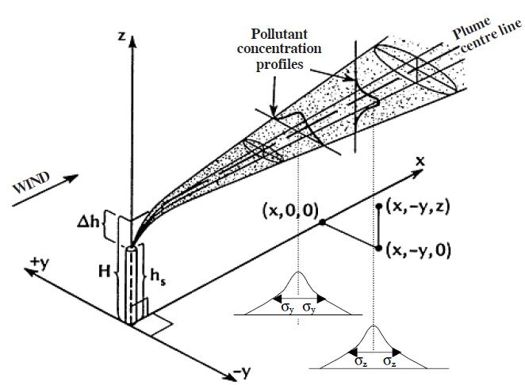
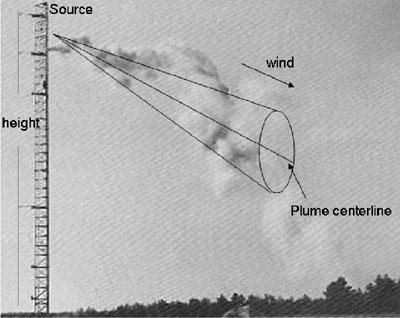
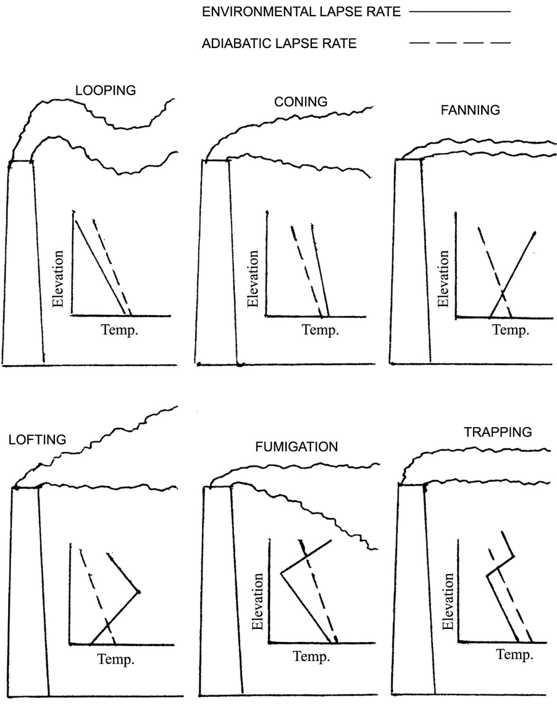
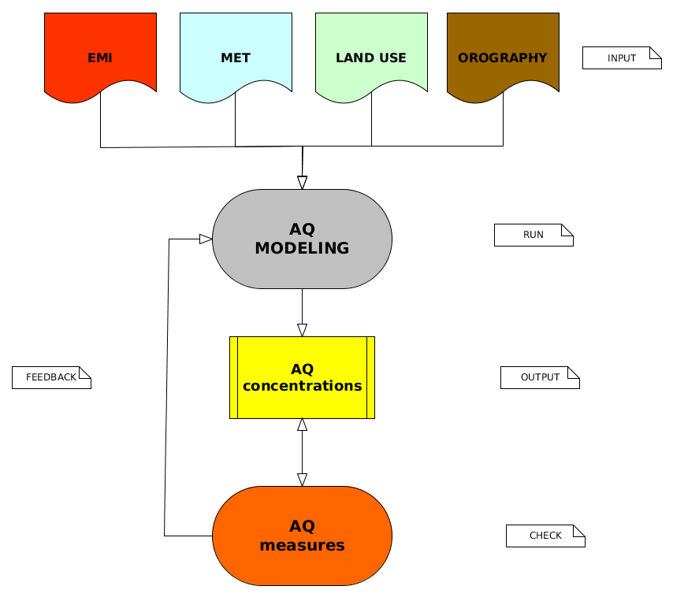

layout: true

background-image: url(./css/logo_arpetta.jpeg)
background-position: 98% 2%
background-size: 5%

```{r setup, include=FALSE}

options(htmltools.dir.version = FALSE)

knitr::opts_chunk$set(echo = FALSE,
                      warning = FALSE, 
                      message = FALSE,
                      comment = NA,
                      fig.retina = 3)
library(knitr)

```

---

layout: false
class: inverse, center, middle

# Breve premessa 
## (un po' filosofica)

# modelli, misure, stime

---
layout: true

background-image: url(./css/logo_arpetta.jpeg)
background-position: 98% 2%
background-size: 5%
---
# Che cos'è un modello?

- è una rappresentazione semplificata della realtà (necessariamente!)

- i modelli, anche quelli più complessi e sofisticati, non prescindono mai dall'utilizzo di misure (anch'esse dei modelli della realtà!)

#### dal reale al modello per .red[semplificazioni, astrazioni, assunzioni]


```{r}

knitr::include_graphics('./img/plume_historical.png') 
 
 

```

.footnote[
...e "tanto peggio per i fatti (se non si accordano con la teoria)", attribuita a Hegel
]

---
# plume spread: semplificazioni!

```{r echo=FALSE, eval=TRUE, fig.align='center'}



```
---

class: center, top

background-image: url(./img/montello_altimetria.png)
background-position: bottom
background-size: contain

# atimetria Montello (TV): semplificazioni!

---
class: center, bottom

background-image: url(./img/pianezze2.jpeg)
background-position: center
background-size: contain

# altezza di rimescolamento: astrazioni!

.white[***2011-01-18 11:00, vista da Pianezze (~1000 m slm), M.te Cesen, TV***]

---
# AERMOD vs. CALPUFF: assunzioni!

## algoritmi differenti  ->  risultati confrontabili?

cfr. mappe di ricaduta caso studio Fonderia di Montebelluna (TV)

- [stima AERMOD](./img/map_aermod.html)

- [stima CALPUFF](./img/map_calpuff.html)

### attenzione alle facili conclusioni, spesso errate...

```{r echo=FALSE, eval=TRUE, fig.align='center'}


```

.footnote[
"il dubbio non è piacevole ma la certezza è ridicola", Voltaire
]
---
# Perchè usare un sistema modellistico?

## ... non posso misurare!

- valutazioni di nuovi impianti in progetto
- valutazioni di modifiche progettuali per impianti esistenti 

## ... non conviene misurare!

- tecnicamente ed economicamente impossibile misurare in ogni punto "dello spazio e del tempo"

## ... non basta misurare!

- valutazione del contributo di una specifica sorgente
- analisi di scenario
---
# sistema modellistico QA: flow chart 

```{r eval=TRUE, echo=FALSE, fig.align='center', out.height=500, out.width=550}



```

---

layout: false
class: inverse, center, middle

## caso applicativo 
# Marchi Industriale SpA, Mirano (VE)
### [id sito 2479]

## le informazioni in 'catasti' sono sufficienti e complete?

---

layout: true

background-image: url(./css/logo_arpetta.jpeg)
background-position: 98% 2%
background-size: 5%

---
# input AERMOD

### dataset minimo per una valutazione di tipo 'speditivo'

descrizione sorgente di emissione puntuale (camino)

.pull-left-augmented[

*parametri geometrici e di esercizio*

1. coordinate piane (epsg:32632) 
  - X = 743912 
  - Y = 5038930

1. diametro camino [m] = 0.80

1. altezza camino [m] = 20.0

1. flusso massa inquinante [g/s] = 2.23

1. velocità uscita effluenti [m/s] = 12.4

1. temperatura effluenti [K] = 308.0

]

.pull-right-reduced[

*in 'catasti'?*

.red[NOK]
.white[blank row]
.white[blank row]
.white[blank row]

.green[OK]

.green[OK]

.green[OK, 2016]

.red[pars, ?]

.red[pars, ?]

]
---
# output AERMOD

- [stima AVG](./img/AERMOD_AVG.html)

- [stima P98](./img/AERMOD_P098.html)

- [stima P99](./img/AERMOD_P099.html)

- [stima P100](./img/AERMOD_P100.html)

- [sync stima AVG vs. P098 vs. P099 vs. P100](./img/AERMOD_cfr_AVG_P098_P099_P100.html)

---

# Conclusioni 
### (un punto di vista personale)

- la disponibilità di informazioni .red[aggiornate, validate e complete] è di fondamentale importanza:  rappresenta il fattore limitante per qualsiasi attività di valutazione (non solo modellistica!)

- i .red[dati ambientali] sono il vero patrimonio ('capitale non materiale') dell'Agenzia: la strutturazione, disponibilità e manutenzione di un efficiente e moderno sistema informativo è essenziale (vitale!)

... e .red['catasti fdp']?

uno strumento utile che si può (dovrebbe) migliorare e valorizzare a partire dall'.red[integrazione] delle necessità ed esigenze operative di tutte le (nuove) strutture dell'Agenzia

---
class: inverse, center, middle
layout: false

# Grazie per l'attenzione 

### massimo.bressan@arpa.veneto.it