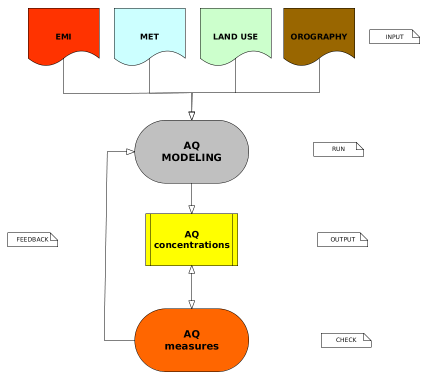

layout: true

background-image: url(./css/logo_arpetta.jpeg)
background-position: 98% 2%
background-size: 5%

```{r setup, include=FALSE}
options(htmltools.dir.version = FALSE)

knitr::opts_chunk$set(echo = FALSE,
                      warning = FALSE, 
                      message = FALSE,
                      comment = NA,
                      fig.retina = 3)
library(knitr)
library(tidyverse)
library(lubridate)
library(scales)

#heavy metals
hm <- read_csv("./data_input/input_murano_2021.csv") %>% 
  mutate(data=as_date(data, format="%d/%m/%Y"),
         anno=year(data))
```
---
layout: false
class: inverse, center, middle

# Monitoraggio qualità dell'aria 
## Analisi serie storica
---
layout: true

background-image: url(./css/logo_arpetta.jpeg)
background-position: 98% 2%
background-size: 5%
---
## Punto monitoraggio QA

```{r echo=FALSE, out.width='100%'}

library(leaflet)

myicon <- awesomeIcons(
  icon = 'home',
  library = 'glyphicon',
  iconColor = 'white',
  markerColor = 'orange')

leaflet() %>%
  addTiles() %>% 
  setView(lat = 45.455609, lng = 12.353883, zoom = 12) %>%
  addAwesomeMarkers(lat = 45.455609, lng = 12.353883, popup="campionatore PM10", icon=myicon)

```

---

##  Murano, Fondamenta Colleoni c/o SM Foscolo
#### campionatore PM10: prelievo 24h, portata 38.33 l/min (2.3 m3/h)

.pull-left[]

.pull-right[]
---

## Risultati monitoraggio 2021 Murano Foscolo

### Metalli [ng/m3]

```{r}

tab_2021<- hm %>%
  filter(stazione == "foscolo",
         data >= "2021-01-01")%>%
  group_by(stazione)%>%
  summarise(As=mean(As),
            Cd=mean(Cd),
            Ni=mean(Ni),
            Pb=mean(Pb))

knitr::kable(tab_2021[2:4], format = "html", caption = "c/o SM Foscolo", digits=1, align = 'c')

```
#### Valori limite metalli, ex DLgs. 155/2010

- As:   6.0 [ng/m3]

- Cd:   5.0 [ng/m3]

- Ni:  20.0 [ng/m3]

- Pb: 500.0  [ng/m3]

#### le concentrazioni medie annuali di Cadmio rappresentano una significativa criticità ambientale nell'isola di Murano

---

### Cadmio, boxplot 2017-2021, Sacca Fisola vs. Murano Foscolo

```{r echo=FALSE, fig.align ='center', fig.height=7.5, fig.width=9.5}

staz.labs <- c("Murano - SM Foscolo", "Venezia - Sacca Fisola")
names(staz.labs) <- c("foscolo", "fisola")

hm %>%
  mutate(anno=factor(year(data)))%>%
  filter(stazione %in% c("foscolo", "fisola"), 
         data >="2017-01-01")%>%
  ggplot(mapping=aes(x = anno, y = Cd)) +
  geom_jitter(width = 0.2, alpha=0.2)+
  geom_boxplot() +
  stat_summary(fun = "mean", color="red", shape=15)+
  coord_trans(y="log10")+
  scale_y_continuous(breaks = trans_breaks("log10", function(x) 10^x),
                     labels = trans_format("log10", math_format(10^.x)),
                     name="Cd [ng/m3]")+
  facet_wrap(.~stazione, labeller = labeller(stazione=staz.labs))+
  theme_bw()

```

---
### Cadmio, medie 24h 2016-2021, Murano Foscolo

```{r echo=FALSE, fig.align ='center', fig.height=7.5, fig.width=10}

hm %>%
  filter(stazione == "foscolo",
         data >= "2016-01-01")%>%
  ggplot(mapping=aes(x = data, y = Cd))+
  geom_point(alpha=0.2)+
  geom_line(alpha=0.2)+
  geom_smooth()+
  scale_x_date(name = NULL, date_breaks = "month", expand = c(0.01, 0.01))+
  scale_y_log10(breaks = trans_breaks("log10", function(x) 10^x),
                labels = trans_format("log10", math_format(10^.x)),
                name = "Cd [ng/m3]") +
  geom_vline(xintercept = as.numeric(ymd("2020-03-08")), linetype="dashed", color = "red", size=0.6)+
  geom_vline(xintercept = as.numeric(ymd("2020-06-03")), linetype="dashed", color = "red", size=0.6)+
  annotate(geom="text", x=ymd("2020-02-10"), y=2000, label="2020-03-08, inizio lockdown", color="red", size=3.5, angle =90)+
  annotate(geom="text", x=ymd("2020-05-10"), y=2000, label="2020-06-03, fine lockdown", color="red", size=3.5, angle =90)+
  annotation_logticks(sides="l")+
  #labs(title = "Stazione c/o Scuola Ugo Foscolo - Murano VE")+
  theme_bw()+
  theme(axis.text.x = element_text(angle = 90))

```

---
### Asenico, medie 24h 2016-2021, Murano Foscolo

```{r echo=FALSE, fig.align ='center', fig.height=7.5, fig.width=10}

hm %>%
  filter(stazione == "foscolo",
         data >= "2016-01-01")%>%
  ggplot(mapping=aes(x = data, y = As))+
  geom_point(alpha=0.2)+
  geom_line(alpha=0.2)+
  geom_smooth()+
  scale_x_date(name = NULL, date_breaks = "month", expand = c(0.01, 0.01))+
  scale_y_log10(breaks = trans_breaks("log10", function(x) 10^x),
                labels = trans_format("log10", math_format(10^.x)),
                name = "As [ng/m3]") +
  annotation_logticks(sides="l")+
  geom_vline(xintercept = as.numeric(ymd("2020-03-08")), linetype="dashed", color = "red", size=0.6)+
  geom_vline(xintercept = as.numeric(ymd("2020-06-03")), linetype="dashed", color = "red", size=0.6)+
  annotate(geom="text", x=ymd("2020-02-10"), y=10, label="2020-03-08, inizio lockdown", color="red", size=3.5, angle =90)+
  annotate(geom="text", x=ymd("2020-05-10"), y=10, label="2020-06-03, fine lockdown", color="red", size=3.5, angle =90)+
  #labs(title = "Stazione c/o Scuola Ugo Foscolo - Murano VE")+
  theme_bw()+
  theme(axis.text.x = element_text(angle = 90))

```
---
### Antimonio, medie 24h 2016-2021, Murano Foscolo

```{r echo=FALSE, fig.align ='center', fig.height=7.5, fig.width=10}

hm %>%
  filter(stazione == "foscolo",
         data >= "2016-01-01")%>%
  ggplot(mapping=aes(x = data, y = Sb))+
  geom_point(alpha=0.2)+
  geom_line(alpha=0.2)+
  geom_smooth()+
  scale_x_date(name = NULL, date_breaks = "month", expand = c(0.01, 0.01))+
  scale_y_log10(breaks = trans_breaks("log10", function(x) 10^x),
                labels = trans_format("log10", math_format(10^.x)),
                name = "Sb [ng/m3]") +
  annotation_logticks(sides="l")+
  geom_vline(xintercept = as.numeric(ymd("2020-03-08")), linetype="dashed", color = "red", size=0.6)+
  geom_vline(xintercept = as.numeric(ymd("2020-06-03")), linetype="dashed", color = "red", size=0.6)+
  annotate(geom="text", x=ymd("2020-02-10"), y=150, label="2020-03-08, inizio lockdown", color="red", size=3.5, angle =90)+
  annotate(geom="text", x=ymd("2020-05-10"), y=150, label="2020-06-03, fine lockdown", color="red", size=3.5, angle =90)+
  #labs(title = "Stazione c/o Scuola Ugo Foscolo - Murano VE")+
  theme_bw()+
  theme(axis.text.x = element_text(angle = 90))

```

---
### Cromo, medie 24h 2016-2021, Murano Foscolo

```{r echo=FALSE, fig.align ='center', fig.height=7.5, fig.width=10}
hm %>%
  filter(stazione == "foscolo",
         data >= "2016-01-01")%>%
  ggplot(mapping=aes(x = data, y = Cr))+
  geom_point(alpha=0.2)+
  geom_line(alpha=0.2)+
  geom_smooth()+
  scale_x_date(name = NULL, date_breaks = "month", expand = c(0.01, 0.01))+
  scale_y_log10(breaks = trans_breaks("log10", function(x) 10^x),
                labels = trans_format("log10", math_format(10^.x)),
                name = "Cr [ng/m3]") +
  annotation_logticks(sides="l")+
  geom_vline(xintercept = as.numeric(ymd("2020-03-08")), linetype="dashed", color = "red", size=0.6)+
  geom_vline(xintercept = as.numeric(ymd("2020-06-03")), linetype="dashed", color = "red", size=0.6)+
  annotate(geom="text", x=ymd("2020-02-10"), y=45, label="2020-03-08, inizio lockdown", color="red", size=3.5, angle =90)+
  annotate(geom="text", x=ymd("2020-05-10"), y=45, label="2020-06-03, fine lockdown", color="red", size=3.5, angle =90)+
  #labs(title = "Stazione c/o Scuola Ugo Foscolo - Murano VE")+
  theme_bw()+
  theme(axis.text.x = element_text(angle = 90))

```
---

### Nichel, medie 24h 2016-2021, Murano Foscolo

```{r echo=FALSE, fig.align ='center', fig.height=7.5, fig.width=10}
hm %>%
  filter(stazione == "foscolo",
         data >= "2016-01-01")%>%
  ggplot(mapping=aes(x = data, y = Ni))+
  geom_point(alpha=0.2)+
  geom_line(alpha=0.2)+
  geom_smooth()+
  scale_x_date(name = NULL, date_breaks = "month", expand = c(0.01, 0.01))+
  scale_y_log10(breaks = trans_breaks("log10", function(x) 10^x),
                labels = trans_format("log10", math_format(10^.x)),
                name = "Ni [ng/m3]") +
  annotation_logticks(sides="l")+
  geom_vline(xintercept = as.numeric(ymd("2020-03-08")), linetype="dashed", color = "red", size=0.6)+
  geom_vline(xintercept = as.numeric(ymd("2020-06-03")), linetype="dashed", color = "red", size=0.6)+
  annotate(geom="text", x=ymd("2020-02-10"), y=45, label="2020-03-08, inizio lockdown", color="red", size=3.5, angle =90)+
  annotate(geom="text", x=ymd("2020-05-10"), y=45, label="2020-06-03, fine lockdown", color="red", size=3.5, angle =90)+
  #labs(title = "Stazione c/o Scuola Ugo Foscolo - Murano VE")+
  theme_bw()+
  theme(axis.text.x = element_text(angle = 90))
```

---

### Piombo, medie 24h 2016-2021, Murano Foscolo

```{r echo=FALSE, fig.align ='center', fig.height=7.5, fig.width=10}

hm %>%
  filter(stazione == "foscolo",
         data >= "2016-01-01")%>%
  ggplot(mapping=aes(x = data, y = Pb))+
  geom_point(alpha=0.2)+
  geom_line(alpha=0.2)+
  geom_smooth()+
  scale_x_date(name = NULL, date_breaks = "month", expand = c(0.01, 0.01))+
  scale_y_log10(breaks = trans_breaks("log10", function(x) 10^x),
                labels = trans_format("log10", math_format(10^.x)),
                name = "Pb [ng/m3]") +
  annotation_logticks(sides="l")+
  geom_vline(xintercept = as.numeric(ymd("2020-03-08")), linetype="dashed", color = "red", size=0.6)+
  geom_vline(xintercept = as.numeric(ymd("2020-06-03")), linetype="dashed", color = "red", size=0.6)+
  annotate(geom="text", x=ymd("2020-02-10"), y=900, label="2020-03-08, inizio lockdown", color="red", size=3.5, angle =90)+
  annotate(geom="text", x=ymd("2020-05-10"), y=900, label="2020-06-03, fine lockdown", color="red", size=3.5, angle =90)+
  #labs(title = "Stazione c/o Scuola Ugo Foscolo - Murano VE")+
  theme_bw()+
  theme(axis.text.x = element_text(angle = 90))


```
---
layout: false
class: inverse, center, middle

# Modellistica atmosferica

---
layout: true

background-image: url(./css/logo_arpetta.jpeg)
background-position: 98% 2%
background-size: 5%
---
### Che cos'è un modello?

- è una rappresentazione semplificata della realtà (necessariamente!)

- i modelli, anche quelli più complessi e sofisticati, non prescindono mai dall'utilizzo di misure (che sono anch'esse dei modelli semplificati della realtà!)

#### dal reale al modello per .red[semplificazioni, astrazioni, assunzioni]


```{r}

knitr::include_graphics('./img_pres/plume_historical.png') 
 
knitr::include_graphics('./img_pres/plume_real_vs_model.png') 

```

.footnote[
...e "tanto peggio per i fatti (se non si accordano con la teoria)", attribuita a Hegel
]

---

## Perchè usare un sistema modellistico?

### ... non posso misurare!

- valutazioni di nuovi impianti in progetto
- valutazioni di modifiche progettuali per impianti esistenti 

### ... non conviene misurare!

- tecnicamente ed economicamente impossibile misurare in ogni punto "dello spazio e del tempo"

### ... non basta misurare!

- valutazione del contributo di una specifica sorgente
- analisi di scenario

---

# Flow chart modellistica amtosferica 

```{r eval=TRUE, echo=FALSE, fig.align='center', out.height=500, out.width=550}



```
---
### CALMET/CALPUFF

#### periodo simulazione settembre - dicembre 2017

#### nuovo run con dati storici su una singola sorgente 'rappresentativa'

- [stima AVG](./img_pres/20220904_cd_avg_periodo.html)

- [stima P98](./img_pres/20220904_cd_p098_periodo.html)

- [stima P100](./img_pres/20220904_cd_p100_periodo.html)

---
## Obiettivi progettuali modellistica atmosferica

***Obiettivo generale 1, obiettivo specifico 3***

***'analisi di sensitività' delle stime storiche rispetto a differenti sistemi modellistici: CALPUFF vs. LAMPMOD***

risponde alla domanda:

"le stime storiche (CALPUFF) sono congruenti rispetto a quelle prodotte con un nuovo e più evoluto sistema modellistico di tipo lagrangiano a particelle (LAPMOD)?"

***Obiettivo generale 2, obiettivo specifico 3***

***'analisi di scenario' in funzione di differenti input alle emissioni: nuova sperimentazione progettuale***

risponde alla domanda: 

"in che modo differenti 'diete di alimentazione' del forno fusorio influiscono sulle emissioni a camino e conseguentemente sullo stato di qualità dell'aria"

---

class: inverse, center, middle
layout: false

## Grazie per l'attenzione

### massimo.bressan@arpa.veneto.it