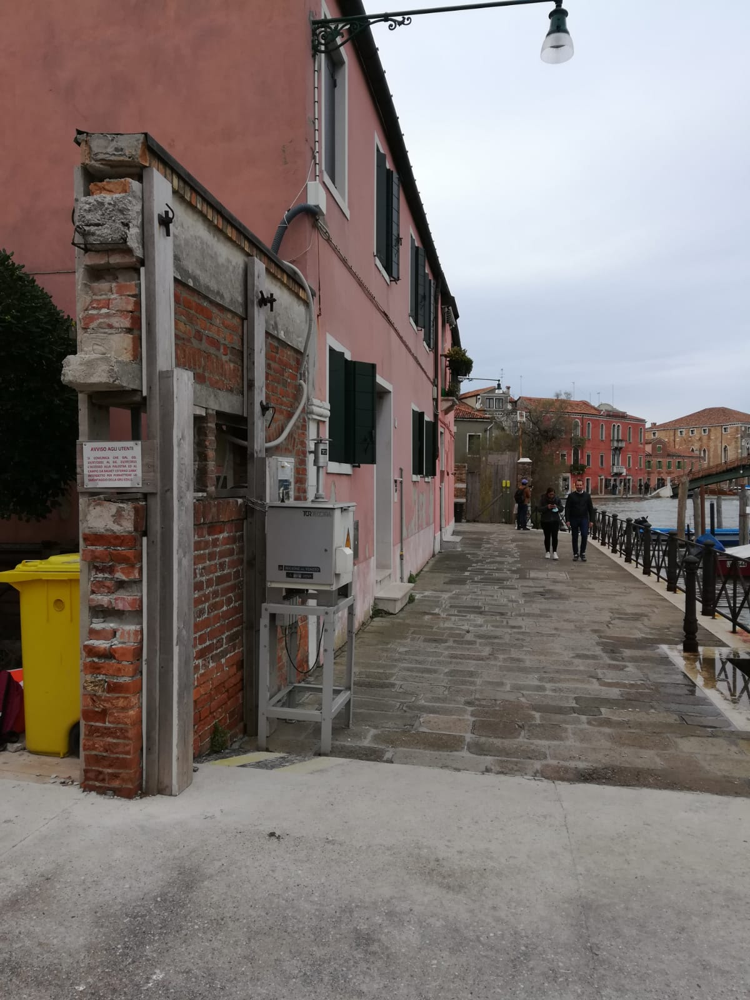

```{r echo=FALSE, out.height='100%', out.width='100%', out.extra='style="vertical-align:top; margin:30px 10px"'}


```

---
layout: true

background-image: url(./css/logo_arpetta.jpeg)
background-position: 98% 2%
background-size: 5%

```{r setup, include=FALSE}
options(htmltools.dir.version = FALSE)

knitr::opts_chunk$set(
	echo = FALSE,
	fig.retina = 3,
	message = FALSE,
	warning = FALSE,
	comment = NA
)
library(knitr)
library(kableExtra)
library(tidyverse)
library(scales)
library(leaflet)
library(mapview)
library(raster)
library(terra)
library(metR)
library(patchwork)
library(sf)
library(ggspatial)

#heavy metals
hm <- read_csv("./data_input/input_murano_metalli.csv") %>% 
  mutate(data=dmy(data),
         anno=year(data))
```

---

## Report progetto (agosto 2023)

```{r out.width='58%', out.height='58%', out.extra='style="border:2px solid #D3D3D3; vertical-align:top; margin:1px 150px"'}


```

---

## Report monitoraggio QA (agosto 2023)

```{r out.width='54%', out.height='54%', out.extra='style="border:2px solid #D3D3D3; vertical-align:top; margin:1px 150px"'}

include_graphics("./img_pres/RT_223UQA23.jpg")

```
---
## Panoramica iniziale: misure vs. modello

```{r eval=TRUE, echo=FALSE, fig.align='center', out.height=500, out.width=450}
#knitr::include_graphics('./img_pres/flow_chart_modellistica_qa.png')
knitr::include_graphics('./img_pres/flow_chart_AQ_it.png')

```

.red[*E' possibile accoppiare la precisione (puntale) delle misure con la capacità descrittiva (areale) del modello?*]

---
background-image: url("img_pres/02_mat_square_rot.jpg")
background-position: center
background-size: cover

layout: false
class: inverse, center, middle

.white[.huge[Stato di qualità dell'aria]]

---
layout: true

background-image: url(./css/logo_arpetta.jpeg)
background-position: 98% 2%
background-size: 5%
---
## Punti di monitoraggio QA

stazione fissa e campionatore

```{r  echo=FALSE, out.width='100%'}

myicon <- awesomeIcons(
  icon = 'home',
  library = 'glyphicon',
  iconColor = 'white',
  markerColor = 'orange')

ptlat <- c(45.455609, 45.4285)
ptlon <- c(12.353883, 12.313)

leaflet() %>% 
  addTiles() %>% 
  addProviderTiles(providers$CartoDB.Positron, group='carto db') %>%
  addProviderTiles(providers$Esri.WorldImagery, group='esri wi') %>%
  setView(lng= 12.339, lat = 45.4435, zoom = 12) %>% 
  addScaleBar()%>%
  addAwesomeMarkers(lng = ptlon,
             lat = ptlat,
             label=c("foscolo", "sacca fisola"),
             icon=myicon) %>% 
  addMeasure(position = "bottomleft",
             primaryLengthUnit = "meters",
             primaryAreaUnit = "sqmeters")  %>% 
  # Layers control
  addLayersControl(
    baseGroups = c("carto db", "esri wi"),
    position = "bottomright",
    options = layersControlOptions(collapsed = TRUE)
    )

```
---
##  Murano, Fondamenta Colleoni c/o Foscolo

campionatore PM10: prelievo 24h

<br>

.pull-left[]

.pull-right[]

---
### Cadmio, medie 24h 2016-2022, Foscolo

```{r echo=FALSE, fig.align ='center', fig.height=7.5, fig.width=10}

hm %>%
  filter(stazione == "foscolo",
         data >= "2016-01-01")%>%
  ggplot(mapping=aes(x = data, y = Cd))+
  geom_point(alpha=0.2)+
  geom_line(alpha=0.2)+
  geom_smooth()+
  scale_x_date(name = NULL, date_breaks = "2 months", expand = c(0.01, 0.01))+
  scale_y_log10(breaks = trans_breaks("log10", function(x) 10^x),
                labels = trans_format("log10", math_format(10^.x)),
                name = expression(paste("Cd [ ", ng~m^-3, " ]"))
                ) +
  geom_vline(xintercept = as.numeric(ymd("2020-03-08")), linetype="dashed", color = "red", size=0.6)+
  geom_vline(xintercept = as.numeric(ymd("2020-06-03")), linetype="dashed", color = "red", size=0.6)+
  annotate(geom="text", x=ymd("2020-02-10"), y=1000, label="2020-03-08, inizio lockdown", color="red", size=3, angle =90)+
  annotate(geom="text", x=ymd("2020-05-10"), y=1000, label="2020-06-03, fine lockdown", color="red", size=3, angle =90)+
  annotation_logticks(sides="l")+
  geom_hline(yintercept = 0.2, linetype="dashed", color = "green", size=0.5)+
  annotate(geom="text", x=ymd("2016-10-01"), y=0.15, label="LQ", colour="green", size=3.5)+
  #labs(title = "Stazione c/o Scuola Ugo Foscolo - Murano VE")+
  theme_bw()+
  theme(axis.text.x = element_text(size=6, angle = 90))

```

---
## Metalli, medie annuali c/o Foscolo

<br>

```{r}

tab_2017 <- hm %>%
  filter(stazione == "foscolo",
         data >= "2017-01-01")%>%
  group_by(stazione, anno)%>%
  summarise(n=n(),
            As=format(round(mean(As),1), nsmall=1),
            Cd=format(round(mean(Cd),1), nsmall=1),
            Ni=format(round(mean(Ni),1), nsmall=1),
            Pb=format(round(mean(Pb),0), nsmall=0))

knitr::kable(tab_2017[2:7], 
             col.names = c("anno", "n","As<br>VO = 6", "Cd<br>VO = 5", "Ni<br>VO = 20", "Pb<br>VL = 500"),
             escape = FALSE, # this is to allow the special character \n
             align = "c",
             format = "html",
             digits=c(0,0,1,1,1,0))%>%
  kableExtra::column_spec(4, color = "red")%>%
  kableExtra::add_header_above(c(" " = 2, "Metalli [ng/m3]" = 4)) %>% 
  kableExtra::footnote(general = c("n = numero campioni analizzati", 
                                   "VO = valore obiettivo (ex DLgs 155/2010)", 
                                   "VL = valore limite (ex DLgs 155/2010)")) 

```

<br>

.red[
sintesi:

tra i metalli normati le concentrazioni medie annuali di Cadmio [Cd] rappresentano una significativa e consolidata criticità ambientale
]

---
### PM10, boxplot 2017-2022, Sacca Fisola vs. Foscolo 

```{r echo=FALSE, fig.align ='center', fig.height=7.5, fig.width=10}

# pm10
pm10 <- read_csv("./data_input/input_murano_pm10.csv") %>%
  pivot_longer(-data, names_to = "stazione", values_to = "pm10") %>% 
  separate(stazione, c('sito','nome_staz'), sep = "_", extra='merge') %>% # this is to deal with the second underscore
  mutate(data = dmy(data), anno=year(data), mese=month(data), .after=data)

staz.labs <- c("Murano - Foscolo", "Venezia - Sacca Fisola")
names(staz.labs) <- c("foscolo", "fisola")

pm10 %>%
  mutate(anno=factor(anno))%>%
  filter(nome_staz %in% c("foscolo", "fisola"), 
         data >="2017-01-01")%>%
  ggplot(mapping=aes(x = anno, y = pm10)) +
  geom_boxplot(notch=TRUE) +
  geom_jitter(width = 0.2, alpha=0.1)+
  stat_summary(fun = "mean", color="red", size = 0.4, shape = 8)+
  labs(y=expression(paste("PM10 [ ", mu*g~m^-3, " ]")), 
       x=NULL)+
  facet_wrap(nome_staz~., labeller = labeller(nome_staz=staz.labs))+
  theme_bw()

```

???
...ma perchè mai ci parli del PM10? 
il Cadmio viene estratto analiticamente sul PM10 (matrice comune) ed una valutazione comparata prima del PM10 e come vedremo successivamente per il Cd rispetto a due siti adiacenti ci dice qualcosa di importante sui contributi locali e la specificità spaziale del fenomeno

---
### Cadmio, boxplot 2017-2022, Sacca Fisola vs. Foscolo

```{r echo=FALSE, fig.align ='center', fig.height=7.5, fig.width=9.5}

staz.labs <- c("Murano - Foscolo", "Venezia - Sacca Fisola")
names(staz.labs) <- c("foscolo", "fisola")

hm %>%
filter(stazione == "foscolo" | stazione == "fisola", anno >=2017) %>% 
  ggplot(aes(x = factor(anno), y = Cd))+
  geom_boxplot(notch=TRUE)+
  geom_jitter(width = 0.2, alpha=0.1)+
  stat_summary(fun = function(x) log10(mean(10^x)), geom='point', colour ="red", size = 2, shape = 8)+
  scale_y_log10(breaks = trans_breaks("log10", function(x) 10^x),
                labels = trans_format("log10", math_format(10^.x))) +
  annotation_logticks(sides="l", colour = "gray")+
  labs(x=NULL,
       y=expression(paste("Cd [ ", ng~m^-3, " ]"))
       )+
  facet_wrap(stazione ~., labeller = labeller(stazione=staz.labs))+
  theme_bw() 

```

---

### Cadmio, boxplot mese tipo 2017-2022: Sacca Fisola vs. Foscolo

```{r echo=FALSE, fig.align ='center', fig.height=8, fig.width=10}

# hm %>%
#   filter(stazione == "foscolo" | stazione == "fisola", anno >=2017) %>% 
#   ggplot(aes(x = factor(month(data, label=TRUE)), y = Cd, colour = stazione))+
#   geom_boxplot(notch=TRUE)+
#   stat_summary(fun = function(x) log10(mean(10^x)), geom='point', size = 1.5, shape = 8, position=position_dodge(width = 0.8), show.legend = FALSE)+
#   scale_y_log10(breaks = trans_breaks("log10", function(x) 10^x),
#                 labels = trans_format("log10", math_format(10^.x))) +
#   annotation_logticks(sides="l", colour = "gray")+
#   scale_colour_manual(labels=c("Sacca Fisola", "Foscolo"), values = c("#00BFC4", "#F8766D"))+
#   labs(colour = "stazione",
#        x = NULL,
#        y =expression(paste("Cd [ ", ng~m^-3, " ]"))
#        )+
#   guides(color=guide_legend("sito"))+ 
#   theme_bw()+
#   theme(legend.position = "bottom")

hm %>%
  filter(stazione == "foscolo" | stazione == "fisola", anno >=2017) %>% 
  ggplot(aes(x = factor(month(data, label=TRUE)), y = Cd, colour = stazione))+
  geom_boxplot(notch=TRUE, linewidth=0.5, alpha=0.5)+
  stat_summary(fun = median,
               geom = 'line',
               aes(group = stazione, colour = stazione),
               position = position_dodge(width = 0.9),
               linewidth=0.5,
               lty="longdash") + 
  scale_y_log10(breaks = trans_breaks("log10", function(x) 10^x),
                labels = trans_format("log10", math_format(10^.x))) +
  annotation_logticks(sides="l", colour = "gray")+
  scale_colour_manual(labels=c("Sacca Fisola", "Foscolo"),
                      values = c("#00BFC4", "#F8766D")
                      )+
  labs(colour = "stazione",
       x = NULL,
       y = expression(paste("Cd [ ", ng~m^-3, " ]")))+
  guides(color=guide_legend("sito"))+ 
  theme_bw()+
  theme(legend.position = "bottom")

```

---

background-image: url("img_pres/03_mat_square_rot.jpg")
background-position: center
background-size: cover

layout: false
class: inverse, center, middle

.white[.huge[Modellistica atmosferica]]

---
layout: true

background-image: url(./css/logo_arpetta.jpeg)
background-position: 98% 2%
background-size: 5%
---
## Che cos'è un modello?

- è una rappresentazione semplificata della realtà (...necessariamente!)

- i modelli, anche i più complessi e sofisticati, non prescindono mai dall'utilizzo di misure (... che sono modelli semplificati della realtà!)

<br/>

#### dal reale al modello per .red[semplificazioni, astrazioni, assunzioni]

<br/>

```{r}

 
knitr::include_graphics('./img_pres/plume_scheme.png') 
knitr::include_graphics('./img_pres/plume_real_vs_model.png') 

```

<br>

.red[il modello è una rappresentazione semplificata della realtà che presuppone un elevato grado di complessità formale]

---
## Perchè utilizzare un modello?

<br>

###... non posso misurare!

- valutazioni di nuovi progetti
- valutazioni di modifiche progettuali per impianti esistenti 

###... non conviene misurare!

- tecnicamente ed economicamente impossibile misurare in ogni punto "dello spazio e del tempo"

###... non basta misurare!

- valutazione del contributo relativo di una o più sorgenti
- analisi di scenario

---
## Che cos'è un modello per la valutazione di impatto ambientale?

<br>

- **un sistema di supporto alle decisioni**

- **uno strumento per trarre conclusioni informate e ripercorribili**

<br>

**con le seguenti caratteristiche principali (*trade-offs*):**

- .red[*"condiziona e subordina"*], almeno in parte, il rigoroso approccio di tipo fisico-chimico (*come fare le stime*) 

- per .red[*"privilegiare ed indirizzare"*] le conclusioni sugli aspetti di tipo operativo-gestionale (*cosa fare con le stime*)

---
## Obiettivi progettuali

<br/>

Obiettivo generale 1, obiettivo specifico 3

***'analisi di sensitività' dei risultati rispetto all'utilizzo di differenti sistemi modellistici: CALPUFF vs. LAPMOD***

<br>

Risponde alle domande:

- Le .red[stime] risalenti al 2017 con CALPUFF sono congruenti con quelle di un nuovo e più evoluto sistema modellistico lagrangiano a particelle LAPMOD?

- Le .red[misure] di qualità dell'aria sono congruenti con le stime prodotte con CALPUFF e/o LAPMOD? A che cosa sono dovute eventuali differenze?

- Esiste un .red['deficit informativo'] relativo alla corretta e completa caratterizzazione delle sorgenti di emissione? Il .red['censimento'] 2017 delle vetrerie è accurato per numero di sorgenti, qualità e quantità di emissioni prodotte? 

---
## Le vetrerie (sorgenti di emissione) 

25 autorizzate all'impiego di Cadmio, periodo di simulazione: Settembre - Dicembre 2017

```{r eval=TRUE, echo=FALSE, fig.align='center', out.width='100%'}

# read table vetrerie
vetr25 <- read_csv('./data_input/lista_25_vetrerie.csv')

# cache.extra = tools::md5sum("./data_input/lista_25_vetrerie.csv")

# spatial vector
vetr25<-vect(vetr25, geom=c("x", "y"), crs="epsg:32632", keepgeom=FALSE)

#reproject lon lat
vetr25<-project(vetr25, "epsg:4326")

# dataframe
vetr25<-as.data.frame(vetr25, geom="XY")

vetr25 %>% 
  
  leaflet() %>% 
  
  addTiles() %>% 
  
  # add basemap
  addProviderTiles(providers$CartoDB.PositronNoLabels, group='carto db') %>%
  
  addProviderTiles(providers$Esri.WorldImagery, group='esri wi') %>%
  
  # focus map in a certain area / zoom level
  setView(lng = 12.352, lat = 45.4565, zoom = 16.2) %>%
  
  ### Add scale bar
  addScaleBar(position = "bottomright")%>%
  
  # add points
  addCircleMarkers(lng = ~x,
                   lat = ~y,
                   #label = mydf$sito,
                   weight = 1,
                   color = 'black',
                   fill=FALSE,
                   #fillColor = 'red',
                   radius = 0.8,
                   opacity = 0.7,
                   #fillOpacity = 1,
                   stroke = TRUE #,
                   #labelOptions = labelOptions(noHide = TRUE, textOnly=TRUE, offset=c(0.1, 0))
                   ) %>% 
  
  # add labels
  addLabelOnlyMarkers(lng = ~x+0.000085,
                      lat = ~y-0.00008,
                      label = ~abbr,
                      labelOptions = labelOptions(#offset = c(10, -18),
                        textOnly=TRUE, noHide = TRUE,
                        textsize = "12px",
                        style = list("color" = "red"))
                      )%>% 
  addMeasure(position = "bottomleft",
             primaryLengthUnit = "meters",
             primaryAreaUnit = "sqmeters") %>% 
  # Layers control
  addLayersControl(
    baseGroups = c("carto db", "esri wi"),
    position = "bottomright",
    options = layersControlOptions(collapsed = TRUE)
    )
```

---
## I punti di misura e stima (recettori discreti)

3 punti di misura QA da confrontare puntualmente con output modellistici, periodo di simulazione: Settembre - Dicembre 2017

```{r eval=TRUE, echo=FALSE, fig.align='center', out.width='100%'}

# read data for monitoring points
p <- read_csv('./data_input/murano_siti_monitor_cd.csv')

# spatial vector
p <- vect(p, geom=c("x", "y"), crs="epsg:32632", keepgeom=FALSE)

# reproject to lon lat
p <- project(p, "epsg:4326")

# here working again with plain df
p <- as.data.frame(p, geom="XY")

p %>%
  leaflet() %>% 
  
  addTiles() %>% 
  
  addProviderTiles(providers$CartoDB.PositronNoLabels, group='carto db') %>%
  
  addProviderTiles(providers$Esri.WorldImagery, group='esri wi') %>%
  
  # focus map in a certain area / zoom level
  setView(lng=12.35, lat=45.455, zoom = 16) %>%
  
  ### Add scale bar
  addScaleBar()%>%
  
  # add points
  addCircleMarkers(lng = ~x,
                   lat = ~y,
                   #label = mydf$sito,
                   weight = 0.5,
                   #color = 'white',
                   fillColor = 'red',
                   radius = 3,
                   fillOpacity = 0.9,
                   stroke = FALSE) %>% 
  
  # add labels
  addLabelOnlyMarkers(lng = ~x+0.0002,
                      lat = ~y+0.0003,
                      label = ~sito,
                      labelOptions = labelOptions(#offset = c(10, -18),
                      textOnly=TRUE, noHide = TRUE, 
                      textsize = "13px",
                      style = list("color" = "red"))
                      )%>% 
  addMeasure(position = "bottomleft",
             primaryLengthUnit = "meters",
             primaryAreaUnit = "sqmeters") %>% 
  # Layers control
  addLayersControl(
    baseGroups = c("carto db", "esri wi"),
    position = "bottomright",
    options = layersControlOptions(collapsed = TRUE)
    )

```

---
## Scenario base (cautelativo)


- dominio temporale: periodo di riferimento set - dic 2017

- dominio spaziale:  4 km x 4 km (centrato su isola Murano)

- risoluzione griglia: 50 m

- 25 sorgenti: vetrerie autorizzate all'impiego dei composti del cadmio (ultima mappatura completa delle sorgenti emissive)

- .red[*portata effluenti max: autorizzata*]

- .red[*concentrazione: max autorizzata (0.1 mg/m3)*]

- profilo di attività temporale ricavato da sistema 'telecontrollo'

- temperatura e velocità fumi da autocontrolli e controlli ispettivi

- generico inquinante ‘inerte’ (no trasformazioni fisico-chimiche)

- 3 punti di controllo per la verifica delle stime vs. misure QA (Foscolo, Marco, Serenella)

<br>

.red[valutato con due sistemi modellistici: CALPUFF vs. LAPMOD]

---

### Scenario base: media periodo, stime CALPUFF

<br>

```{r val=TRUE, echo=FALSE, fig.align='center', out.width='100%'}

cp_r_avg <- raster('./data_input/calpost_grid/rank(0)_cd_2952hr_conc_cd.grd') 

# remember the CALPUFF extent in km
new_extent <- raster::extent(raster::xmin(cp_r_avg) * 1000, raster::xmax(cp_r_avg) * 1000, 
                             raster::ymin(cp_r_avg) * 1000, raster::ymax(cp_r_avg) * 1000)

cp_r_avg <- raster::setExtent(cp_r_avg, new_extent)

raster::crs(cp_r_avg) <- 32632

# prepare palette
pal_cp <- colorNumeric("viridis", domain=values(cp_r_avg),
                    na.color = "transparent")

ptlat <- 45.45 
ptlon <- 12.35

leaflet() %>% 
  addTiles() %>%
  addProviderTiles(providers$CartoDB.PositronNoLabels) %>%
  setView(lng = ptlon, lat = ptlat, zoom = 13) %>%
  addRasterImage(cp_r_avg, colors = pal_cp, opacity = 0.4) %>%
  addLegend(pal = pal_cp, 
            values = values(cp_r_avg), 
            title = "Cd<br>[ng/m3]", 
            opacity=0.4,
            bins=5) %>% 
  addMeasure(position = "bottomleft",
             primaryLengthUnit = "meters",
             primaryAreaUnit = "sqmeters") 

```

---

### Scenario base: media periodo, stime LAPMOD

<br>

```{r val=TRUE, echo=FALSE, fig.align='center', out.width='100%'}

lp_r_avg <- raster('./data_input/lapost_grid/annual.grd') 

raster::crs(lp_r_avg) <- 32632

pal_lp <- colorNumeric("viridis", domain=values(lp_r_avg),
                    na.color = "transparent")

leaflet() %>% 
  addTiles() %>%
  addProviderTiles(providers$CartoDB.PositronNoLabels) %>%
  setView(lng = ptlon, lat = ptlat, zoom = 13) %>%
  addRasterImage(lp_r_avg, colors = pal_lp, opacity = 0.4) %>%
  addLegend(pal = pal_lp, 
            values = values(lp_r_avg),
            title = "Cd<br>[ng/m3]",
            opacity=0.4) %>% 
  addMeasure(position = "bottomleft",
             primaryLengthUnit = "meters",
             primaryAreaUnit = "sqmeters") 

```

---
### Scenario base: media periodo, isolinee CALPUFF vs. LAPMOD 

```{r, fig.align = 'top', fig.width = 109, fig.height = 8.5, out.width = '100%', out.height = '100%', fig.retina = 3, eval = TRUE}

source('./rscript_source/03_read_grid_plot_contour_model_output_avg_period_presentazione.R')


```

.tiny[.red['+' recettore, 'o' sorgente]]
.center[.red[&rarr;] [*link img*](./img_pres/contour_calpuff_vs_lapmod_avg.png)]

---

### Scenario base: stime presso i recettori, CALPUFF vs. LAPMOD 

```{r}

# read discrete receptors
cpf_lap_mis <- read_csv('./data_input/recettori_calpuff_lapmod_misure.csv')

summary_cpf_lap_mis <- cpf_lap_mis %>%
  group_by(recettore, stima) %>%
  summarise(#n = sum(!is.na(valore)), # this accounting for the number of observations excluding NA
            avg=mean(valore, na.rm=TRUE),
            p98=quantile(valore, 0.98, na.rm=TRUE),
            max=max(valore, na.rm=TRUE)) 


summary_cpf_lap_mis %>%
  knitr::kable(col.names = c("recettore", "stima", "media", "98° perc.", "max"),
               caption = "valori di concentrazione in [ng/m3]",
               align = "c",
               digits=c(0,0,1,1,1)
               ) %>%
  #kableExtra::collapse_rows(columns = 1, valign = "middle") %>% 
  #kableExtra::column_spec(4, color = "red") %>% 
  kableExtra::row_spec(c(3,6,9), color = "red")

```

*sintesi*: 

- .red[accettabile convergenza stime CALPUFF e LAPMOD], più evidente rispetto al valore medio (statistica 'robusta');

- .red[significativa divergenza rispetto alle misure ambientali] (ordini di grandezza), indipendente dal tipo di modello utilizzato;

---

### Scenario base: medie 24h, CALPUFF vs. LAPMOD vs. misura Foscolo

```{r fig.align='center', out.width='75%', out.height='75%'}

# here define a named vectos for colors
cols <- c("misura" = "#00BA38", "lapmod" = "#619CFF", "calpuff"="#F8766D")

# transformation factor
coeff<-1000

fos_cal <- cpf_lap_mis %>% 
  filter(recettore=="foscolo") %>% 
  pivot_wider(id_cols=c(data,recettore), names_from = stima, values_from = valore) %>% 
  ggplot() + 
  geom_line(aes(x=data, y = misura, colour="misura"), linewidth = 0.75)+
  geom_line(aes(x=data, y = calpuff*coeff, colour = "calpuff"), linewidth = 0.75)+
  scale_y_continuous(name = expression(paste("misura [ ", ng~m^-3, " ]")), 
                     #limits=c(0,2100), 
                     sec.axis = sec_axis(~./coeff, name=expression(paste("calpuff [ ", ng~m^-3, " ]"))))+
  #ylim(0, 2100)+
  coord_cartesian(ylim = c(0, 2500)) + #this is the safest option to avoid any conversion of data to NA
  scale_x_date(name=NULL, breaks="month", date_labels = "%d-%b-%y")+
  scale_color_manual(values=cols)+
  theme_minimal()+
  theme(legend.position="top", legend.title = element_blank())

fos_lap <- cpf_lap_mis %>% 
  filter(recettore=="foscolo") %>% 
  pivot_wider(id_cols=c(data,recettore), names_from = stima, values_from = valore) %>% 
  ggplot() + 
  geom_line(aes(x=data, y = misura, colour="misura"), linewidth = 0.75)+
  geom_line(aes(x=data, y = lapmod*coeff, colour = "lapmod"), linewidth = 0.75)+
  scale_y_continuous(name = expression(paste("misura [ ", ng~m^-3, " ]")), 
                     #limits=c(0,2100), 
                     sec.axis = sec_axis(~./coeff, name=expression(paste("lapmod [ ", ng~m^-3, " ]"))))+
  #ylim(0, 2100)+
  coord_cartesian(ylim = c(0, 2500)) + #this is the safest option to avoid any conversion of data to NA
  scale_x_date(name=NULL, breaks="month", date_labels = "%d-%b-%y")+
  scale_color_manual(values=cols)+
  theme_minimal()+
  theme(legend.position="top", legend.title = element_blank())

# compose two charts
fos_cal / fos_lap #+ plot_annotation(title = "Foscolo: misura vs. lapmod vs. calpuff")

```

???

per brevità qui non si riportano i grafici relativi agli altri due recettori: Marco e Serenella, perché valgono anche in questi casi valgono considerazione del tutto analoghe a Foscolo

---
## E' possibile 'avvicinare' le stime alle misure?

<br>

Definizione di uno scenario *'altamente cautelativo'* che rispetto allo scenario *'base' (già cautelativo)* considera gli effetti dovuti a .red[‘building downwash’] (solo indirettamente in LAPMOD!) ed annullamento del .red[‘plume rise’].

.red[*Che cosa significa dal punto di vista modellistico?*]

*building downwash (calcolo del)*

- la cattura del pennacchio inquinante emessa dai camini di emissione all’interno della scia degli edifici circostanti 

*plume rise (annullamento del)*

- la spinta di tipo meccanico e termico di innalzamento del pennacchio degli inquinanti emessi a camino

.red[*Qual è la traduzione in termini di impatto?*]

.red[
- *simulare artificiosamente un effetto complessivo di abbassamento del pennacchio per stimare maggiori concentrazioni di inquinante al suolo*
]

---

### Scenario altamente cautelativo: stime LAPMOD presso i recettori

```{r}

# read discrete receptors
lap_mis_l <- read_csv('./data_input/recettori_lapmod_base_hbdpr_vs_misura.csv')

summary_lap_mis <- lap_mis_l %>% 
  group_by(recettore, stima) %>% 
  summarise(#n=sum(!is.na(valore)),
            #min=min(valore, na.rm=TRUE),
            #p25=quantile(valore, 0.25, na.rm=TRUE),
            avg=mean(valore, na.rm=TRUE),
            #median=median(valore, na.rm=TRUE),
            #p75=quantile(valore, 0.75, na.rm=TRUE),
            p98=quantile(valore, 0.98, na.rm=TRUE),
            max=max(valore, na.rm=TRUE)) 


summary_lap_mis %>% 
 knitr::kable(col.names = c("recettore", "stima*", "media", "98° perc.", "max"),
               caption = "Valori di concentrazione in [ng/m3]",
               align = "llccc",
               digits=1,) %>% 
  kableExtra::row_spec(c(3,6,9), color = "red") %>% 
  kableExtra::footnote(general = c("base = stime LAPMOD scenario base", 
                                     "bdnpr = stime LAPMOD scenario altamente cautelativo", 
                                     "misure = concentrazioni ambientali presso i recettori"))

```

<br>
.small[
...perchè solo LAPMOD?

considerato che le stime sono risultate sufficientemente 'indipendenti' dal tipo di modello (CALPUFF vs LAPMOD) è stato preferito il sistema che permette la migliore 'risoluzione' nel campo vicino

]
---
### Scenario altamente cautelativo: LAPMOD valutazione risultati

<br>

- .red[stime di concentrazione più elevate], in particolare per percentili ‘alti’, rispetto allo scenario 'base';

- *.red[le stime non riescono comunque ad avvicinare in modo significativo] i livelli ambientali di concentrazione misurati dalle stazioni qa*;

Limitando il confronto alle medie di periodo, si osserva .red[*il rapporto tra valori valori misurati e valori stimati*] presso i recettori discreti:

- circa *100* per *Foscolo*,  circa *83* per *Marco*,  circa *118* per *Serenella*,

- con un .red[*valore medio*] di tali rapporti che è pari a circa .red[*100*]. 

<br>

In altri termini:

- .red[*partendo dallo scenario di valutazione 'altamente cautelativo' (costruito a sua volta su uno scenario di tipo 'cautelativo'), le emissioni in ingresso al modello devono essere incrementate di circa 100 volte per  ottenere valori simulati (stime) paragonabili a quelli ambientali osservati (misure).*]

---
background-image: url("img_pres/cotisso_orange.jpg")
background-position: center
background-size: cover

layout: false
class: inverse, center, middle

.white[.huge[Conclusioni]]

---
## Conclusioni: stato QA

<br>
- una significativa e consolidata criticità delle .red[concentrazioni ambientali di Cd]: dal 2017 presso il sito Foscolo medie annuali sistematicamente .red[superiori al valore obiettivo di 5 ng/m3];

-  la specificità  dei valori ambientali di Cd presso presso il sito Foscolo (Murano) rispetto a Sacca Fisola (Venezia) rende conto di un .red[significativo contributo a carattere locale] da ricondurre necessariamente all'attività delle vetrerie;

- la serie storica delle medie giornaliere di Cd rilevate in modo continuativo a partire da metà 2016 presso il sito Foscolo evidenzia un .red[andamento tipicamente altalenante] da mettere in relazione alle .red[emissioni a ciclo discontinuo] prodotte dalle vetrerie.

---
## Conclusioni: modellistica atmosferica

<br>

- la simulazione di dispersione con due alternativi sistemi modellistici (CALPUFF e LAPMOD) ha evidenziato una .red[significativa sottostima] rispetto alle misure ambientali da ricondurre senza alcun dubbio all’.red[incompleta caratterizzazione del profilo emissivo], sia in termini di numero di sorgenti attive che per quantità inquinanti;

- la ‘chiusura di stima’ rispetto alle vetrerie effettivamente presenti ed operanti nell'isola e la quantificazione del loro contributo sullo stato di qualità dell’aria presuppone necessariamente l'.red[attualizzazione del censimento] delle sorgenti attive e dei loro profili emissivi (parte di una nuova possibile attività progettuale?).

---
## Ipotesi di lavoro futuro 
<br>

- costruire un efficace .red[sistema di supporto alle decisioni] per la gestione della qualità dell’aria incentrato su analisi di scenario 

- con .red['valutazioni controfattuali'] (scenario reale vs. possibile scenario futuro) definite in funzione di:
  - pianificazione/programmazione/progettazione del territorio;
  - vincoli urbanistici ed architettonici;
  - prescrizioni autorizzative all'esercizio;
  - materiali di processo impiegati (quantità e tipologia);
  - gestione operativa delle vetrerie e implementazione di sistemi di abbattimento;
  - valutazione costi-benefici.

---

background-image: url("img_pres/cotisso_giallo.jpg")
background-position: center
background-size: cover

class: inverse, center, middle
layout: false

## Grazie per l'attenzione

### consuelo.zemello@arpa.veneto.it
### massimo.bressan@arpa.veneto.it

<br>
.white[https://shorturl.at/akmJV]
