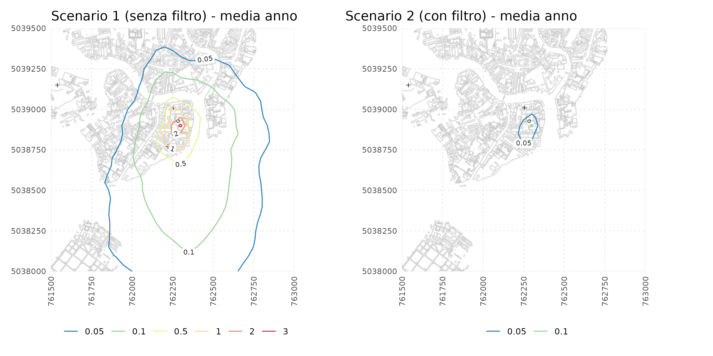
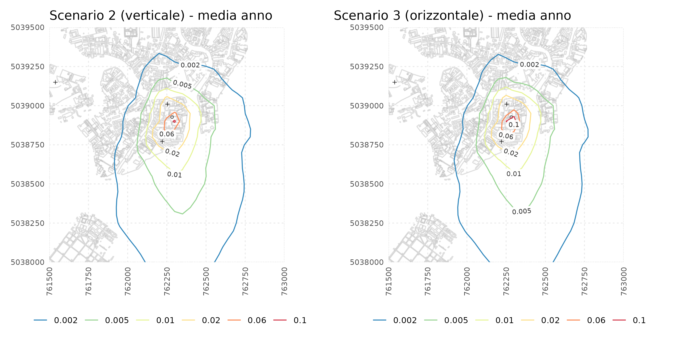
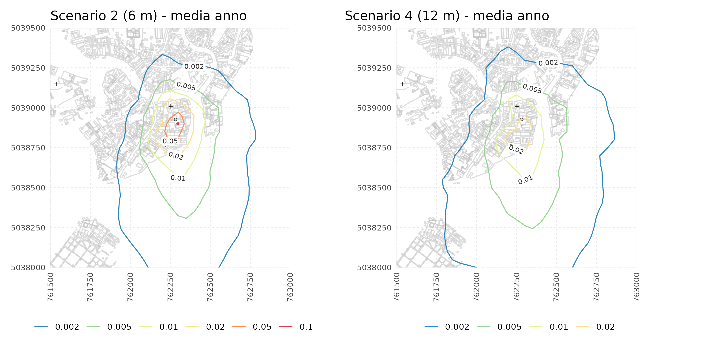

```{r echo=FALSE, out.height='100%', out.width='100%', out.extra='style="vertical-align:top; margin:30px 10px"'}


```

---
layout: true

background-image: url(./css/logo_arpetta.jpeg)
background-position: 98% 2%
background-size: 5%

```{r setup, include=FALSE}
options(htmltools.dir.version = FALSE)

knitr::opts_chunk$set(echo = FALSE,
                      warning = FALSE, 
                      message = FALSE,
                      comment = NA,
                      fig.retina = 3)
library(knitr)
library(kableExtra)
library(tidyverse)
library(scales)
library(leaflet)
library(mapview)
library(raster)
library(terra)
library(metR)
library(patchwork)
library(sf)
library(ggspatial)

```

---
## Obiettivi progettuali

<br>

***Obiettivo generale 2, obiettivo specifico 3***

***'analisi di scenario' in funzione di differenti input alle emissioni su nuova sperimentazione progettuale 'Effetre'***

<br>

risponde alla domanda: 

.red[*in che modo differenti 'diete' di alimentazione e configurazioni operative della 'linea di fusione' influiscono sulle emissioni a camino e conseguentemente sullo stato di qualità dell'aria*]

---
background-image: url("img_pres/02_mat_square_rot.jpg")
background-position: center
background-size: cover

layout: false
class: inverse, center, middle

.white[.huge[Emissioni forno sperimentale]]

---

layout: true

background-image: url(./css/logo_arpetta.jpeg)
background-position: 98% 2%
background-size: 5%

---

background-image: url("img_pres/montage_fornace.jpg")
background-position: center
background-size: contain

---

background-image: url("img_pres/montage_mat_forno.jpg")
background-position: center
background-size: contain

---
## Misure a monte sistema di filtrazione

```{r}
# read file with table for emissions pilot furnace
tab_emi_prove_f3_new <- readr::read_csv('./data_input/tab_emi_prove_f3_new.csv', skip= 2)

tab_emi_prove_f3_new[,c(1,3:8)] %>%
  knitr::kable(.,
             col.names = c("n", 
                           "materiale",
                           "vel\n[m/s]",
                           "temp\n[°C]",
                           "portata\n[Nm3/h]",
                           "conc\n[mg/Nm3]",
                           "rateo\n[mg/s]"),
             align = "c",
             format ='html') %>% 
  row_spec(3, color="red", italic = TRUE) 

```

<br>
.red[rateo emissivo prova n. 3 (caso peggiore cotisso): simulazioni modellistiche di scenario per aziende *senza* 'obbligo sistemi filtrazione']

---
## Misure a valle sistema filtrazione

```{r}


tab_emi_prove_f3_new[,c(1, 3,9:13)] %>%
  knitr::kable(.,
             col.names = c("n",
                           "materiale",
                           "vel\n[m/s]",
                           "temp\n[°C]",
                           "portata\n[Nm/H]",
                           "conc\n[mg/Nm3]",
                           "rateo\n[mg/s]"),
             align = "c",
             format ='html')  %>% 
  row_spec(5, color="red", italic = TRUE) 
```

<br>
.red[rateo emissivo prova n. 5 (caso peggiore 'minerale'): simulazioni modellistiche di scenario per aziende *con* 'obbligo sistemi filtrazione']

---

background-image: url("img_pres/montage_linea_prelievo_emi.jpg")
background-position: center
background-size: contain

---
background-image: url("img_pres/03_mat_square_rot.jpg")
background-position: center
background-size: cover

layout: false
class: inverse, center, middle

.white[.huge[Modellistica atmosferica]]

.white[.huge[analisi di scenario]]

---
layout: true

background-image: url(./css/logo_arpetta.jpeg)
background-position: 98% 2%
background-size: 5%
---

background-image: url("img_pres/camino_f3_mappa_foto.png")
background-position: bottom
background-size: contain

## Punto di emissione 'Effetre' (sperimentale)

- sbocco orizzontale, a parete

- diametro 0.25 m, quota emissione 6 m dal suolo

- direzione N

---
## Setup modellistico (in breve)

- CALMET
  - dominio: 8 km * 10 km
  
  - griglia regolare: 500 m
  
  - periodo di riferimento: anno 2022

- LAPMOD v. 20220331 (upgrade: camini qualsiasi direzione)

  - dominio: 4 km * 4 km
  
  - .red[griglia regolare: 50 m] (risoluzione fine!)
  
  - 'tuning' parametri modello con analisi di sensitività risultati 
  
<br>
Per maggiori ed ulteriori dettagli report finale di progetto.


---
## Scenari di valutazione: descrizione (1/2)

- .red[**Scenario 1**]

  caso tipo aziende .red[non obbligate] filtrazione, rateo emissivo .red[*a monte*] sistema filtrazione ('Effetre'), forno alimentato con .red[*cotisso rosso opaco*], camino .red[*6 m*] con sbocco .red[*verticale*];

- .red[**Scenario 2**]
  
  caso tipo aziende .red[obbligate] filtrazione, rateo emissivo .red[*a valle*] sistema filtrazione ('Effetre'), forno alimentato con .red[*CdS*], camino .red[*6 m*] con sbocco .red[*verticale*];

- .red[**Scenario 3**]

  caso reale sperimentazione 'Effetre', rateo emissivo .red[*a valle*] sistema di filtrazione, forno alimentato con .red[*CdS*], camino .red[*6 m*] con sbocco .red[*orizzontale*] a parete;

- .red[**Scenario 4**]

  idem .red[*Scenario 2*], ad eccezione per camino .red[*12 m*] (*altezza doppia*);

---
## Scenari di valutazione: descrizione (2/2)

per una effettiva confrontabilità delle stime, in tutti gli scenari:

- temperatura *media* e velocità *media* degli effluenti misurati *'a valle'* del sistema di filtrazione;

- *profilo tipo di attività* più possibile aderente ad una vetreria artistica *'media'*, considerate le principali festività, le ferie (agosto) ed il periodo di fermo produttivo (seconda metà dicembre), consiste in:

  - frequenza di circa 2-3 fusioni/settimana, che rendono conto di un totale complessivo di circa 150 cicli di fusione/anno; 

  - emissioni nel periodo serale e notturno: tipicamente la fascia oraria dalle 18.00 alle 03.00; 

  - numero totale di 1552 ore di emissione/anno;
  
---
## Scenari di valutazione: tabella di sintesi 

```{r}
# read file with table for emissions pilot furnace
tab_emi_scenari_f3 <- readr::read_csv('./data_input/tab_emi_scenari_f3.csv')

tab_emi_scenari_f3 %>%
  knitr::kable(.,
               col.names = c("n",
                             "materiale",
                             "rateo\nemissivo",
                             "sbocco\ncamino",
                             "altezza\ncamino",
                             "caso tipo"),
             align = "clllcl",
             format ='html')%>% 
  row_spec(3, color="red", italic = TRUE) 
```

<br>
keywords:
- *scenario 1: cotisso, no filtro, 6 m, verticale* 
- *scenario 2: CdS, filtro, 6 m, verticale*
- *scenario 3: CdS, filtro, 6 m, orizzontale*
- *scenario 4: CdS, filtro, 12 m, verticale*
---

## Stime per scenario e per statistica (contour)

```{r include=FALSE, eval=TRUE}

source('./rscript_source/03_read_grid_plot_sc_1_f3_presentazione.R')
source('./rscript_source/03_read_grid_plot_sc_2_f3_presentazione.R')
source('./rscript_source/03_read_grid_plot_sc_3_f3_presentazione.R')
source('./rscript_source/03_read_grid_plot_sc_4_f3_presentazione.R')

```

.pull-left[

- **Scenario 1**

  *keywords: cotisso, no filtro, 6 m, verticale* 

  - &rarr; [media anno](./img_pres/contour_sc1_avg.png)
  
  - &rarr; [98° pct 24h](./img_pres/contour_sc1_p98.png)
  
  - &rarr; [max 24h](./img_pres/contour_sc1_max.png)
  
- **Scenario 2** 

  *keywords: CdS, filtro, 6 m, verticale*

  - &rarr; [media anno](./img_pres/contour_sc2_avg.png)
  
  - &rarr; [98° pct 24h](./img_pres/contour_sc2_p98.png)
  
  - &rarr; [max 24h](./img_pres/contour_sc2_max.png)
  
]

.pull-right[

- **Scenario 3**

  *keywords: CdS, filtro, 6 m, orizzontale*

  - &rarr; [media anno](./img_pres/contour_sc3_avg.png)
  
  - &rarr; [98° pct 24h](./img_pres/contour_sc3_p98.png)
  
  - &rarr; [max 24h](./img_pres/contour_sc3_max.png)
  
- **Scenario 4**

  *keywords: CdS, filtro, 12 m, verticale*

  - &rarr; [media anno](./img_pres/contour_sc4_avg.png)
  
  - &rarr; [98° pct 24h](./img_pres/contour_sc4_p98.png)
  
  - &rarr; [max 24h](./img_pres/contour_sc4_max.png)

]

---
## Analisi di contrasto tra scenari

- .red[**Scenario 1 vs. Scenario 2: 'effetto filtro'**]

  - 'caso peggiore' con alimentazione a *cotisso* .red[senza obbligo di sistemi di filtrazione] *vs.* 'caso peggiore' con forno alimentato a miscela minerale di *CdS* .red[con sistema di filtrazione]; 
  .red[*nota bene*]: questo 'contrasto' valuta gli effetti ambientali di una .red[efficienza di abbattimento] del sistema di filtrazione pari ad un .red[fattore 30] (approccio cautelativo perchè reale efficienza di abbattimento è circa 3 ordini grandezza, cfr. misure monte vs. valle!);

- .red[**Scenario 2 vs. Scenario 3: 'effetto direzione'**]

  - sbocco camino .red[*verticale vs. orizzontale*], per valutare eventuali effetti su diluizione inquinante (concentrazioni) ed area di impatto (estensione);

- .red[**Scenario 2 vs. Scenario 4: 'effetto diluizione'**]

  - .red[*raddoppio altezza*] camino (sbocco verticale), per valutare eventuali effetti su  diluizione inquinante (concentrazioni) ed area di impatto (estensione);

---
## Scenario 1 vs. Scenario 2: 'effetto filtro' (tabelle)

*camino: senza filtro (Scenario 1) vs. con filtro (Scenario 2)*

.red[
- [Scenario 1] >> [Scenario 2]: fissata la statistica e la posizione, il rapporto tra concentrazioni è pari a circa 30 : 1 (per max dominio e per max ai recettori); abbastanza ovvio, è lo stesso rapporto dei ratei emissivi! (no trasformazioni chimiche)
]

<br>

```{r}

# read file
tab_dom_sc1_vs_sc2 <- readr::read_csv('./data_input/output_scenari_f3/tab_out_dom_sc1_vs_sc2.csv')

tab_dom_sc1_vs_sc2 %>%
  knitr::kable(.,
             col.names = c("scenario",	"max 24h",	"98°pct 24h",	"media anno"),
             caption = "Valori massimi di dominio [ng/m3]",
             align = "c", 
             format ='html') %>%
  kableExtra::kable_styling(font_size = 18)

```
<br>
```{r}

# read file
tab_rec_sc1_vs_sc2 <- readr::read_csv('./data_input/output_scenari_f3/tab_out_rec_sc1_vs_sc2.csv', skip=1)

tab_rec_sc1_vs_sc2 %>%
  knitr::kable(.,
             col.names = c("recettore",
                           "max 24h",
                           "98°pct 24h",
                           "media anno",
                           "max 24h",
                           "98°pct 24h",
                           "media anno"),
             caption = "Valori massimi ai recettori [ng/m3]",
             align = "c",
             format ='html')%>%
  kableExtra::add_header_above(c(" " = 1, "Scenario 1" = 3, "Scenario 2" = 3))%>%
  kableExtra::kable_styling(font_size = 18)

```

---
## Scenario 1 vs. Scenario 2: 'effetto filtro' (contour)

*camino: senza filtro (Scenario 1) vs. con filtro (Scenario 2)*

```{r, fig.align ='center', fig.width=12, fig.height=10, out.width='100%', out.height='100%', fig.retina = 3, eval=TRUE}

source('./rscript_source/03_read_grid_plot_sc1_vs_sc2_f3_presentazione_new_scale.R')



```

.red[&rarr;] [*zoom img*](./img_pres/contour_sc1_vs_sc2_avg_new_scale.png)

---
## Scenario 2 vs. Scenario 3: 'effetto direzione' (tabelle)

*camino: verticale (Scenario 2) vs. orizzontale (Scenario 3)*

.red[
- max dominio: camino orizzontale +20% per [max 24h] e per [98 pct 24h], +16% per [media anno];

- max ai recettori: > incremento in Foscolo (più vicino!), +9% per [max 24h], +16% per [98 pct 24h], +10% per [media anno];
]

<br>

```{r}

# read file with table for emissions pilot furnace
tab_dom_sc2_vs_sc3 <- readr::read_csv('./data_input/output_scenari_f3/tab_out_dom_sc2_vs_sc3.csv')

tab_dom_sc2_vs_sc3 %>%
  knitr::kable(.,
             col.names = c("scenario",	"max 24h",	"98°pct 24h",	"media anno"),
             caption = "Stime valori massimi di dominio [ng/m3]",
             align = "c",
             format ='html') %>%
  kableExtra::kable_styling(font_size = 18)

```
<br>
```{r}

# read file
tab_rec_sc2_vs_sc3 <- readr::read_csv('./data_input/output_scenari_f3/tab_out_rec_sc2_vs_sc3.csv', skip=1)

tab_rec_sc2_vs_sc3 %>%
  knitr::kable(.,
             col.names = c("recettore",
                           "max 24h",
                           "98°pct 24h",
                           "media anno",
                           "max 24h",
                           "98°pct 24h",
                           "media anno"),
             caption = "Stime valori massimi ai recettori [ng/m3]",
             align = "c",
             format ='html')%>%
  kableExtra::add_header_above(c(" " = 1, "Scenario 2" = 3, "Scenario 3" = 3))%>%
  kableExtra::kable_styling(font_size = 18)

```

---
## Scenario 2 vs. Scenario 3: 'effetto direzione' (contour)

*camino: verticale (Scenario 2) vs. orizzontale (Scenario 3)*

```{r, fig.align ='center', fig.width=12, fig.height=10, out.width='100%', out.height='100%', fig.retina = 3, eval=TRUE}

source('./rscript_source/03_read_grid_plot_sc2_vs_sc3_f3_presentazione_new_scale.R')



```

.red[&rarr;] [*zoom img*](./img_pres/contour_sc2_vs_sc3_avg_new_scale.png)

---
## Scenario 2 vs. Scenario 4: 'effetto diluizione' (tabelle)

*camino: 6 m (Scenario 2) vs. 12 m (Scenario 4)*

.red[
- max dominio: per camino 12 m, circa -1/2 per [max 24h], circa -2/3 per [98 pct 24h] e per [media anno];

- max ai recettori: maggiore riduzione presso Foscolo (più vicino!), circa -1/2 per [max 24h], per [98 pct 24h], e per [media anno]
]

<br>

```{r}

# read file with table for emissions pilot furnace
tab_dom_sc2_vs_sc4 <- readr::read_csv('./data_input/output_scenari_f3/tab_out_dom_sc2_vs_sc4.csv')

tab_dom_sc2_vs_sc4 %>%
  knitr::kable(.,
             col.names = c("scenario",	"max 24h",	"98°pct 24h",	"media anno"),
             caption = "Stime valori massimi di dominio [ng/m3]",
             align = "c",
             format ='html') %>%
  kableExtra::kable_styling(font_size = 18)

```
<br>
```{r}

# read file
tab_rec_sc2_vs_sc4 <- readr::read_csv('./data_input/output_scenari_f3/tab_out_rec_sc2_vs_sc4.csv', skip=1)

tab_rec_sc2_vs_sc4 %>%
  knitr::kable(.,
             col.names = c("recettore",
                           "max 24h",
                           "98°pct 24h",
                           "media anno",
                           "max 24h",
                           "98°pct 24h",
                           "media anno"),
             caption = "Stime valori massimi ai recettori [ng/m3]",
             align = "c",
             format ='html')%>%
  kableExtra::add_header_above(c(" " = 1, "Scenario 2" = 3, "Scenario 4" = 3)) %>%
  kableExtra::kable_styling(font_size = 18)

```

---
## Scenario 2 vs. Scenario 4: 'effetto diluizione' (contour)

*camino: 6 m (Scenario 2) vs. 12 m (Scenario 4)*

```{r, fig.align ='center', fig.width=12, fig.height=10, out.width='100%', out.height='100%', fig.retina = 3, eval=TRUE}

source('./rscript_source/03_read_grid_plot_sc2_vs_sc4_f3_presentazione_new_scale.R')



```

.red[&rarr;] [*zoom img*](./img_pres/contour_sc2_vs_sc4_avg_new_scale.png)

---
background-image: url("img_pres/cotisso_orange.jpg")
background-position: center
background-size: cover

layout: false
class: inverse, center, middle

.white[.huge[Conclusioni]]

---
## Considerazioni finali

- l'impiego di .red[sistemi di filtrazione] è di fondamentale importanza: a parità di tutti gli altri parametri, i valori di concentrazione stimati al suolo dal sistema modellistico sono .red[ridotti di decine di volte]; 

- a parità di rateo emissivo, diametro e quota del camino, i valori di concentrazione stimati al suolo sono .red[minori] per il camino con .red[sbocco verticale] rispetto a quello orizzontale; gli effetti sono evidenti nell'.red[immediato intorno della sorgente] (effetti localizzati);

- a parità di rateo emissivo, diametro e tipo di sbocco del camino, i valori di
concentrazione al suolo sono .red[significativamente inferiori] al raddoppio dell'.red[altezza] (camino da 6 m a 12 m); considerato il contesto urbanistico ed architettonico dell’isola si tratta di una 'soluzione' che potrebbe non essere sempre realizzabile;

- l'utilità di installare sistemi di filtrazione dovrebbe essere valutata anche in termini .red[economici] ('analisi costi-benefici') ed in funzione della .red[logistica] (locali produttivi  in spazi limitati che, nel contesto insediativo dell’isola, possono risultare un fattore limitante o di concreto impedimento operativo).

---
background-image: url("img_pres/cotisso_giallo.jpg")
background-position: center
background-size: cover

class: inverse, center, middle
layout: false

## Grazie per l'attenzione

### massimo.bressan@arpa.veneto.it

<br>

https://shorturl.at/clqu8