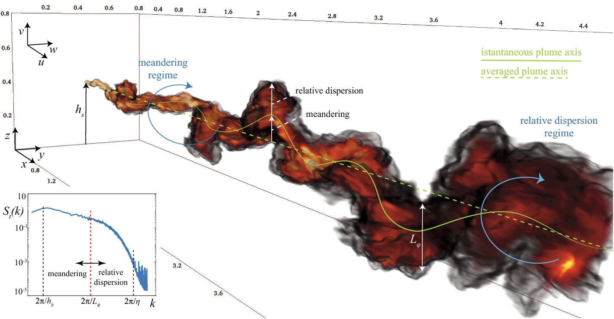
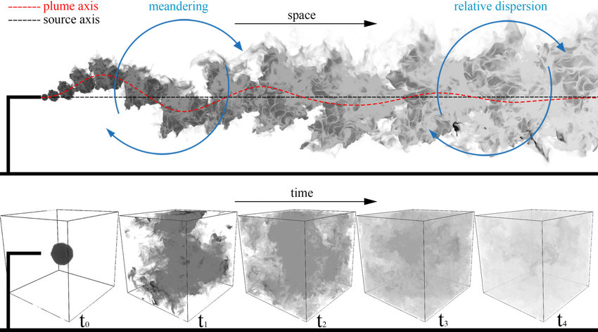
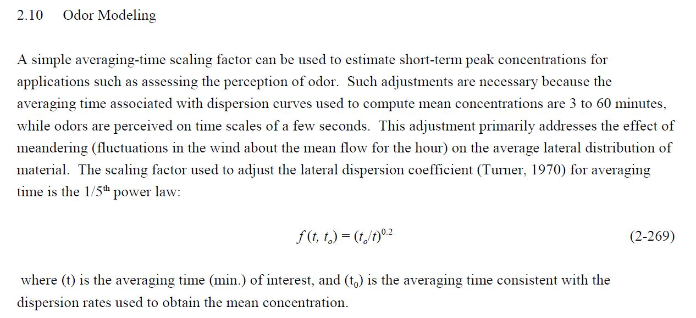
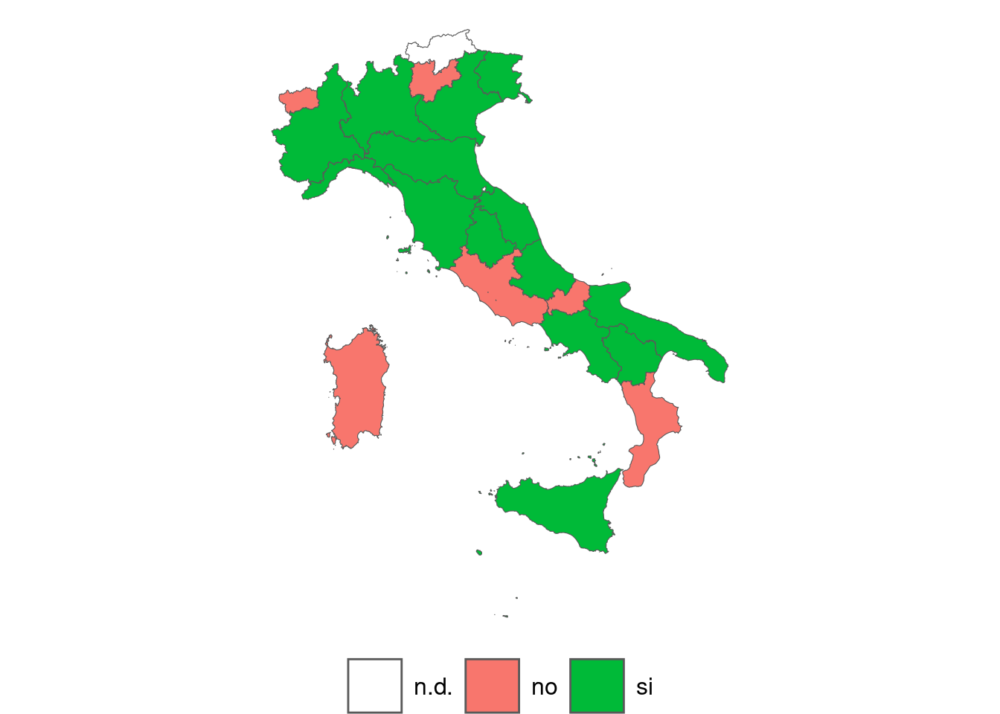
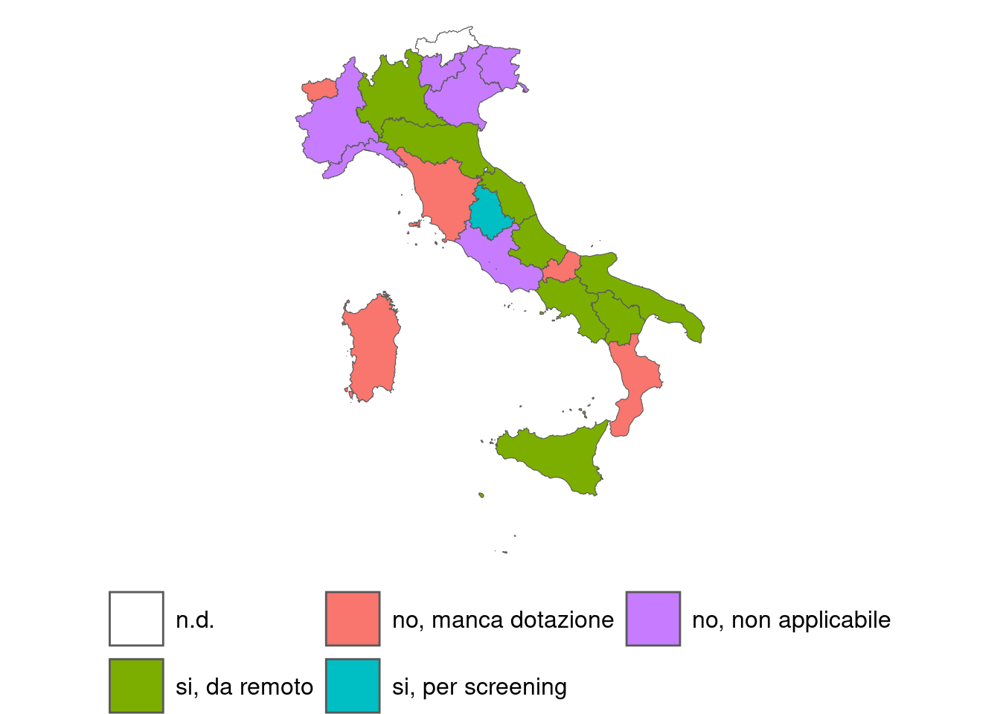
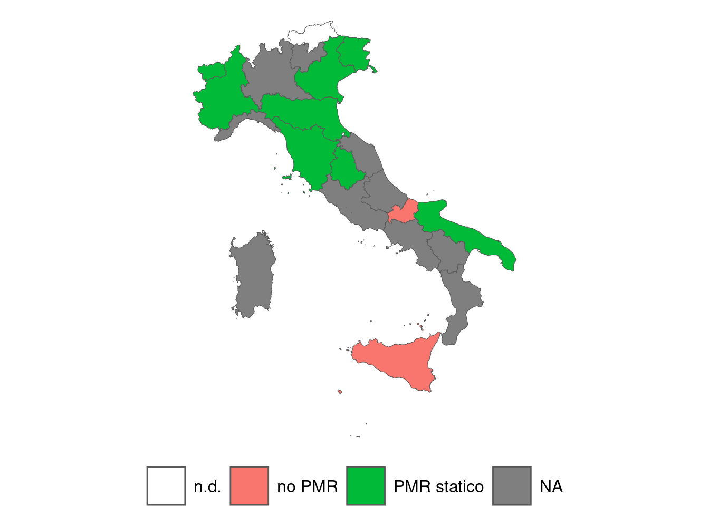
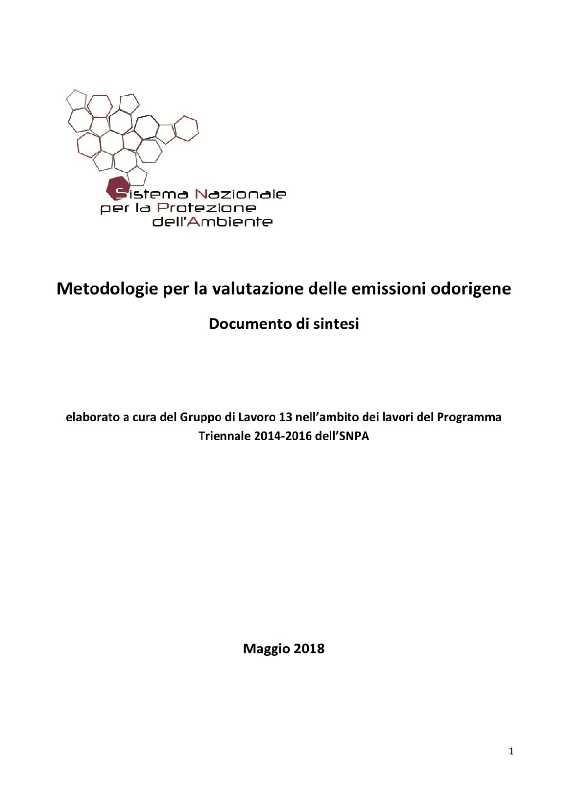
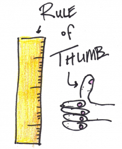
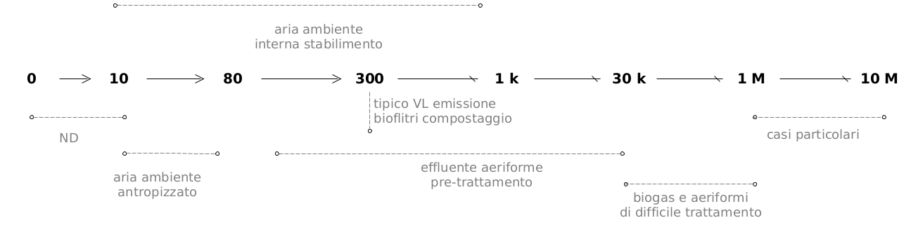
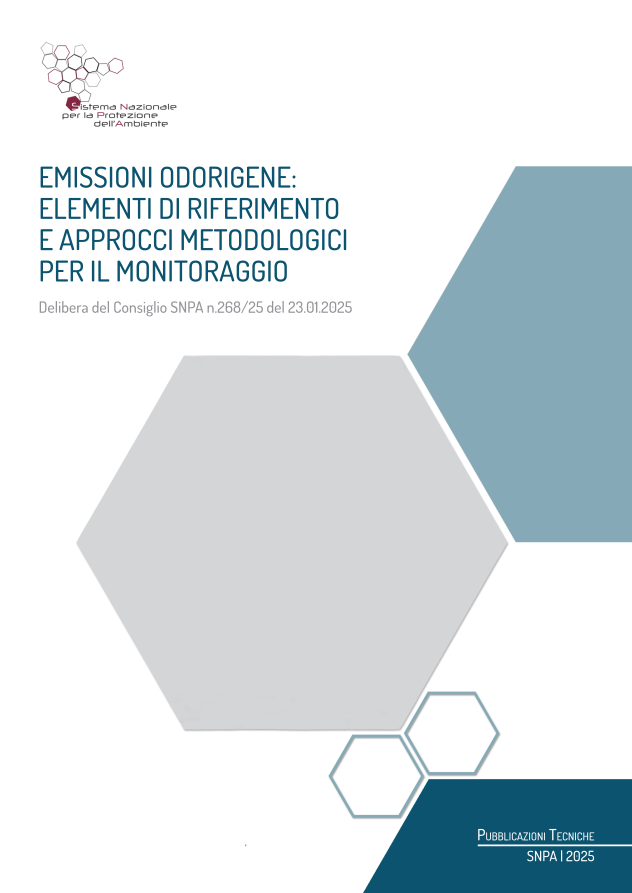

```{r setup, include=FALSE}

options(htmltools.dir.version = FALSE)

knitr::opts_chunk$set(
	echo = FALSE,
	message = FALSE, 
	fig.dim=c(5, 5), 
	out.width="100%",
	fig.retina = 3,
	fig.align = 'center',
	message = FALSE,
	warning = FALSE
	)

# here load libraries uncomment accordingly

library(knitr)
library(kableExtra)
library(tidyverse)
library(DiagrammeR)

# use scribble
xaringanExtra::use_scribble(pen_color= "#befa46")

```


layout: false
class: inverse_3, center, middle

# BACKUP SLIDES 

---

layout: true

background-image: url(./img_layout/logo_arpetta.jpeg)
background-position: 98% 2%
background-size: 5%

<!-- set normal layout -->
---

# Modellistica odorigena: sintesi

#### .red[Principali caratteristiche e criticità]

- La concentrazione (misura intensiva) all'emissione non è sufficiente per determinare l'impatto presso i recettori, bisogna considerare il flusso o portata odorigena (OER) all'emissione (misura estensiva);

- La stima della portata odorigena (OER) in particolare per alcune tipologie di sorgenti (es. areali passive) è molto complessa e questo determina una forte incertezza nelle valutazioni;

- Presso i recettori è necessario valutare le concentrazioni odorigene e le loro fluttuazioni a breve termine; nel caso "classico" dell'inquinamento atmosferico da inquinanti "tradizionali" la scala temporale è tipicamente di 1 h mentre nell'impatto odorigeno la scala temporale è riferibile ad un atto respiratorio (pochi secondi);

- Operativamente viene impiegato un "fattore di correzione" delle stime 1h (peak-to-mean) oppure un sistema modellistico che riesca a trattare in modo adeguato e robusto i valori massimi a breve termine (sistema non ancora completamente disponibile). 


---

layout: false
class: inverse_3, center, middle

# Parametri per caratterizzare<br>le sorgenti odorigene<br>nelle valutazioni modellistiche

---
layout: true

background-image: url(./img_layout/logo_arpetta.jpeg)
background-position: 98% 2%
background-size: 5%

<!-- set normal layout -->
---

# Concentrazione odorigena

La concentrazione di odore per unità di volume che caratterizza un determinato campione di aria prelevato alla sorgente.

Viene espressa in numero di unità odorigene presenti in un metro cubo di aria in condizioni standard (EN 13725).

$$
[OU_E~m^{-3}]
$$

E' un valore che tipicamente deriva dal prelievo di un campione alla sorgente e l'analisi tramite olfattometria dinamica.

Per caratterizzare una sorgente a volte vengono utilizzati "valori di riferimento" tratti da dati di letteratura tecnico-scientifica di settore (incertezza molto elevata!).

---

# Portata volumetrica effluenti

E' il flusso degli effluenti per unità di tempo.

Viene espressa in:


- $[Nm^3~s^{-1}]$ riferita a 20 °C (per olfattometria dinamica)


Rappresenta un parametro la cui determinazione risulta fondamentale in tema di emissioni e sempre molto critica, in particolare per le sorgenti passive (non dotate di flusso proprio).

---

# OER, Odour Emission Rate o Portata di odore

E' la concentrazione  di odore per unità di tempo che caratterizza una determinata sorgente.

Viene espresso in:

$$
[OU_E~s^{-1}]
$$


E' calcolato dal prodotto tra la concentrazione di odore $OU_E~m^{-3}$ e la portata (flusso) di effluenti della sorgente  $m^3~s^{-1}$.

Per una valutazione dell'impatto odorigeno di una determinata sorgente non è sufficiente calcolare la concentrazione di odore ma è necessario determinare OER.

.small[
Eesempio:

- camino con flusso volumetrico di effluenti: $10 ~ m^3~s^{-1}$
- concentrazione odorigena (da olfattometria dinamica): $200 ~ OU_E~m^{-3}$

$$
OER = 10~[m^3~s^{-1}] \times 200 ~ [OU_E~m^{-3}] = 2000 ~ [OU_E~s^{-1}]
$$
]

---

# SOER, Specific Odour Emission Rate

E' la concentrazione di odore riferita all'unità di superficie e di tempo, tipicamente utilizzata per le sorgenti areali passive.

Viene espresso in:

$$[OU_E~m^{-2}~s^{-1}]$$

Prodotto tra concentrazione di odore e flusso di aria indotto all'interno strumento di campionamento (cappa statica, wind tunnel), diviso per l'area (estensione) coperta dallo strumento.
Rappresenta la "copertura" dello strumento sulla superficie di emissione odorigena campionata. 

.small[
Esempio:

- sorgente areale con concentrazione odorigena (da olfattometria dinamica): $5000 ~ OU_E~m^{-3}$
- flusso di aria neutra indotto all'interno della cappa statica: $2~ l~min^{-1}$, cioè $0.002 ~m^3~min^{-1}$
- area della sorgente coperta dalla cappa statica: $0.5 ~m^2$

$$
SOER = \frac{5000 ~ [OU_E~m^{-3}] \times 0.002 ~ [m^3~min^{-1}]}{0.5 ~[m^2]}= 20~ [OU_E~m^{-2}~min^{-1}]
$$
]
---


# SOER

### flusso di odore "specifico" per sorgenti areali passive


$$SOER =  \frac{C_{OD} \times Q_{AIR}}{A_{hood}} = [OU_E~m^{-2}~s^{-1}]$$

dove:

$C_{OD} = [OU_E~m^{-3}]$ 

concentrazione di odore misurata in uscita allo strumento (WT, cappa)

$Q_{AIR} = [Nm^3~s^{-1}]$ 

flusso di aria insufflato nello strumento

$A_{hood} = [m^2]$ 

superficie dello strumento di campionamento (che copre la superficie della sorgente di emissione dell'odore)

---

# OER

### flusso di odore "complessivo" per sorgenti areali passive


$$OER = SOER \times A_{sorgente} = [OU_E~s^{-1}]$$


dove:

$SOER =  \frac{C_{OD} \times Q_{AIR}}{A_{hood}} = [OU_E~m^{-2}~s^{-1}]$ 

concentrazione di odore riferita all'unità di superficie e di tempo

$A_{sorgente} = [m^2]$

area complessiva della sorgente passiva

---

# Portata di odore per areali passive (1/2)

- Non esiste un metodo standard per il campionamento delle areali passive; i metodi più utilizzati sono del tipo "a cappa" (wind tunnel, flux chamber).

- La caratterizzazione della portata di odore di una sorgente areale di tipo passivo prevede il calcolo del parametro relativo al flusso specifico di odore (SOER) emesso per unità di superficie e per unità di tempo.

- SOER è fortemente influenzato dal protocollo di campionamento adottato ed è riferito alle condizioni di velocità del flusso d’aria indotte sperimentalmente e, quindi, alle condizioni “micro” imposte nel confinato “ambiente di campionamento”.

- La dispersione degli odoranti da superfici areali di tipo passivo in ambiente aperto non dipende in modo prevalente dalla diffusione chimica delle molecole ma dal movimento della massa d’aria che ne lambisce la superficie (Bliss et al.,1995) e dalle condizioni prevalenti di temperatura e stabilità atmosferica.

---

# Portata di odore per areali passive (2/2)

- Per valutare il valore “reale” del SOER relativo “all’ambiente aperto”, cioè riferibile alle differenti condizioni atmosferiche (es. velocità del vento, temperatura, etc.), è necessario “rimodulare” il valore del SOER ottenuto dal campionamento adottando un qualche opportuno “fattore di trasformazione”.

- Per definire in modo ottimale tale “fattore di trasformazione” è necessario essere in grado di descrivere accuratamente dapprima i processi ed i meccanismi di volatilizzazione entro la camera di campionamento e successivamente correlarli con le condizioni ambientali che si verificano “in campo”.

- Pur essendo noti i termini generali ed i fattori specifici che entrano in gioco nella stima e nella modellazione delle sorgenti areali passive, la definizione di una prassi operativa standard per affrontare tali problematiche nell’ambito degli studi di impatto ambientale è tutt’altro che risolta (almeno allo stato attuale).

---

# Calcolo portata di odore per areali passive

- La portata di odore da sorgenti diffuse areali passive è variabile in funzione della velocità dell’aria che lambisce la superficie di emissione.

- Calcolo di portata odore sulla superficie di emissione a partire dalla portata di riferimento misurata mediante un sistema a cappa (wind tunnel, flux chamber).


$$
OER_S = OER_R ~\sqrt{\frac{V_S}{V_R}}
$$
.small[
- $OER_S =$ portata odore alla velocità dell'aria $V_S$ ricalcolata sulla superficie di emissione 
- $OER_R =$ portata odore alla velocità di riferimento $V_R$ in uscita da camera  campionamento
- $V_S =$ velocità dell'aria sulla superficie di emissione
- $V_R =$ velocità dell'aria di riferimento nella camera di ventilazione durante il campionamento
]

- Approccio empirico derivato per una sorgente emissiva liquida, a livello operativo adottato, per similitudine e per motivi di "praticità", in molti altri contesti di valutazione.

- Formulazione non valida per tutte le tipologie di sorgenti e tutti i dispositivi di campionamento in cui l’aerodinamica della cappa gioca un ruolo fondamentale.

---

# Calcolo velocità aria su superficie emissiva

Metodo di calcolo determinato sperimentalmente e "validato" per le superfici liquide.


$$
V_S = V_H \frac{ln(\frac{Z_S}{Z_0})}{ln(\frac{Z_H}{Z_0})}
$$
.small[
- $V_S =$ velocità dell'aria vicino alla superficie emissiva
- $V_H =$ velocità del vento alla quota dell’anemometro
- $Z_S =$ quota rispetto al suolo a cui si vuole calcolare $V_S$
- $Z_H =$ quota dell’anemometro rispetto al suolo
- $Z_0 =$ lunghezza di rugosità superficiale (scabrezza di superficie)
]

Non è una formula universalmente applicabile a tutte le situazioni (per quanto detto prima).

---

# Classificazione sorgenti per modellistica 

#### significative (da considerare)

$OER$ > 500 $UO_E~s^{-1}$

#### non significative (possono non essere considerate)

$C_{OD}$ < 80  $UO_E~m^{-3}$ 

.red[indipendentemente da portata volumetrica emessa]

#### eventuali esclusioni

"[...] un insieme di sorgenti .red[*può essere ritenuto trascurabile*] se corrispondente ad un rateo emissivo di odore inferiore al 10% di quello complessivo dello stabilimento e comunque contemporaneamente non superiore a 500 ou/s"

"In ogni caso deve essere data evidenza, almeno in forma riassuntiva tabellare, .red[di tutte le fonti di emissione odorigena presenti, indipendentemente dalla loro effettiva modellizzazione]." 
.footnote[.small[
Indirizzi MASE, 2023, All. 1
]]

---

# Scenario emissivo 


### sorgenti significative per stima modellistica

Lo scenario emissivo delle simulazioni modellistiche di impatto olfattivo deve  considerare tutte le sorgenti di emissione presenti nell’impianto o nell'attività oggetto di studio (convogliate, diffuse, fuggitive) che verificano:

- #### .red[una portata di odore:]  $OER > 500 ~[OU_E~ s^{-1}]$

fatta eccezione per le sorgenti, indipendentemente dalla portata volumetrica emessa, che verificano:

- #### .red[una concentrazione massima di odore:]  $C_{OD} < 80 ~ [OU_E~ m^{-3}]$

---

# Tipologia sorgenti

- convogliate puntiformi (camini)
- areali attive (biofiltri)
- areali passive (vasche trattamento, cumuli, discariche)
- volumetriche (edifici, stabilimenti, finestrature, cumuli)
- fuggitive (valvole, flange)


Le sorgenti areali passive, volumetriche e fuggitive sono le più difficili da caratterizzare in termini di portata odorigena.

Le difficoltà maggiori sono spesso legate alla determinazione della portata (flusso) degli effluenti, oltre che alla misura di concentrazione (da ricordare che EN 13725 riguarda solo le sorgenti di tipo attivo).

---

# Convogliate puntiformi (camini)

- portata volumetrica effluenti
- velocità e temperatura effluente
- concentrazione di odore
- portata di odore
- coordinate georeferenziate punto di emissione
- quota altimetrica del suolo alla base della sorgente
- altezza punto di emissione rispetto al suolo
- area sezione emissione

---

# Areali attive (biofiltri)

- portata volumetrica effluenti
- velocità e temperatura effluente
- concentrazione di odore
- portata di odore
- coordinate georeferenziate perimetro emissione
- quota altimetrica del suolo alla base della sorgente
- altezza punto di emissione rispetto al suolo (per biofiltro è altezza della struttura di contenimento del letto filtrante)
- area della superficie di emissione
- sigma z iniziale (da inserire in sistema modellistico)


.footnote[
.small[
User's Guide for the AMS/EPA Regulatory Model (AERMOD). EPA-454/B-19-027, August, 2019. Table 3-2.
Summary of Suggested Procedures for Estimating Initial Lateral Dimensions σy and Initial Vertical Dimensions σz for Volume and Line Sources.
]
]
---

# Areali passive (vasche, cumuli, discariche)

- flusso specifico di odore (SOER)
- area della superficie emissiva esposta all'atmosfera
- portata di odore calcolata come prodotto tra SOER e superficie emissiva
- coordinate georeferenziate perimetro di emissione
- quota altimetrica del suolo alla base della sorgente
- altezza punto di emissione rispetto al suolo
- velocità e temperatura effluente
- sigma z iniziale (da inserire in sistema modellistico)

.footnote[
.small[
User's Guide for the AMS/EPA Regulatory Model (AERMOD). EPA-454/B-19-027, August, 2019. Table 3-2.
Summary of Suggested Procedures for Estimating Initial Lateral Dimensions σy and Initial Vertical Dimensions σz for Volume and Line Sources.
]
]
---

# Volumetriche (capannoni con finestrature, locali con ricambio naturale, stalle aperte)

- volume interno dei locali
- portata di odore
- coordinate georeferenziate sorgente
- quota altimetrica del suolo alla base della sorgente
- altezza punto di emissione rispetto al suolo
- velocità e temperatura effluente
- sigma z iniziale (da inserire in sistema modellistico)

.footnote[
.small[
User's Guide for the AMS/EPA Regulatory Model (AERMOD). EPA-454/B-19-027, August, 2019. Table 3-2.
Summary of Suggested Procedures for Estimating Initial Lateral Dimensions σy and Initial Vertical Dimensions σz for Volume and Line Sources.
]
]

---

# Recettori discreti (sensibili)

- Sono i punti del dominio di calcolo presso i quali simulare l'impatto odorigeno delle emissioni.

- Devono essere individuati in relazione alle "classi di sensibilità" del recettore ed all'interno dell'area definita dall'isolinea corrispondente alla concentrazione odorigena di $1~OU_E ~m^{-3}$, corrispondente al 98° percentile delle concentrazioni di picco orarie su base annuale.

---

# Dominio spaziale e passo di griglia

- Il dominio spaziale di calcolo deve estendersi in modo tale da comprendere almeno l'isoliena di concentrazione dell’odore pari a $1~OU_E ~m^{-3}$ corrispondente al 98° percentile delle concentrazioni di picco orario su base annuale e deve includere tutti i ricettori sensibili.

- Il passo della griglia di calcolo deve essere inferiore alla distanza fra il ricettore sensibile più prossimo
e la sorgente dell’odore e deve essere determinato a seguito di un’analisi di sensitività dei risultati che permetta
di individuare le aree di massimo impatto in modo chiaro e distinto (e sostanzialmente indipendente dal valore del passo di griglia).

- In via orientativa e del tutto generale un passo di griglia adeguato risulta compreso tra 25 e 250 m, a seconda dell’ampiezza del dominio di calcolo, delle caratteristiche geometriche delle sorgenti, delle caratteristiche orografiche e di uso del suolo.

---

# Plume meandering

```{r, echo=FALSE, fig.align='center', out.width = '90%'}



```

.small["Concentration fluctuations are relevant in many fields including the evaluation of toxicity, flammability, and odour nuisance. 
Characterizing concentration fluctuations requires not just the mean concentration but also at least the variance of the concentration in the location of interest. However, for most purposes the characterization of the concentration fluctuations requires knowledge of the concentration probability density function (PDF) in the point of interest and even the time evolution of the concentration."]

.footnote[
.small[
from: 

Cassiani et al., 2020. Concentration Fluctuations from Localized Atmospheric Releases. Boundary-Layer Meteorology (2020) 177:461–510
https://doi.org/10.1007/s10546-020-00547-4
]
]

---

# Plume meandering

```{r, echo=FALSE, fig.align='center', out.width = '100%'}



```

.footnote[
.small[
from: 

Orsi et al., 2021. Scalar mixing in homogeneous isotropic turbulence: A numerical study. Physical review Fluids 6. DOI: 10.1103/PhysRevFluids.6.034502
]
]

---


# Esempi PMR (standard internazionali)

<br>

Country | Region   | $t_p$       | $\frac{C_p}{C_m}$ | Pct (%) |
------- | -------  | ----------- | ------------------|---------|
Canada  | Quebec   | 4 min       | 1.9               |    98   
  -     | Ontario  | 10 min      | 1.65              |    99.5 
  -     | Manitoba | 3 min       | 2.3               |    100  
Denmark |   -      | 1 min       | 7.8               |    99   
Germany |   -      | 1 sec       | 4                 |    98   
.red[Italy]   |   .red[-]   | .red[not defined] | .red[2.3]   |  .red[98]   


<br>

.red[
#### domanda:

#### da dove e come origina il valore numerico del PMR = 2.3 utilizzato in Italia?
]

<br>
.footnote[
.small[
from:

Brancher, M., Griffiths, K. D., Franco, D., & de Melo Lisboa, H. (2017). A review of odour impact criteria in selected countries around the world. Chemosphere, 168, 1531–1570.
]
]
---

# Italia, PMR = 2.3

Un'.red[ipotesi] (possibile spiegazione) sul valore numerico del PMR utilizzato in Italia.


$$\psi =\frac{C_p}{C_m} = \left ( \frac{t_m}{t_p} \right )^n = \left ( \frac{3600}{60} \right )^{0.2} = 60~^{0.2} = 2.267933155 \approx 2.3$$


.red[Ipotesi] che si basa sulle seguenti assunzioni (non verificate ma plausibili):

- $t_m = 3600 ~s$

- $t_p = 60 ~s$

- $n = 0.2$, cfr. CALPUFF user manual


...sempre che si utilizzi l'approccio empirico proposto da Smith (1973).

---

# Smith's power law as function of stability

```{r chart-pmr-smith, echo=FALSE, fig.align='center', out.width = '75%'}

# by assuming the formula of smith 1973
# where the non-dimensional exponent u 
# depends on atmospheric stability

# in CALPUFF
# the scaling factor used to adjust the lateral dispersion coefficient (Turner, 1970)
# for averaging time is the 1/5 th power law:
# paragraph 2.10 Odor Modeling
# formula (2-269)

# here some of the many parametrizations around

u_AB <- 0.65
u_C <- 0.52 
u_D <- 0.35 
u_EF <- 0
u_CPUF <- 0.2

# seq of time in seconds up to 1h

t<-seq(1,3600)

# then

AB_0.65 <- (3600/t)^u_AB
C_0.52 <- (3600/t)^u_C
D_0.35 <- (3600/t)^u_D
EF_0 <- (3600/t)^u_EF
mod_CALPUFF_0.2 <- (3600/t)^u_CPUF

# define a df
df_PMR <- data.frame(t,
                     AB_0.65,
                     C_0.52,
                     D_0.35,
                     EF_0,
                     mod_CALPUFF_0.2)

df_PMR_l <- df_PMR %>% 
  pivot_longer(-t, names_to = "PMR", values_to = "value")

df_PMR_l  %>% 
  ggplot(aes(x=t, y=value, group=PMR, colour=PMR))+
  geom_line()+
  geom_hline(yintercept = 2.3, linetype = "dashed", colour="gray")+
  geom_vline(xintercept = 60, linetype = "dashed", colour="gray")+
  scale_x_continuous(name="seconds", 
                     breaks = c(seq(0,1200,100)),
                     guide = guide_axis(n.dodge = 2))+
  scale_y_continuous(name="PMR", breaks = c(seq(1,4,0.5),2.3))+
  annotate("text", x=500, y=2.4, label="LG Lombardia", size=2.5)+
  annotate("text", x=150,  y=0.5, label="60 s", size=2.5)+
  coord_cartesian(xlim = c(0, 1200), ylim=c(0,4))+
  guides(colour = guide_legend(""),
         group = guide_legend(""))+
  #labs(title = "Smith's power law")+
  theme_light()
# + theme(axis.text.x = element_text(angle=90))

```

---

# Calpuff user manual

```{r calpuff-pmr, echo=FALSE, fig.align='center', out.width = '100%', out.height='100%'}



```


.red[
il manuale di CALPUFF "suggerisce" un valore di "default" dell'esponente $n$ = 0.2
]

---

# PMR 2.3 altri possibili riferimenti

- Turner (1994) cita Hino (1968) per i valori di PMR.

- Hino indica 2.3 per la media di 10 minuti o inferiore.


Ma questo non significa necessariamente che l'origine del valore PMR pari a 2.3 che viene tipicamente applicato in l'Italia derivi proprio da questi riferimenti.

.footnote[
.small[
Estratto da: Turner, 1994. Workbook of atmospheric dispersion estimates. An intoduction to dispersion modelling. Lewis Publishers.

https://books.google.it/books?id=0GP2fgVfzQsC&lpg=SA4-PA9&ots=odU2hXEva8&dq=Hino%2C%201968%3A&hl=it&pg=SA4-PA9#v=onepage&q=Hino,%201968:&f=false

Abstract articolo: Hino, 1968. Maximum ground-level concentration and sampling time. Atmospheric Environment, (2):149-165.

https://www.researchgate.net/publication/248403591_Maximum_ground-level_concentration_and_sampling_time
]
]

---

# Italia, PMR = 2.3 by Hino - Turner


$$\psi =\frac{C_p}{C_m} = \left ( \frac{t_m}{t_p} \right )^n = \left ( \frac{3600}{600} \right )^{0.5} = 6~^{0.5} = 2.449489743 \approx ?? ~ 2.3$$

.red[Ipotesi] che si basa sulle seguenti assunzioni:

- $t_m = 3600 ~s$

- $t_p = 600 ~s$

- $n = 0.5$


.footnote[

.small[

Hino, M. Maximum ground‐level concentration and sampling time. Atmospheric Environ. 1968, 2, 149–155. 

from a memorandum:
https://www.cdpr.ca.gov/docs/emon/pubs/ehapreps/analysis_memos/2000_segawa.pdf


"Hino (1968) found that the reduction of ground level concentrations with, increasing sampling times, for time-weighted average sampling times ranging from 10 minutes to 5 hours, follows a 1/2 power law, rather than the 1/5 power law that Stewart et al. (1958) had suggested. Hino (1968) suggests that the 1/5 power law is valid only for average sampling times less than 10 minutes.
Turner (1994) recommends the Hino (1968) 1/2 power law be used as the peak-to-mean calculation method to estimate a peak short-term concentration associated with time
weighted averaged samples taken over 10 minute to 5 hours. Example peak-to-mean ratios from
Hino (1968), as presented in Turner (1994), are shown in Table 1. These peak-to-mean ratios are in general agreement with the peak-to-mean ratios of 1 to 5 found by Gifford (1960)."


Hino citato da:
https://www.mdpi.com/2073-4433/11/3/224 e
https://www.maind.it/contents/support_articoli.aspx?idf=163&ids=CLW1&sname=  

]
]

---

# Monitoraggio olfattometrico 
## alla sorgente

```{r echo=FALSE, fig.align='center', out.width = '80%'}



```

---

# Monitoraggio olfattometrico 
## ai recettori

```{r echo=FALSE, fig.align='center', out.width = '80%'}



```

---

# Modellistica PMR

```{r echo=FALSE, fig.align='center', out.width = '80%'}



```

---

# 2018, documento SNPA

.pull-left[

```{r fig.width = 5, fig.height = 5, out.width='95%', out.height='95%', out.extra='style="border:2px solid #D3D3D3; vertical-align:top; margin:1px 1px"'}



``` 

]

.pull-right[ 
Delibera n. 38/2018

Approvazione documento: *Metodologie per la valutazione delle emissioni odorigene - documento di sintesi*

]

---

# Modelli gaussiani

- condizioni omogenee e stazionarie

- per ogni intervallo temporale tutte le variabili meteo sono orizzonalmente costanti nel dominio di calcolo;

- emissioni e condizioni meteo sono costanti per tutto il tempo necessario perchè il "plume" raggiunga i recettori;

- ogni intervallo temporale di calcolo (1h) è una "fotografia istantanea", non c'è memoria della posizione dell'inquinante o degli effetti delle emissioni precedenti;

- non trattano situazioni ambientali complesse come: stratificazione verticale vento, regimi di brezza, eventi di stagnazione, canalizzazioni, orografia complessa, "inversion break-up fumigation", "thermal internal boundary layer";

- non trattano le condizioni di calma o assenza di vento (spesso le più critiche per gli eventi odorigeni), se non con l'aggiustamento operativo di specifici "algoritmi";
  
- non trattano il "meandering" (fluttuazione) laterale del pennacchio;

---

# Modelli lagrangiani a puff

- condizioni non omogenee e non stazionarie

- meteorologia 3D variabile nel tempo e nello spazio, per calcolo più realistico concentrazioni;

- emissioni continue come pacchetti discreti (puffs) indipendenti: il centro del puff si muove per "avvenzione" secondo il "vento locale" (es. vento all'altezza verticale dov'è la massa del puff);
   
- turbolenza atmosferica aumenta dimensioni puff in movimento (in funzione di: dev.st. vento, tempo volo, tempo lagrangiano  scala); allungamento puff in "slugs" lungo direzione vento (per applicazioni "near-field" con vento molto variabile);
   
- "vertical puff-splitting" con "vertical wind shear"; "horizontal puff splitting" quando puff copre più celle di calcolo meteo;
   
- trattano condizioni di calma o assenza di vento (molto importanti per gli odori); puffs non si muovono per avvenzione ma continuano a crescere per turbolenza atmosferica;
   
- le concentrazioni presso ciascun recettore sono la somma dei contributi dei vari puffs;

---

# Modelli lagrangiani a particelle 

- modelli numerici, di tipo stocastico, simulano emissione di "particelle virtuali" di unità di inquinante emesso, trasportato e disperso;

- dispersione 3D in condizioni non omogenee e non stazionarie; particelle si muovono liberamente nel dominio di calcolo e loro distribuzione permette un'accurata descrizione (teorica) di qualsiasi punto del PBL;

- richiedono una dettagliata caratterizzazione delle condizioni meteo; alcune variabili di turbolenza (velocità e tempo lagrangiano di scala) sono difficili da misurare e non sono calcolate dai modelli driver meteo;

- trade-off tra numero di particelle emesse per discretizzare la sorgente e qualità della simulazione, possono richiedere significative risorse di calcolo; 

- descrivono traiettorie indipendenti di particelle e riescono a trattare solo concentrazioni "average ensamble", e quindi con grandi difficoltà a trattare le concentrazioni di picco per cui richiedono l'implementazione di algoritmi ad hoc;

---

# Altri modelli

#### .red[Euleriani (grid models)]

- la risoluzione è determinata dal grigliato di calcolo e sono molto dispendiosi dal punto di vista computazionale;

- sorgenti odorigene non adeguatamente descritte dal grigliato perchè emissione viene "spalmata" su grid (contiene sorgente);

- non includono algoritmi near field (building o stack tip downwash) e producono campi di concentrazione medi (no fluttuazioni);

  
#### .red[CFD (computational fluid dynamics)]

- teoricamente i più adatti per trattare  problemi odorigeni per la possibilità di considerare su micro-scala l'impatto degli ostacoli (edifici, piante, strutture)

- utilizzati a scopo di ricerca e non regolatorio, molto dispendiosi per risorse di calcolo e  per tempo di preparazione input;

- simulano specifiche condizioni meteo ma una simulazione annuale diventa spesso proibitiva;

---

# Concentrazione di odore $\neq$ Flusso di odore

#### $C_{OD} ~ [OU_E~m^{-3}]$ = concentrazione

misura "intensiva" che dipende dallo stato del sistema (e non dalle sue dimensioni) 

#### $OER ~ [OU_E ~ s^{-1}]$ = flusso (portata)

misura "estensiva" che dipende dalle dimensioni del sistema


#### Nella valutazione dell'impatto odorigeno la .red[concentrazione] NON è sufficiente perchè bisogna considerare il .red[flusso d'aria] $Q_{AIR}~ [m^3~s^{-1}]$ associato (emesso) (d)alla sorgente!

#### Il parametro fondamentale per valutare l'impatto odorigeno (input modellistico) è il .red[flusso di odore] $OER$ che si ricava da:

#### $$OER = Q_{AIR} \times C_{OD}$$

#### e viene espresso in unità di odore al secondo $[OU_E ~ s^{-1}]$

<br>

.footnote[.small[
La norma EN 13725 stabilisce che il flusso d'aria volumetrico deve essere valutato in condizioni normali per l'olfattometria: 20°C e 101,3 KPa, umido, cioè condizioni identiche a quelle della misura della concentrazione.
]
]

---

# Modellistica: scenario emissivo sorgenti

- sorgenti di emissione .red[*significative*]: tutte le sorgenti con .red[*portata > 500 ouE/s* e *concentrazione > 80 ouE/m3*];
  
- sorgenti di emissione .red[*non significative*]: tutte le sorgenti con .red[*concentrazione <  80 ouE/m3, indipendentemente dalla portata degli effluenti*];
  
- *"l’esclusione dal calcolo modellistico di sorgenti non significative è condizionata alla presentazione del gestore di elementi di giudizio di tipo oggettivo"*;

- un *insieme* di sorgenti può essere ritenuto .red[trascurabile] (*complessivamente* non significativo) se corrispondente ad una .red[*portata emissiva < 10% dello stabilimento e contemporaneamente < 500 ouE/s*];

- resta ferma la possibilità di AC di richiedere la valutazione di sorgenti .red[*sotto soglia*] per stabilimenti con numero di sorgenti molto rilevante;

- deve essere data evidenza, in forma riassuntiva tabellare, di .red[*tutte*] le sorgenti di emissione odorigena dello stabilimento, indipendentemente dal loro impiego nella stima modellistica.

---

# Concentrazione di odore 

.pull-left[
#### $C_{OD} ~ [OU_E~m^{-3}]$
]

.pull-right[

```{r, echo=FALSE, fig.align='right', out.width = '25%'}

```

]

**Valori di riferimento, "a spanne"!**

<br>

```{r, echo=FALSE, fig.align='center', out.width = '180%'}



```

.footnote[.small[adapted from: Invernizzi]]

---

# Flusso di odore 

.pull-left[
#### $OER ~ [OU_E ~ s^{-1}]$
]

.pull-right[
```{r, echo=FALSE, fig.align='right', out.width = '25%'}

```
]

**Valori di riferimento, "a spanne"!**

<br>

```{r, echo=FALSE, fig.align='center', out.width = '180%'}

knitr::include_graphics("./img_pres/flowchart/c_oer/oer_no_label.png")
```

.small[Nota bene: 

l'indicazione (trascurabile, critica, etc.) è da prendere con molta cautela e  contestualizzare rispetto all'ambiente; il "salto" è che viene "stimato" il potenziale impatto sui recettori da una misura riferita all'emissione (cioè, non sono considerati gli effetti della dispersione atmosferica)]


.footnote[.small[adapted from: Invernizzi]]

---

# Vademecum modellistica odorigena

#### Confronto caratteristiche gaussiani vs. lagrangiani

```{r}

models <- read_csv('./data_input/tables/tab_comparison_gaussian_lagrangian.csv')

models %>% 
  kbl(format='html', align = 'lcc') %>% 
  kable_styling(bootstrap_options = "striped", 
                full_width = FALSE, 
                position = "left",
                font_size = 14) %>%  
  column_spec(1, width = '1.5in')%>%
  column_spec(2, width = '3in') %>%
  column_spec(3, width = '3in') 

```

.footnote[
.small[
adapted from:

AMIGO & Olores.org (2023) International Handbook on the Assessment of Odour Exposure using Dispersion Modelling]
]

---

# Tempi di mediazione e PMR

<br>

- ".red[No matter the duration of the exposure] to an odorant, it is known that the peaks (not the average concentration), .red[the height of peaks and the frequency of occurrence of peaks are important] in determining the perception of the odour."

<br>

- "Dispersion modelling typically produces 10-60 minute to exposure level averages, while for acute odour responses, a timescale of 5 seconds is appropriate. Therefore it makes sense to .red[adjust for the peak-to-mean ratio of the variable concentration level]." 

.footnote[
**NSW EPA: Technical Notes - Draft Policy: Assessment and Management of Odour from
Stationary Sources In NSW, Environment Protection Authority, NSW, Sydney, Australia (2001).**
]

---

# Perchè sono utilizzati i percentili?

- Osservazione sperimentale di una relazione lineare tra disturbo a lungo termine nella popolazione ed il .red[logaritmo del 98° e del 99° percentile dei valori medi orari stimati da modello] (Versucht et al., 1991; Walpot et al. 1991); relazione empirica valida per elevate concentrazioni odorigene $C_{OD~98~1h} > 10~OU_E~m^{-3}$

- La "buona" correlazione dei percentili "alti" con il disturbo odorigeno, rispetto ad altre statistiche (medie, moda, mediana,..), deriva dal fatto che .red[poche ore con elevate concentrazioni di odore sono critiche nel determinare disturbo o molestia olfattiva], rispetto alla maggior parte delle ore quando la concentrazione è relativamente bassa (o nulla).

- .red[Nella valutazione di impatto odorigeno "contano" i picchi di concentrazione, non il valore medio!]

.footnote[
.red[Cosa sono i percentili?]
.small[
Statistica descrittiva che "partiziona" la distribuzione (osservazioni) rispetto ad un predefinito valore soglia.
Ad esempio: il 98° percentile corrisponde al valore per cui il 98% delle osservazioni (misurazioni di odore) risulta inferiore alla soglia di concentrazione odorigena definita dal valore numerico del percentile considerato.
]
]

---

# Perchè fare domande?

.pull-right-reduced[

```{r, echo=FALSE, fig.align='right', out.width = '40%'}


```

]

.pull-left-augmented[
Motivazione:

- tecnico-scientifica: 

  - riferimenti casi studio in letteratura

- normativa (Allegato 1, MASE, 2023):
  
  - modellistica come strumento per verifica di conformità
  
  - PMR = 2.3 per riproducibilità ma non come unica possibilità
  
]

.footnote[.small[

Schauberger G., Piringer M., Schmitzer R., Kamp M., Sowa A., Koch R., Eckhof W., Grimm E., Kypke J., Hartung E., 2012. Concept to assess the human perception of odour by estimating short-time peak concentrations from one-hour mean values. Atmospheric Environment, 54, 624-628.

Schauberger G., Piringer M., 2012. Assessment of Separation Distances to Avoid Odour Annoyance: Interaction Between Odour Impact Criteria and Peak-to-Mean Factors. Chemical Engeneering Transactions 30, 13-18.

Brancher M., Hieden A., Baumann-Stanzer K., Schauberger G., Piringer M., 2020. Performance evaluation of approaches to predict sub-hourly peak odour concentrations. Atmospheric Environment: X, 7, 100076.

Invernizzi M., Brancher M., Sironi S., Capelli L., Piringer M., Schauberger G., 2020. Odour impact assessment by considering short-term ambient concentrations: A multi-model and two-site comparison. Environment International, 144, 105990.

]]

---

# 2025, documento SNPA

.pull-left[
```{r fig.width = 5, fig.height = 5, out.width='95%', out.height='95%', out.extra='style="border:2px solid #D3D3D3; vertical-align:top; margin:1px 1px"'}



``` 
]

.pull-right[ 
Delibera n. 268/2025

Approvazione documento: *Emissioni odorigene: elementi di riferimento e approcci metodologici per il monitoraggio*

.small[
<br>

1. L’odore e la sua percezione 

2. I principali riferimenti normativi in materia di odori

3. Analisi delle metodologie di monitoraggio e controllo delle emissioni odorigene

4. .red_bold[*Modelli di dispersione per la valutazione di impatto olfattivo*]

5. Approcci integrati per la valutazione della molestia olfattiva 

6. Metodologie di abbattimento degli odori
]

]

---

# 2018, documento SNPA

.pull-left[

```{r fig.width = 5, fig.height = 5, out.width='95%', out.height='95%', out.extra='style="border:2px solid #D3D3D3; vertical-align:top; margin:1px 1px"'}


``` 

]

.pull-right[ 
Delibera n. 38/2018

Approvazione documento: *Metodologie per la valutazione delle emissioni odorigene - documento di sintesi*

]

---

# Vademecum modellistica atmosferica 

Una classificazione semplificata, per grandi "famiglie":

- **deterministici**: chiusura analitica e/o numerica
  - **euleriani**: sistema di riferimento "fisso" 
      - *gaussiani*: ipotesi stazionarietà ed omogeneità
      - *a griglia*: risoluzione determinata da "mesh" di calcolo

  - **lagrangiani**: sistema di riferimento "mobile" (segue gli spostamenti delle masse d'aria)
      - *puff*: estensione dei gaussiani in condizioni non omogenee e non stazionarie
      - *particelle*: simulano emissione di "particelle virtuali" (unità di inquinante emesso, trasportato e disperso)

- **stocastici (data-driven)**: chiusura "statistica" (diversi approcci)

- **fluidodinamici**: molto sofisticati, computazione onerosa 

- **al recettore**: "invertono" l'integrazione, dalle concentrazioni alle emissioni, per stima del termine sorgente.

---

# Classificazione sorgenti per modellistica 

#### significative (da considerare)

$OER$ > 500 $UO_E~s^{-1}$

#### non significative (possono non essere considerate)

$C_{OD}$ < 80  $UO_E~m^{-3}$ 

.red[indipendentemente da portata volumetrica emessa]

#### eventuali esclusioni

"[...] un insieme di sorgenti .red[*può essere ritenuto trascurabile*] se corrispondente ad un rateo emissivo di odore inferiore al 10% di quello complessivo dello stabilimento e comunque contemporaneamente non superiore a 500 ou/s"

"In ogni caso deve essere data evidenza, almeno in forma riassuntiva tabellare, .red[di tutte le fonti di emissione odorigena presenti, indipendentemente dalla loro effettiva modellizzazione]." 
.footnote[.small[
Indirizzi MASE, 2023, All. 1
]]

---

# Valori di accettabilità ai recettori

I valori di accettabilità dell’impatto olfattivo da rispettare presso i ricettori sono definiti in funzione delle classi di sensibilità individuate sulla base della classificazione ISTAT delle località e delle Zone Territoriali Omogenee (ZTO ex DM 2 aprile 1968, n. 1444, e s.m.i.).

**ex Allegato 1, Indirizzi nazionali**

- la verifica di conformità presuppone una stima modellistica di dispersione odorigena;

- .red[98° percentile delle concentrazioni orarie di picco calcolate tramite l'utilizzo di un fattore moltiplicativo (peak-to-mean-ratio, PMR) pari a 2.3 (PMR statico)];

- il confronto tra valori stimati da modello e valori di accettabilità presso il recettore prevede un intervallo temporale di valutazione di un anno.

---

# Valutazioni modellistiche preventive

- verificare che gli standard di riferimento esistenti alle emissioni garantiscano i valori di accettabilità ai recettori;

- predire il disturbo o molestia olfattiva presso la popolazione residente nei pressi di un impianto o attività in relazione
alle condizioni meteorologiche ed alle caratteristiche emissive della sorgente;

- valutare l’effetto di configurazioni alternative di un impianto o attività per definirne l’assetto ottimale in grado di minimizzare l’impatto presso i recettori (ad es: dimensionamento camino, implementazione di sistemi di abbattimento).

---

# Valutazioni modellistiche successive 

- verifica di conformità dei criteri di accettabilità in condizioni emissive o meteo non considerate in autorizzazione;

- interpretare disturbo o molestia olfattiva (meteorologia, emissioni, effetto degli edifici circostanti), anche in termini cumulativi;

- simulare effetto ambientali modifiche layout impianto a seguito di prescrizioni autorizzative e/o tecniche-gestionali;

- predisporre "sistema gestione" criticità odorigene per management aziendale o "sistema allerta" per eventi incidentali (impianti sostanze pericolose);

- individuare contributo relativo sorgenti sul territorio per stima impatto differenziale (nello spazio e nel tempo);

-  stimare termine sorgente (emissioni) con “modellistica inversa”;

- analisi sensitività per differenti approssimazioni termine sorgente, scenari emissivi, ri-allocazione virtuale sorgente;

- assimilare misure di concentrazione odorigena da sistemi puntuali (“nasi elettronici”) per valutazione più robusta su scala estesa.

---


# PMR, come si calcola?

Relazione empirica tra .red[concentrazione di picco] $C_p$ riferita ad intervallo temporale $t_p$ (ad es. 5 s) e .red[concentrazione media] $C_m$ riferita ad intervallo temporale $t_m$ (ad es. 1 h).

<br>

.big[

$$\psi =\frac{C_p}{C_m} = \left ( \frac{t_m}{t_p} \right )^u$$
]

<br>
.small[

$\psi$ =  PMR, Peak-to-Mean ratio <br>
$C_p$ =  concentrazione odorigena di picco (a breve termine, per convenzione 5 s)<br>
$C_m$ =  concentrazione odorigena media (tipicamente riferita a 1 h)<br>
$t_m$ = intervallo temporale medio (tipicamente 1 h)<br>
$t_p$ = intervallo temporale di picco (a breve termine, per  convenzione 5 s)<br>
$u$ = esponente in funzione della classe di stabilità atmosferica (vari schemi proposti)<br>

]

.footnote[
.small[

Smith M., 1973. Recommended Guide for the Prediction of the Dispersion of Airborne Effluents. ASME Eds, New York.

Schauberger G., Piringer M., Schmitzer R., Kamp M., Sowa A., Koch R., Eckhof W., Grimm E., Kypke J., Hartung E., 2012. Concept to assess the human perception of odour by estimating short-time peak concentrations from one-hour mean values. Atmospheric Environment, 54, 624-628.
]
]

---

# Stime presso recettori (selezione)

100 m (R1), 300 m (R3), 500 m (R5) di distanza (xy) dalla sorgente

.center[
```{r}

tb_disc_rec <- read_csv('./data_input/tables/summary_cp_vs_lp_disc_rec.csv') %>% 
  filter(rec_n %in% c(1, 3, 5),
         samtype == "avg") %>% 
  select(c(PMR_type, system,PMR_lab,
           rec_lab, dist_x_y, 
           pct98, 
           exc_1h, 
           n_epis,
           dur_epis)) %>% 
  mutate(pct98 = round(pct98,1))

tb_disc_rec %>% 
  kable(digits = 1,   
        col.names = c("PMR",
                      "Model",
                      "Run",
                      "Rec", 
                      "Dist_xy", 
                      "Pct98",	
                      "Exc_1h",
                      "N_epis",
                      "Dur_epis"),
        align = "c") %>% 
  #column_spec(6, bold = TRUE, background = ifelse(tb_disc_rec$pct98>20, "orange", "white")) %>% 
  column_spec(6, bold = FALSE, background = case_when(tb_disc_rec$pct98 == 2.2 ~ "#d5f007",
                                                      tb_disc_rec$pct98 > 20 ~ "#d5f007",
                                                      TRUE ~ "white")) %>%
  # column_spec(7, bold = FALSE, background = case_when(tb_disc_rec$exc_1h == 1663 ~ "#d5f007",
  #                                                     tb_disc_rec$exc_1h ==2480 ~ "#d5f007",
  #                                                     TRUE ~ "white")) %>%
  # column_spec(8, bold = FALSE, background = case_when(tb_disc_rec$n_epis == 811 ~ "yellow",
  #                                                     tb_disc_rec$n_epis == 585 ~ "yellow",
  #                                                     TRUE ~ "white")) %>%
  # column_spec(9, bold = FALSE, background = case_when(tb_disc_rec$dur_epis == 11 ~ "yellow",
  #                                                     tb_disc_rec$dur_epis == 17 ~ "yellow",
  #                                                     TRUE ~ "white")) %>%
  kable_styling(font_size = 18,
                position = "center",
                full_width = TRUE) %>% 
  collapse_rows(columns = 1:3, valign = "middle")

```
]
.footnote[
.small[

Exc_1h = superamenti valore soglia pari a 1 OUE/m3<br>
N_epis = numero di episodi (ore continuative) di superamento soglia<br>
Dur_epis = durata massima (ore) di un episodio di superamento continuativo

]
]

---

# Estensione areale impatto (isolinee)

- definita una soglia "arbitraria": $1~ OU_E~m^{-3}$; 

- calcolo dell'estensione areale, in $km^2$, sottesa dall'isolinea relativa al 98° percentile delle concentrazioni annuali di picco;


<br>

.center[
```{r}

area <- read_csv('./data_input/tables/area_contours.csv')

area %>% 
  kable() %>% 
  #column_spec(4, bold = FALSE, background = case_when(area$km2 == 0.3152 ~ "yellow",
  #                                                    area$km2 == 0.9995 ~ "yellow",
  #                                                    TRUE ~ "white"))  
 row_spec(c(2,4), bold = FALSE, background = "#d5f007")
```
]

<br>

- misura quantitativa (proxy) di impatto odorigeno relativa alla stima prodotta con alternative configurazioni modellistiche (PMR statico vs. PMR dinamico).


---


