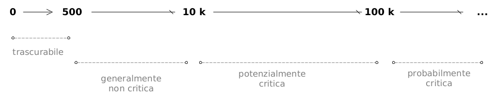

<!-- set general options and load libraries -->

```{r setup, include=FALSE}

options(htmltools.dir.version = FALSE)

knitr::opts_chunk$set(
	echo = FALSE,
	message = FALSE, 
	fig.dim=c(5, 5), 
	out.width="100%",
	fig.retina = 3,
	fig.align = 'center',
	message = FALSE,
	warning = FALSE
	)

# here load libraries uncomment accordingly

library(knitr)
library(kableExtra)
library(tidyverse)
library(DiagrammeR)

# use scribble
xaringanExtra::use_scribble(pen_color= "#befa46")

```


### Parte prima
### Il caposaldo

<br>
<br>
<br>
<br>

.left[
# Ho ancora nel naso l'odore ...
]

<br>
<br>
<br>

.right[
### Il sergente nella neve, M. Rigoni Stern
### 1953

]

---

layout: true

background-image: url(./img_layout/logo_arpetta.jpeg)
background-position: 98% 2%
background-size: 5%

<!-- set normal layout -->
---

# Contenuti 

1. La letteratura tecnico-scientifica e gli orientamenti normativi stabiliscono il .red["governo"] delle emissioni odorigene (sorgenti) tramite la .red[valutazione degli effetti presso i recettori (target)].

1. La verifica di .red[conformità ai valori di accettabilità presso i recettori] definita negli "Indirizzi" (MASE, 2023) si basa su una .red[simulazione modellistica odorigena].

1. Il percorso regolatorio (iter) previsto dagli "Indirizzi" inquadra la .red[modellistica] come strumento operativo integrato nel .red[ciclo di miglioramento continuo] di performance ambientale d'impianto.

1. La definizione delle classi di sensibilità e dei valori di accettabilità degli "Indirizzi" apre ad una possibile .red["valutazione di impatto strategica" (zonizzazione osmogena del territorio)]?

1. La .red[parametrizzazione della simulazione modellistica] ha un ruolo cruciale (critico) per la riproducibilità (trasparenza) della valutazione. .red[Analisi di sensitività dei risultati] di un caso studio.

---


layout: false
class: inverse_3, center, middle

# Parole chiave

---

layout: true

background-image: url(./img_layout/logo_arpetta.jpeg)
background-position: 98% 2%
background-size: 5%

<!-- set normal layout -->


---

# Odore vs. odorante

<br>

```{r, echo=FALSE, fig.align='center', out.width = '65%'}


```

<br>

.red[l'odore (effetto)]

- .red[non] coincide con l'.red[odorante (causa)] e .red[non] rappresenta una caratteristica intrinseca (tipica) delle molecole.

- corrisponde alla .red[sensazione] che la(e) molecola(e) provoca(no) nel recettore (uomo) attraverso il sistema olfattivo.


---

# Complessità: dagli odoranti alla lamentela

.pull-left[
```{r, echo=FALSE, fig.height=6, fig.width=5, align='top', out.width='130%', out.extra='style="vertical-align:top; margin:0px 90px"'}


```
]
.pull-right-reduced[

<br>
.body_center[
.red[
**Domanda:**

**quale "metrica" utilizzare per misura/monitoraggio odoranti/odore?**
] 
]


.small[
.footnote[
Van Harreveld, 2001. From odorant formation to odour nuisance: new definitions for discussing a complex process, Water Science & Technology, 44: 9-15.
]

]
]

---

# Metrica (misura, monitoraggio, stima)

### approccio multi-modale e multi-dimensionale

.red[**target**] (righe) vs. .red[**metodo**] (colonne)

```{r}
t <- read_csv('./data_input/tables/tab_monitor_odour.csv')

t %>% 
  kbl(format='html', align='c') %>% 
  column_spec(1, bold= TRUE, color = ifelse(t[,1] == "immissioni-recettore", "red", "black")) %>% 
  column_spec(4, color = ifelse(t[,4] == "modellistica dispersione", "red", "black")) %>% 
  collapse_rows(columns = 1:4, valign = "middle") %>% 
  row_spec(2:6, background = "white") %>% 
  kable_styling("basic", position="center", full_width = TRUE, font_size = 18)
 

```


.footnote[.small[

Adapted from: 

Bax et al., 2020, How Can Odors Be Measured? An Overview of Methods and Their Application.
Atmosphere, 11, 92; doi:10.3390/atmos11010092

(*) Applicability of "eddy covariance" and "gradient method from similarity theory" for the estimation of gas vertical fluxes: Lotesoriere et al., 2022: Micrometeorological Methods for the Indirect Estimation of Odorous Emissions, Critical Reviews in Analytical Chemistry, https://doi.org/10.1080/10408347.2022.2036092

]
]

---

# Valori di accettabilità


#### Verifica di conformità presso i ricettori da effettuare con una .red[valutazione modellistica di dispersione odorigena].


```{r}

vacz <- read_csv('./data_input/tables/tab_valori_accettabilità_short.csv',
              locale = locale(encoding = "UTF-8"))

vacz %>% 
  kbl(format='html', align = 'clc') %>% 
  kable_styling(bootstrap_options = "striped", 
                full_width = TRUE, 
                position = "left",
                font_size = 17) %>% 
  column_spec(1, 
              bold = TRUE,
              color = case_when(str_detect(vacz$Classe, "PRIMA") ~ "green",
                                   str_detect(vacz$Classe, "SECONDA") ~ "orange",
                                   str_detect(vacz$Classe, "TERZA") ~ "red",
                                   str_detect(vacz$Classe, "QUARTA") ~ "brown",
                                   str_detect(vacz$Classe, "QUINTA") ~ "purple",
                                   .default = as.character(vacz$Valori))) %>% 
  column_spec(3, 
              bold = TRUE,
              color = case_when(str_detect(vacz$Valori, "1 OUE/m3") ~ "green",
                                str_detect(vacz$Valori, "2 OUE/m3") ~ "orange",
                                str_detect(vacz$Valori, "3 OUE/m3") ~ "red",
                                str_detect(vacz$Valori, "4 OUE/m3") ~ "brown",
                                str_detect(vacz$Valori, "5 OUE/m3") ~ "purple",
                                .default = as.character(vacz$Valori)))
  
```


#### ex Indirizzi Nazionali, Decreto Direttoriale MASE n. 309/2023

---

# Modellistica odorigena

.red[
####Strumento matematico che fornisce una valutazione quantitativa del processo di "trasporto e diluizione" dell'odore nell'aria ambiente, dalla sorgente al recettore.  
]
<br>
```{r, echo=FALSE, fig.align='center', out.width = '69%'}

knitr::include_graphics("./img_pres/odorant_odour/wind_odour_diluition.png")

```

<br>
.small[
Analogia rispetto agli obiettivi di valutazione con olfattometro

Strumento di *laboratorio* che *diluisce* un campione di aria per determinare il "livello" (concentrazione) di odore "misurato" dagli esaminatori tramite il riconoscimento sensoriale ("naso") della soglia olfattiva; la diluizione del campione in laboratorio *"simula" il processo di diluizione* dell'emissione odorigena nell'aria ambiente. 
]
---

# Impatto odorigeno

Ricerca di una soluzione operativa per "tradurre":
 
- la .red[**concentrazione di una miscela di odoranti**]  
 .small[quantità chimica in aria ambiente in [ppm, ppb] o [mg/m3, ug/m3]]

- in .red[**concentrazione odorigena**]  
 .small[quantità di odore percepito dal naso umano in [OUE/m3]]   
   - alla sorgente -> olfattometria dinamica  
   - ai recettori -> modellistica di dispersione odorigena  

- in .red[**intensità odorigena**] e/o .red[**tono edonico**]  
 .small["forza" e "s-piacevolezza" della sensazione percepita dal ricettore (varie scale)]

- in .red[**disturbo/molestia olfattiva (schema FIDO*)** ]  
 .small[manifestazione e percezione "globale" impatto odorigeno presso i recettori]

<br>

.small[
.red[**Nota bene!**]

.red[NON] sono note relazioni quantitative univoche ed universalmente riconosciute tra: .red[composizione e concentrazione chimica] di un’aria osmogena, .red[concentrazione odorigena] misurata con il naso umano, .red[intensità odorigena] e .red[tono edonico], .red[disturbo/molestia odorigena]   percepita dal recettore.
]

---

#Impatto odorigeno: fasi e processi


```{r chart-paper, echo=FALSE, fig.align='center', out.width = '60%'}


```


.footnote[.small[Adapted from: Schauberger, NOSE24]]

---

# Disturbo vs. molestia

- #### .red[Disturbo (Annoyance)]

  .red[reazione immediata] determinata dall'esposizione all'odore che porta ad una .red[valutazione cognitiva negativa];
  
  .small[il .red[potenziale di disturbo] di un odore è uno specifico .red[attributo del composto (miscela)] che determina una reazione (negativa) da parte dei recettori]

- #### .red[Molestia (Nuisance)]

  .red[effetto cumulativo] prodotto da ripetuti eventi di disturbo in un lungo periodo di tempo, che genera un comportamento modificato o alterato nel recettore;
  
  .small[il .red[potenziale di molestia] di un odore è un .red[attributo specifico della una popolazione (recettori)] che indica la propensione dei recettori di verificare condizioni di molestia olfattiva]


.footnote[
.small[
Van Harreveld, 2001. From odorant formation to odour nuisance: new definitions for discussing a complex process, Water Science & Technology, 44: 9-15.
]

]

---

layout: false
class: inverse_3, center, middle

# Le caratteristiche
# del fenomeno odorigeno

---

layout: true

background-image: url(./img_layout/logo_arpetta.jpeg)
background-position: 98% 2%
background-size: 5%

<!-- set normal layout -->

---

# Tempi di mediazione


- .red[**percezione dei recettori --> su "tempi brevissimi"**] 

 - .small[concentrazioni di picco su .red[pochi secondi] (Brancher et al. 2017);]
 - .small[durata fisiologica inalazione umana: .red[1.6 s] (Mainland and Sobel, 2006);]
 - .small[risposta stimolo olfattivo: tempo medio di un respiro .red[3.6 s] (Freeman  & Cudmore, 2002);] 
 - .small[ valore di riferimento per ciclo "inalazione, percezione, espirazione": per convenzione .red[5 s]  (Ruijten et al., 2009);]
 

- .red[**"misure" (valutazioni) presso i recettori --> su "tempi lunghi"**]

 - .small[standard QA (breve termine): medie .red[1 h] (ex DLgs. 155/2010);]
 - .small[strumentazione QA: .red[tempi di risposta] non adeguati (tranne eccezioni >=.red[1 min]);]
 - .small[modellistica dispersione atmosferica (standard):  medie .red[1 h];]
 - .small[modellistica odorigena: ricerca di un adeguato .red["fattore di correzione"] delle medie 1h.]
 
<br>

.red[**La differenza nei tempi di mediazione caratteristici tra:**]

- .red[**percezione (manifestazione) vs. misura (osservazione, stima)**]

.red[**rappresenta l'elemento di principale criticità nel determinare l'efficacia (correttezza) della valutazione di impatto odorigeno.**]

---

# Il problema dal punto di vista teorico...


```{r, echo=FALSE, fig.align='center', out.width = '90%'}


```

.footnote[synthetic data (esempio)]

---

# ...e dal punto di vista sperimentale

.pull-left-augmented[
```{r, echo=FALSE, fig.align='center', out.width = '100%'}


```
]

.pull-right-reduced[ 
<br>
.green[**< 1 OU**]

$t_m$: 1 h 
<br>
<br>
<br>
.orange[**~ 1 OU**]

$t_m$: 10 min 
<br>
<br>
<br>
<br>
<br>
.red[**0-6 OU**]

$t_m$: 12 s 

]

.footnote[
.small[
Nicell, 2009. Assessment and regulation of odour impacts. Atmos. Env., 43:196-206.
]
]

---

# Conseguenze operative

- .red[**paradosso logistico ed organizzativo**]

.small[

    normali tempi di intervento (>> 1h) determinano la difficoltà e, a volte, l'impossibilità di trovare "traccia" di un evento di disturbo o molestia olfattiva caratterizzato da intervalli temporali molto brevi ed una significativa intermittenza.

]

- .red[**paradosso "strumentale" (misura)**]

.small[
 
  monitoraggio in continuo di un odorante (miscela) viene effettuata su tempi di mediazione "lunghi", tipicamente orari (per standard QA e normale operatività strumentazione);
  
 impiego di sistemi modellistici configurati secondo la "parametrizzazione classica" per gli inquinanti atmosferici "tradizionali" (media 1h).
]

<br>

.red_bold[

Problema:

necessità di individuare sistemi e strumenti di misura (monitoraggio, stima) che in termini di  "risoluzione temporale" siano adeguati per "trattare" in modo accurato la complessità e la specificità del fenomeno odorigeno *presso i recettori*.
]

**La simulazione modellistica fornisce una risposta utile? Ed eventualmente in che termini?**

---

layout: false
class: inverse_3, center, middle

# Quali tipologie di sorgenti con più frequente criticità odorigena?

## .white[Questionario RRTEM05 SNPA 2023]

---
layout: true

background-image: url(./img_layout/logo_arpetta.jpeg)
background-position: 98% 2%
background-size: 5%

<!-- set normal layout -->
---

# Mappatura sorgenti criticità .small[(1/2)]

```{r echo=FALSE, fig.align='center', out.width = '84%'}

knitr::include_graphics("./img_pres/questionario_snpa_2023/criticità_impianti_map_ordered_page_1_.png")

```

---

# Mappatura sorgenti criticità .small[(2/2)]

```{r echo=FALSE, fig.align='center', out.width = '84%'}

knitr::include_graphics("./img_pres/questionario_snpa_2023/criticità_impianti_map_ordered_page_2_.png")

```

---

class: center, bottom

background-image: url(./img_pres/politically_correct_signal_crop.png)
background-position: bottom
background-size: cover

# .white[...la gestione d'impianto!]

---

layout: false
class: inverse_3, center, middle

# Modellistica di dispersione atmosferica
# (introduzione un po' filosofica) 

<!-- set inverse layout -->

---
layout: true

background-image: url(./img_layout/logo_arpetta.jpeg)
background-position: 98% 2%
background-size: 5%

<!-- set normal layout -->
---

# Flow chart modellistica atmosferica

.pull-left-augmented[
```{r eval=TRUE, echo=FALSE, fig.align='center', out.height=540, out.width=450}


```
]

.pull-right-reduced[
.body_center[
.large[
.red_bold[
<br>
<br>
<br>
<br>
<br>
Modellistica odorigena:<br>
stime vs. misure?

Come fare?
]
]
]
]
---

# Che cos'è un modello?

- rappresentazione  semplificata del reale, necessariamente! 

- i modelli, anche i più complessi e sofisticati, non prescindono mai dall'utilizzo di misure (...a loro volta dei modelli!)

#### dal reale al modello per .red[semplificazioni, astrazioni, assunzioni]

```{r fig.show = "hold", out.width = "45%", fig.align = "default"}


 

```

.footnote[
.small[
"Tanto peggio per i fatti (se non si accordano con la teoria)", attribuita a Hegel.

"All models are wrong, but some are useful", Box.
]
]

---

# Plume spread: semplificazioni!

```{r echo=FALSE, eval=TRUE, fig.align='center', out.height=500, out.width=500}


```

---

class: center, top

background-image: url(./img_pres/montello_altimetria.png)
background-position: bottom
background-size: contain

# Altimetria: semplificazioni!

.bottomtext[
***Rilievo del Montello (TV)***
]

---

class: center, top

background-image: url(./img_pres/pianezze2.jpeg)
background-position: center
background-size: contain

# Altezza rimescolamento: astrazioni!

.bottomtext[
.white[***2011-01-18 11:00, vista da Pianezze (~1000 m slm), M.te Cesen, TV***]
]

---

# Parametrizzazioni: assunzioni!


```{r, echo=FALSE, fig.align='center', out.width = '75%'}


```

---

# Perchè utilizzare un modello?

###... non posso sempre misurare!

- nuovi progetti o modifiche progettuali per impianti esistenti 

###... non conviene sempre misurare!

- tecnicamente ed economicamente impossibile misurare in ogni punto dello spazio e del tempo

###... non basta solo misurare!

- valutazione del contributo relativo ad una o più sorgenti


###L'utilizzo di un modello permette di:

- estendere la misura puntuale nello spazio e nel tempo

- effettuare valutazioni 'contro-fattuali' (analisi di scenario)

---

layout: false
class: inverse_3, center, middle


# Modellistica odorigena
# e schema FIDO*

---

layout: true

background-image: url(./img_layout/logo_arpetta.jpeg)
background-position: 98% 2%
background-size: 5%

<!-- set normal layout -->

---

# Schema FIDO.red[*]


Fattori (elementi) nella valutazione dell'impatto odorigeno: 

- .red[**F**]requency (frequenza)

- .red[**I**]ntensity (intesità)

- .red[**D**]uration (durata)

- .red[**O**]ffensiveness (offensività)

<br> 

In letteratura tecnico-scientifica le differenti varianti dello schema **FIDO** prevedono un .red[fattore di valutazione aggiuntivo]:

- **FIDO.red[S]** $\rightarrow$ .red[**S**]ensitivity (sensitivtà)

- **FIDO.red[L**] $\rightarrow$ .red[**L**]ocation (luogo)

- **FIDO.red[R**] $\rightarrow$ .red[**R**]eceptor (recettore)

---

# Frequency (.red[F]IDO)

Misura la .red[frequenza di accadimento degli eventi odorigeni] che dipende dalla variazione temporale delle emissioni e dalle condizioni meteorologiche e dispersive dell'atmosfera.

.small[
Due approcci tipici:

- .red[conteggio delle ore di odore ("odour hours")]: 

.small[esprime la frequenza (percentuale) di ore sopra la soglia minima di concentrazione (intensità) odorigena (soglia di percezione); è condiderato un'espressione del $LOD_{field}$
]

- .red[ranking delle concentrazioni odorigene ("percentile")]:

.small[esprime la concentrazione odorigena (intensità) di soglia che si verifica con una frequenza predefinita (98° percentile delle concentrazioni orarie di picco su base annuale)
]
]
<br>

.red_bold[Implicazioni modellistiche]:

- scelta dei tempi di mediazione

- definizione dei criteri di impatto: es. 98° percentile 

---

# Intensity (F.red[I]DO)

Misura .red["quanto forte"]  viene percepito l'odore, cioè descrive la .red["magnitudo" della  sensazione] percepita tramite l'olfatto umano.

.small[
.red[Natura logaritmica della percezione olfattiva]: al decrescere della concentrazione odorigena (misurata con un olfattometro, tipicamente di un fattore 10), l'intensità è diminuita di una "quantità/forza" molto inferiore.


.red[La concentrazione odorigena sopra la soglia di percezione non è un'indicazione diretta dell'intensità odorigena] (forza di percezione dell'odore) perchè non è mai stata osservata e definita una relazione univoca (universalmente valida) tra disturbo o molestia olfattiva e misura dei livelli di concentrazione odorigena.
]

<br>

.red_bold[Implicazioni modellistiche]:

- stima della magnitudo delle emissioni odorigene

- stima output concentrazioni odorigene (fattore di rimodulazione peak-to-mean ratio)

---

# Duration (FI.red[D]O)

Misura la .red[durata di esposizione] di un recettore alle .red[concentrazioni di picco] di odore. 

.small[L'entità del disturbo/molestia olfattiva risulta strettamente correlata all'intervallo temporale di esposizione del recettore.]

<br>

.red_bold[Implicazioni modellistiche]:

- trattazione delle stime di concentrazione odorigena ai recettori in termini di .red[percentili "alti"] (il 98° percentile delle medie orarie, in Italia!).

---

# Offensiveness (FID.red[O])

Misura il .red[tono edonico] dell'odore cioè una .red[misura soggettiva] dell'accettabilità dell'odore: è un fattore chiave nella valutazione del disturbo/molestia odorigena.

.small[Il tono edonico .red[non è un attributo "indipendente"] di un odorante ma dipende strettamente da intensità, concentrazione, durata, frequenza dell'esposizione e .red[rappresenta una misura soggettiva] correlata all'esperienza, allo stato emotivo ed alle circostanze ambientali in cui si trova il recettore.]


<br>

.red_bold[Implicazioni modellistiche (warning)]:

- aspetto non esplicitamente trattato nelle simulazioni (in Italia)

.footnote[

.red[*"Offensiveness must be considered at the level of odour exposure without extrapolation of potential evolution for lower or higher concentrations."*`]

.small[
from: 
AMIGO & Olores.org (2023) International Handbook on the Assessment of Odour Exposure using Dispersion Modelling
]
]
---

# Location-Sensitivity-Receptor (FIDO.red[L-S-R])

Il .red[luogo] dove si verifica il disturbo o molestia olfattiva presuppone una .red[sensitività] differente in funzione di:

- destinazione d'uso del territorio, del contesto ambientale, economico (*pecunia non olet*) e sociale (accettabilità);

- dello stato di benessere e/o di salute dei .red[recettori], anche per contemporanea presenza di altre fonti di "pressione ambientale".


<br>

.red_bold[Implicazioni modellistiche]:

- criteri di selezione dei recettori (distanza da sorgente, luogo, sensibilità recettore)

- destinazione d'uso (classificazione) del territorio

- normativa di riferimento e criteri di impatto

---

# Modellistica e FIDO*

<br>
.red_bold[Quali fattori FIDO* sono risolti nella simulazione modellistica?]

.center[
|Modellistica odorigena | schema FIDO* |
|:-----------------:|:--------------------:|
|.small[Criteri di impatto, Percentili]| .small[.red[F]requency, .red[D]uration]|
|.small[Valori di accettabilità<br>(1, 3, 5 OUE/m3)<br>Peak-to-Mean (2.3, in Italia) | .small[.red[I]ntensity (pars!)]]|
|.small[Classi di Sensibilità<br>(prima, ...,quinta) | .small[.red[L]ocation, .red[S]ensitivity, .red[R]eceptors]]|

.small[Ricomposizione schema FIDO secondo i contenuti tecnici degli "Indirizzi " (ex MASE n. 309/2023)]

]

<br>
Nota bene:

- .red[Intensity]: non viene valutato, è considerato solo "indirettamente" con *proxy*  .red[concentrazione odorigena] (diverso da intensità!).

-  .red[Offensiveness]: nelle tipiche applicazioni e nella normativa italiana non è contemplato il tono edonico (difficile da chiudere!);


---

layout: false
class: inverse_3, center, middle

# Modellistica odorigena:
# caratteristiche, specificità, limiti

---
layout: true

background-image: url(./img_layout/logo_arpetta.jpeg)
background-position: 98% 2%
background-size: 5%

<!-- set normal layout -->

---

# Modellistica odorigena .small[(1/2)]

<br>
- Il disturbo/molestia olfattiva è connesso alla percezione dell’odore presso i .red[recettori].
<br>

- L'olfattometria dinamica (UNI EN 13725) è la tecnica di riferimento per la quantificazione delle .red[*concentrazioni*] di odore .red[*alla sorgente (emissioni)*], ma .red[non adeguata] per l’impatto ai recettori. 
<br>

- Per quantificare l’esposizione dei recettori è necessaria una .red["misura in campo" degli odori]: estremamente complessa, soggetta a grandi incertezze e non ancora "chiusa" dal punto di vista tecnico-scientifico e normativo.
<br>

- Le simulazioni modellistiche permettono la .red[stima della concentrazione di odore ai recettori] a partire dal flusso di odore emesso dalla sorgente.
<br>

- Le "normativa" stabilisce la verifica dei valori di accettabilità presso i recettori tramite simulazioni modellistiche che stimano la .red[frequenza di superamento] di una  concentrazione di soglia.

---

# Modellistica odorigena .small[(2/2)]

<br>
- I “modelli classici” di dispersione degli inquinanti “tradizionali” producono stime su media 1h (non utili per impatto odorigeno).
<br>

- La principale limitazione della modellistica risiede nella difficoltà teorica e pratica (non ancora superata) di ricostruire le .red[fluttuazioni di concentrazione], cioè i picchi di odore su pochi secondi.
<br>

- "Nuovi" approcci modellistici (CFD, trasporto varianza, pennacchio fluttuante, micromixing, a due particelle), ancora in fase di sviluppo e ricerca, non hanno una "diffusa traduzione operativa".
<br>

- Necessario concepire .red[un "metodo di stima" delle fluttuazioni a breve termine] delle concentrazioni odorigene oppure applicare un .red["fattore di correzione"] ai risultati delle simulazioni medie 1h.
<br>

- L'approccio più utilizzato (semplice e pragmatico) è l'applicazione del fattore moltiplicativo "semi-empirico" .red[*Peak-to-Mean Ratio*] alle stime delle medie 1h: una soluzione non del tutto rigorosa!

---


# Concentrazione vs. flusso odore emissioni

<br>

#### $C_{OD} ~ [OU_E~m^{-3}]$ = .red[concentrazione]

misura "intensiva", dipende dallo *stato del sistema* 

.small[
espressa in unità odorimetriche europee $[OU_E~m^{-3}]$ rappresenta il numero di diluizioni di aria neutra necessarie per portare la concentrazione del campione alla soglia di rilevamento di odore da parte del panel di esaminatori; assunzione forte, di perfetta trasferibilità: la risposta del panel all'odorante di riferimento (n-butanolo) è uguale alla soglia di percezione per qualsiasi altro tipo di odorante
]

<br>

#### $OER ~ [OU_E ~ s^{-1}]$ = .red[flusso (portata)]

misura "estensiva", dipende dalle *dimensioni del sistema*

.small[
espresso in unità di odore al secondo $[OU_E ~ s^{-1}]$ è il parametro fondamentale per valutare l'impatto odorigeno (input modellistico); nella valutazione di impatto odorigeno (recettori) la .red[concentrazione alle emissioni NON è sufficiente] perchè bisogna considerare il .red[flusso d'aria] $Q_{AIR}~ [m^3~s^{-1}]$ associato (emesso) (d)alla sorgente!

$$OER = Q_{AIR} \times C_{OD}$$

]


---

# Concentrazione di odore 

.pull-left[
#### $C_{OD} ~ [OU_E~m^{-3}]$
]

.pull-right[

```{r, echo=FALSE, fig.align='right', out.width = '25%'}
knitr::include_graphics("./img_pres/rule_of_thumb/rule-of-thumb.png")
```

]

**Valori di riferimento, "a spanne"!**

<br>

```{r, echo=FALSE, fig.align='center', out.width = '180%'}

knitr::include_graphics("./img_pres/flowchart/c_oer/c_od_no_label.png")

```

.footnote[.small[adapted from: Invernizzi]]

---

# Flusso di odore 

.pull-left[
#### $OER ~ [OU_E ~ s^{-1}]$
]

.pull-right[
```{r, echo=FALSE, fig.align='right', out.width = '25%'}
knitr::include_graphics("./img_pres/rule_of_thumb/rule-of-thumb.png")
```
]

**Valori di riferimento, "a spanne"!**

<br>

```{r, echo=FALSE, fig.align='center', out.width = '180%'}


```

.small[
Nota bene: 

l'indicazione (trascurabile, critica, etc.) è da prendere con molta cautela e  contestualizzare rispetto all'ambiente perché viene "stimato" il potenziale impatto sui recettori da una misura riferita all'emissione
]


.footnote[.small[adapted from: Invernizzi]]

---


# Classificazione sorgenti per modellistica 

#### significative (da considerare)

$OER$ > 500 $UO_E~s^{-1}$

#### non significative (possono non essere considerate)

$C_{OD}$ < 80  $UO_E~m^{-3}$ 

.red[indipendentemente da portata volumetrica emessa]

<br>

.small[**eventuali esclusioni**

"[...] un insieme di sorgenti .red[*può essere ritenuto trascurabile*] se corrispondente ad un rateo emissivo di odore inferiore al 10% di quello complessivo dello stabilimento e comunque contemporaneamente non superiore a 500 ou/s"

"In ogni caso deve essere data evidenza, almeno in forma riassuntiva tabellare, .red[di tutte le fonti di emissione odorigena presenti, indipendentemente dalla loro effettiva modellizzazione]." 
.footnote[.small[
Indirizzi MASE, 2023, All. 1
]]
]
---

# Concentrazione vs. percezione recettori .small[(1/2)]

Le valutazioni modellistiche stimano i .red[**percentili** della concentrazione odorigena di picco], su base annuale, da confrontare con un .red[valore "di soglia"] definito dalla normativa.

.small[
Per quantificare l'impatto ai recettori (popolazione target) .red["non contano" i valori medi] ma contano i .red["valori massimi"] e la loro .red[frequenza di manifestazione] (percezione).
]

<br>

In .red[olfattometria dinamica] si ha che statisticamente:

- $1\ OU_E\ m^{-3}\Rightarrow$ il 50% della popolazione percepisce l’odore;

- $3\ OU_E\ m^{-3}\Rightarrow$ l’85% della popolazione percepisce l’odore;

- $5\ OU_E\ m^{-3}\Rightarrow$ il 90-95% della popolazione percepisce l’odore.

<br>

Questi valori numerici, secondo un'ipotesi di trasferibilità (forte!), sono .red[convenzionalmente assunti in aria ambiente per valutare l'impatto odorigeno sui recettori].

---

# Concentrazione vs. percezione recettori .small[(2/2)]

<br>

Definire un valore di soglia:

- .red[**1, 2, 3, 4, 5**], espresso in $OU_E~m^{-3}$ (ex MASE, 2023)

che corrisponde statisticamente al:

- .red[**98° percentile delle concentrazioni odorigene annuali di picco**], 

significa definire:

  - .red[**"un criterio protettivo"**] 
  
per cui viene "concesso" che i recettori percepiscono l'odore:

- .red[**al massimo per un periodo pari a 175 ore/anno (2% di 8760 ore).**]

---

# Peak-to-Mean Ratio (PMR): che cos'è?

.red[fattore moltiplicativo] semi-empirico che stima ai recettori le concentrazioni *di picco* ("istantanee") dai *valori medi (1h)*

```{r, echo=FALSE, fig.align='center', out.width = '70%'}


```

.footnote[
.small[
adapted from:
Freeman T. & Cudmore R., (2002). Review of Odour Management in New Zealand. Air quality Technical Report n. 24. https://environment.govt.nz/assets/Publications/Files/odour-tr-aug02.pdf
]
]

---

# PMR e plume meandering

PMR tenta di stimare  i valori di "picco" ai recettori "determinati" dalle fluttuazioni del pennacchio (vs. "ensamble average").


```{r, echo=FALSE, fig.align='center', out.width = '80%'}


```


.footnote[
.small[
from: Stull, 2015. Practical Meteorology. An Algebra-based Survey of Atmospheric Science. The University of British Columbia Vancouver, Canada.
]
]

---

layout: false
class: inverse_3, center, middle

# Quali applicazioni per la modellistica odorigena? E con quali strumenti?

## .white[Questionario RRTEM05 SNPA 2023]

---
layout: true

background-image: url(./img_layout/logo_arpetta.jpeg)
background-position: 98% 2%
background-size: 5%

<!-- set normal layout -->
---

# Per verifica pareri di competenza

```{r echo=FALSE, fig.align='center', out.width = '80%'}


```

---

# Per verifica segnalazioni recettori

```{r echo=FALSE, fig.align='center', out.width = '80%'}


```

---

# Approcci modellistici utilizzati

```{r echo=FALSE, fig.align='center', out.width = '80%'}


```


---

layout: false
class: inverse_3, center, middle

# Obiettivi delle simulazioni modellistiche 
# nelle valutazioni di impatto odorigeno

---

layout: true

background-image: url(./img_layout/logo_arpetta.jpeg)
background-position: 98% 2%
background-size: 5%

<!-- set normal layout -->

---

# Obiettivi differenti

#### Rispetto a una o più sorgenti su "area limitata":

- .red[**valutazioni preventive**] (ex ante, prognostiche)
  - verifica di conformità dei livelli di accettabilità presso i recettori
  - analisi di scenario per modifiche layout impianto

- .red[**valutazioni successive**] (ex post, diagnostiche)
  - misura quantitativa dell'impatto presso i recettori
  - sistema di gestione e/o allerta d'impianto


#### Rispetto a più sorgenti su "area estesa":

- .red[**valutazioni strategiche**] (zonizzazione)
  - sistema di supporto decisionale alla pianificazione territoriale

 Allo stato attuale è una valutazione in gran parte inespressa, prevista solo indirettamente dagli "Indirizzi", ricollegabile alla definizione dei valori di accettabilità ai recettori definiti essenzialmente su criteri di pianificazione urbanistica e territoriale.

---

# Valutazioni modellistiche strategiche .small[(1/3)]

#### .red["Vecchi" criteri e valori di accettabilità (ex LG ARPAV):]

- recettori in **aree residenziali**
 - .small[1 OUE/m3 per distanze > 500 m da sorgenti]
 - .small[2 OUE/m3 per distanze tra 500 m e 200 m da sorgenti]
 - .small[3 OUE/m3 per distanze < 200 m da sorgenti]

- recettori in **aree non residenziali**
  - .small[2 OUE/m3 per distanze > 500 m da sorgenti]
  - .small[3 OUE/m3 per distanze tra 500 m e 200 m da sorgenti]
  - .small[4 OUE/m3 per distanze < 200 m da sorgenti]

#### .red["Nuovi" criteri e valori di accettabilità (ex "Indirizzi" MASE, 2023):]

- eliminazione del criterio "distanza" dalle sorgenti;
- definizione più rigorosa ed articolata dell'ambito territoriale e delle classi di sensibilità dei recettori;
- enfasi su aspetti legati alla pianificazione urbanistica/territoriale.


---

# Valutazioni modellistiche strategiche .small[(2/3)]

### Legato (...o meglio, un auspicio!)

Il contenuto tecnico degli "Indirizzi" (MASE, 2023) presuppone una *sinergia e verifica di compatibilità* con gli strumenti sovraordinati di pianificazione urbanistica e territoriale.

*"Appare utile [...] che le competenti autorità territoriali possano .red[assicurare, a livello locale, un efficace coordinamento con le norme e procedure relative alle emissioni acustiche e quelle relative alla pianificazione territoriale/urbanistica"*] (ex "Indirizzi")

Importanza di un approccio .red[*strategico (preventivo)*] nella gestione dell'impatto odorigeno. La definizione dei criteri di accettabilità richiama i criteri guida della .red[*"Zonizzazione Acustica"*].

.red[**Domanda aperta**:]

- la possibile evoluzione normativa e procedurale delle valutazioni di impatto odorigeno sarà caratterizzata dalla definizione di una .red[**Zonizzazione Odorigena (Osmogena) del Territorio?**]

---

# Valutazioni modellistiche strategiche .small[(3/3)]

### ...Ma come fare?

<br>

- Non esistono "LG ufficiali" sui contenuti tecnici di una valutazione modellistica odorigena "strategica" con l'obiettivo di produrre una classificazione "osmogena" del territorio.

- E' possibile l'impiego della .red[**"modellistica inversa"**]?
  
  La modellistica inversa (kernel deconvolution) produce un stima del .red[**"termine sorgente"**]: per ogni cella del dominio di calcolo stima .red[**l’emissione massima di odore [OUE/s] "consentita" per garantire il rispetto dei valori di accettabilità presso i recettori discreti**].

- Un argomento "nuovo" ed una metodica di valutazione da inventare, sviluppare e testare: c'è qualche "caso studio" interessante ma ancora in fase di sviluppo (ARPA-FVG).

---

layout: false
class: inverse_3, center, middle

# La modellistica odorigena 
# nel processo regolatorio (autorizzativo)
# ex "Indirizzi Nazionali"


---

layout: true

background-image: url(./img_layout/logo_arpetta.jpeg)
background-position: 98% 2%
background-size: 5%

<!-- set normal layout -->

---

# PDCA, autorizzazione ex "Indirizzi"

Il processo decisionale di autorizzazione e valutazione dell’impatto odorigeno degli “Indirizzi" visto come un .red[**ciclo di miglioramento continuo (Deming, PDCA)**].

.pull-left[

<br/>

<!-- ```{r deming} -->

<!-- source('./script/autorizzazione_deming_modellistica.R') -->

<!-- d %>% -->
<!--   render_graph() -->

<!-- ``` -->

```{r echo=FALSE, fig.align='center', out.width = '100%'}


```

]

.pull-right[
.red[**PLAN – istruttoria**]
.small[
- autorizzazione "iniziale" (sub iudice) e "finale" (aggiornamento)
- prescrizioni tecniche, gestionali, operative e di monitoraggio
]

.red[**DO – esercizio attività**]
.small[
- implementazione, monitoraggio 
]

.red[**CHECK – riesame e rivalutazione**]
.small[
- controllo risultati, feedback
]

.red[**ACT – mitigazione e controllo**]
.small[
- messa a regime, regolazione
]

]

---

# PDCA, modellistica e autorizzazione

```{r echo=FALSE, fig.align='center', out.width = '80%'}


```

---

# Impianti nuovi o con modifiche peggiorative

- .red[**PLAN - istruttoria**]

modellistica con fattori di emissioni stimati da letteratura o da misure in impianti analoghi o da storico attività $\Rightarrow$ obiettivo: verifica impatto ai recettori.

- .red[**DO - monitoraggio e rilascio autorizzazione**]

modellistica a seguito di prescrizioni impiantistiche, gestionali, operative $\Rightarrow$ obiettivo: definizione di valori alle emissioni "funzionali" alla fase successiva.

- .red[**CHECK - impianto realizzato, autorizzazione iniziale**]

modellistica con fattori di emissione da misure dirette; eventuale supporto ed integrazione del monitoraggio presso i recettori  $\Rightarrow$ obiettivo: proposta di valori alle emissioni per autorizzazione finale.

- .red[**ACT - impianto realizzato, aggiornamento autorizzazione**]

modellistica con fattori di emissioni da misure dirette, dopo la messa a regime $\Rightarrow$ obiettivo: definizione dei valori di emissione in autorizzazione finale.

---

# Impianti esistenti con casi critici

- .red[**PLAN - fase iniziale**]

modellistica con fattori di emissioni da misure dirette $\Rightarrow$ obiettivo: conferma impatto presso i recettori.

- .red[**DO - monitoraggio, progettazione interventi**]

modellistica a valle di prescrizioni impiantistiche, gestionali, operative $\Rightarrow$ obiettivo: definizione di valori alle emissioni "funzionali" alla fase successiva.

- .red[**CHECK - verifica soluzioni proposte**]

modellistica con fattori di emissione da misure dirette; eventuale supporto ed integrazione del monitoraggio presso i recettori $\Rightarrow$ obiettivo: proposta di valori alle emissioni per autorizzazione finale.

- .red[**ACT - aggiornamento autorizzazione**]

modellistica con fattori di emissione da misure dirette, dopo la messa a regime $\Rightarrow$ obiettivo: definizione dei valori di emissione in autorizzazione finale.

---

layout: false
class: inverse_3, center, middle

# Caso studio simulato 
# PMR statico vs. dinamico

---
layout: true

background-image: url(./img_layout/logo_arpetta.jpeg)
background-position: 98% 2%
background-size: 5%

<!-- set normal layout -->

---

# NOSE24 

.red[**Naples, 15-18 September 2024**]

.pull-left[
**Bressan M., Dalla Fontana A., Intini B., Bassan R., Pretto U., Tomiato L., 2024.**

*Sensitivity analysis of odour exposure from dispersion modelling exercises with different Peak-to-Mean Ratio.*

*Chemical Engineering Transactions, 112, 169-174.*

.small[https://doi.org/10.3303/CET24112029]
 
]

.pull-right[
```{r, echo=FALSE, fig.align='top', out.width='95%', out.extra='style="border:1px solid #D3D3D3; vertical-align:top; margin:1px 1px"'}


```

]


---

# Layout caso studio simulato

.red[sorgente, emissioni, meteo, dominio, terreno, recettori]


```{r chart-ter-wr, echo=FALSE, fig.align='center', out.width = '160%', fig.dim=c(9, 7)}


```

.small[
.pull-left[

sorgente puntuale (camino): h = 22 m, d = 1 m

effluenti: T = 50 °C, v = 13 m/s

OER: 24,000 OUE/s (costante 24/7)

transetto SW: 25 recettori discreti 

]

.pull-right[

CALMET (Cosmo5 24+): 10x10 km, mesh 250 m 

LAPMOD, CALPUFF:  4x4 km, mesh 50 m

rosa venti: h = 10 m, da CALMET

uso suolo: CORINAIR; orografia: DTM RV
]
]

---

# Il problema 

**Quanto e come cambiano le stime modellistiche di impatto odorigeno con differenti (alternative) modalità di calcolo PMR?**<br>(oltre al .red["classico" PMR = 2.3], usato in Italia!)

<br>

- **Sensitività a differenti (alternativi) sistemi modellistici**:<br>
.red[CALPUFF vs. LAPMOD]   (lagrangiano puff vs. lagrangiano particelle)

- **Sensitività a differenti (alternative) parametrizzazioni PMR**:<br>
.red[LAPMOD]  .red[PMR 'statico' (costante) vs. PMR 'dinamico' (variabile)] (post-processing vs. stima 'interna' al modello)

<br>

.small[
**PMR 'statico'**:  fattore moltiplicativo costante nel tempo e nello spazio, post-processing medie orarie;

**PMR 'dinamico'**:  variabile nel tempo e nello spazio, calcolo internalizzato nel codice e parametrizzato in funzione di stabilità atmosferica, tempo di volo, tempo lagrangiano;
]
.footnote[
.small[

Smith M., 1973. Recommended Guide for the Prediction of the Dispersion of Airborne Effluents. ASME Eds, New York.

Mylne K., Mason P., 1991. Concentration fluctuation measurements in a plume dispersing at a range up to 1000. Q. J. R. Meteorol. Society, 117, 177-206.

]
]

---

# 2 modelli, 7 configurazioni 

#### per 7 stime alternative di impatto odorigeno 

<br>

.center[
```{r}

tb_model <- read_csv('./data_input/tables/tab_model_runs.csv', col_names = FALSE)

tb_model %>% 
  kbl(col.names = c("#", "sigla", "modello", "PMR", "valore", "peak-time", "stat" ),
      align = c("l", "l", "l", "c", "c", "c", "c")) %>% 
  kable_styling(font_size = 20) %>% 
  # column_spec(2, bold = FALSE, background = case_when(tb_model$X2 == "s_2.3" ~ "yellow",
  #                                                     tb_model$X2 == "s_avg_2.3" ~ "yellow",
  #                                                     tb_model$X2 == "d_avg_5s" ~ "yellow",
  #                                                     tb_model$X2 == "d_avg_60s" ~ "yellow",
  #                                                    TRUE ~ "white")) %>%
  collapse_rows(columns = c(3,4), valign = "middle")

  

```
]

.footnote[

.red[PMR statico] = post-processing output modello, fattore .red[costante];

.red[PMR dinamico] = stima interna al modello, fattore .red[variabile];

]


---

# Contour plots: 98° percentile

<!-- panoramica 98° percentile -->

```{r, echo=FALSE, fig.align='center', out.width = '75%'}


```

---

# LAPMOD: PMR 2.3 (statico)  

```{r, echo=FALSE, fig.align='center', out.width = '78%'}


```

.footnote[
.small[s_avg_2.3]
]

---

# LAPMOD: PMR 5s (dinamico) 

```{r, echo=FALSE, fig.align='center', out.width = '78%'}


```

.footnote[
.small[d_avg_5s]
]

---

# Estensione areale impatto (isolinee)

- definita una soglia "arbitraria": $1~ OU_E~m^{-3}$; 

- calcolo dell'estensione areale, in $km^2$, sottesa dall'isolinea relativa al 98° percentile delle concentrazioni annuali di picco;


<br>

.center[
```{r}

area <- read_csv('./data_input/tables/area_contours.csv')

area %>% 
  kable() %>% 
  #column_spec(4, bold = FALSE, background = case_when(area$km2 == 0.3152 ~ "yellow",
  #                                                    area$km2 == 0.9995 ~ "yellow",
  #                                                    TRUE ~ "white"))  
 row_spec(c(2,4), bold = FALSE, background = "#d5f007")
```
]

<br>

- misura quantitativa (proxy) di impatto odorigeno relativa alla stima prodotta con alternative configurazioni modellistiche (PMR statico vs. PMR dinamico).


---

# LAPMOD, transetto recettori, Pct98

```{r, echo=FALSE, fig.align='center', out.width = '120%'}


```

.footnote[
nb: zoom --> ylim(0, 5)
]

---

# LAPMOD, distanza separazione, Pct98

```{r, echo=FALSE, fig.align='center', out.width = '100%'}


```

.footnote[225 °N transetto recettori discreti]

---

# Qual è la stima "corretta"...

<br>

.pull-left[

###.center[...PMR statico?]

```{r, echo=FALSE, out.width = '70%'}


```

]

.pull-right[

###.center[...PMR dinamico?] 

```{r, echo=FALSE, out.width = '70%'}


```

]


###.center[...non c'è una risposta univoca !]


- variabilità dovuta alle modalità di calcolo PMR introduce un significativo margine di incertezza nelle stime;
- manca una verifica empirica di tipo contro-fattuale (es. field inspection, analisi lamentele, citizen science); 

---

# Conclusioni 

.red[**di tipo operativo (su stime)**]

- concentrazioni fino a ~ 1 km: PMR dinamico (5s) > PMR statico;

- impatto recettori vicini sorgente < 150 m: PMR dinamico superiore fino ad un ordine di grandezza;

- distanza di seprarazione: PMR dinamico >  PMR statico.

.red[**di tipo regolatorio (su iter autorizzativo)**]

- necessaria forte *consapevolezza tecnica* sulle configurazioni modellistiche *adottate (o non adottate)* dai proponenti e/o *richieste (o non richieste)* da autorità di controllo;

- richiesto notevole impegno verso la *riproducibilità* per una valutazione di impatto *accurata e robusta*;

- utilizzo *esclusivo* di una specifica configurazione modellistica può determinare un *bias significativo* nella verifica di conformità.
<br>
<br>
<br>
.center[
###"All models are wrong, but some are useful." Box
]

---

layout: false
class: title-slide, middle, no-scribble

# Grazie per l'attenzione
## massimo.bressan@arpa.veneto.it

