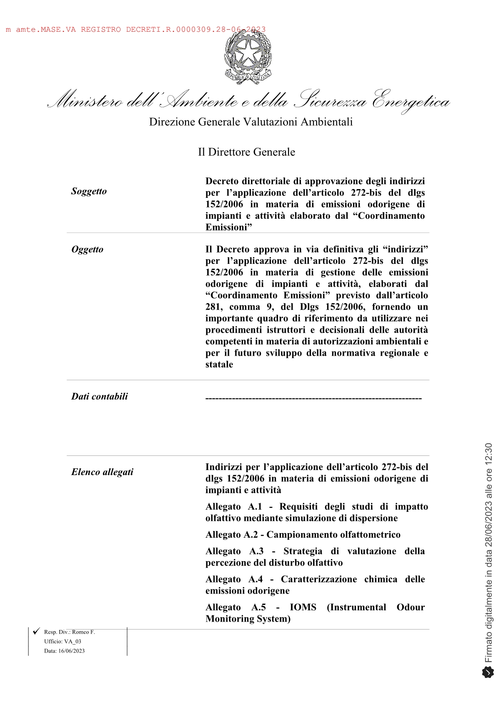
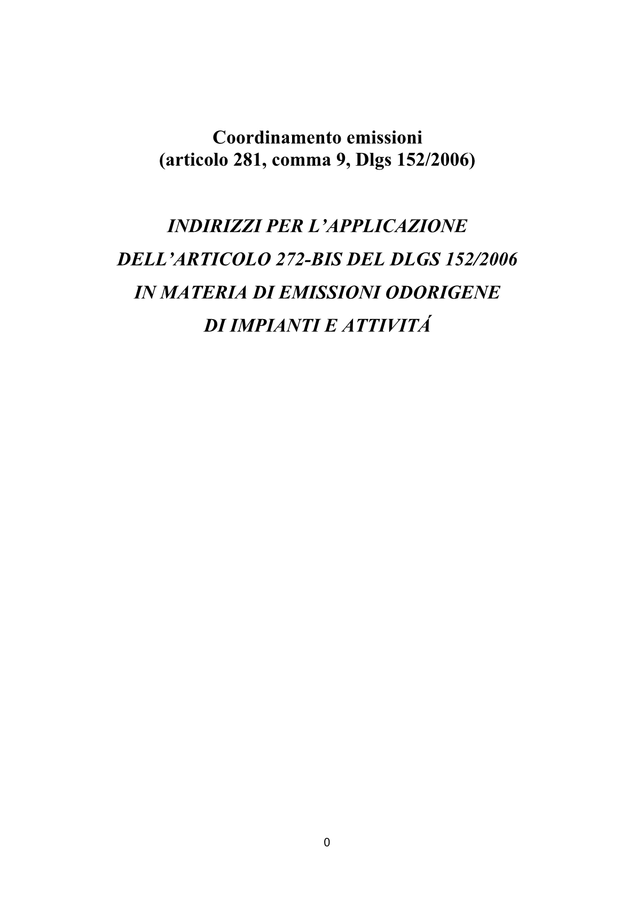
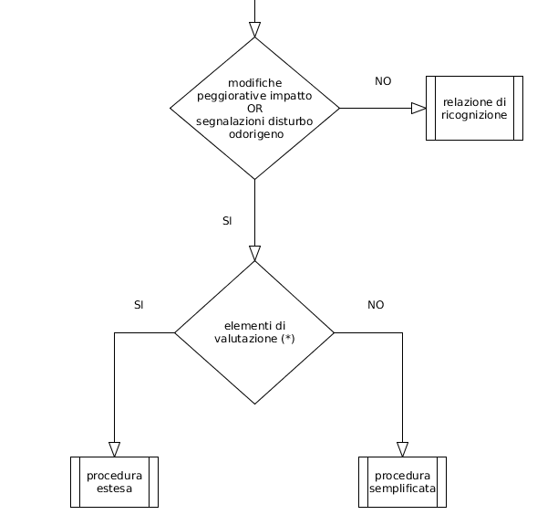
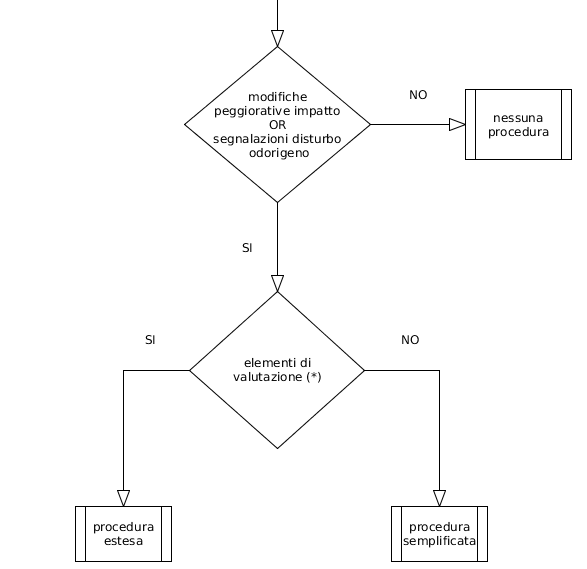
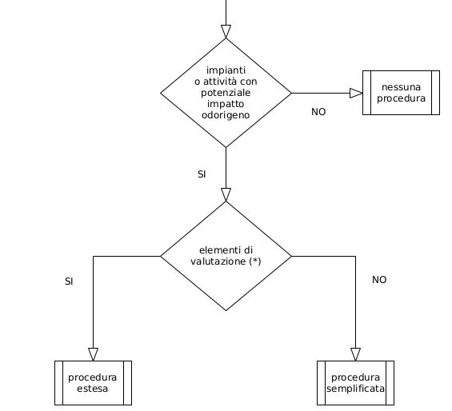
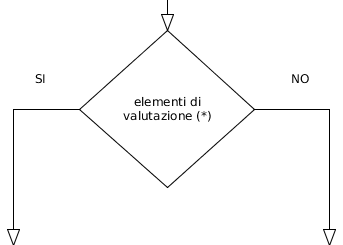
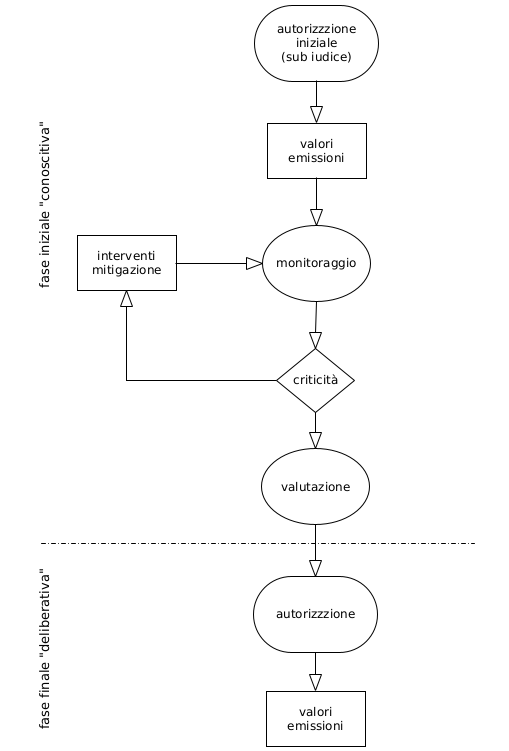
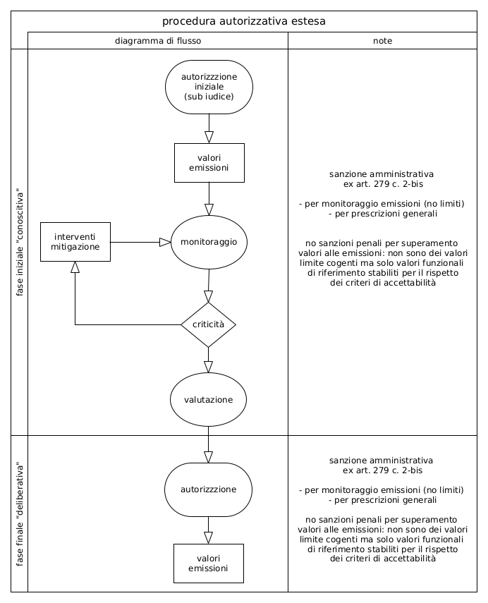

layout: true

background-image: url(./img_layout/logo_arpetta.jpeg)
background-position: 98% 2%
background-size: 5%

<!-- set normal layout -->

<!-- set general options and load libraries -->

```{r setup, include=FALSE}

options(htmltools.dir.version = FALSE)

knitr::opts_chunk$set(
	echo = FALSE,
	message = FALSE, 
	fig.dim=c(5, 5), 
	out.width="100%",
	fig.retina = 3,
	fig.align = 'center',
	message = FALSE,
	warning = FALSE
	)

# here load libraries uncomment accordingly

library(knitr)
library(kableExtra)
library(tidyverse)
# library(scales)
# library(leaflet)
# library(mapview)
# library(raster)
# library(terra)
# library(metR)
# library(patchwork)
# library(sf)
# library(ggspatial)
library(DiagrammeR)

# use scribble
xaringanExtra::use_scribble(pen_color= "#befa46")

```

---

# 2023, Decreto direttoriale MASE

.pull-left[
```{r fig.width = 5, fig.height = 5, out.width='95%', out.height='95%', out.extra='style="border:2px solid #D3D3D3; vertical-align:top; margin:1px 1px"'}



``` 
]

.pull-right[ 
Decreto 28/06/2023

Approva gli .red[*“Indirizzi”*] per l’applicazione dell’art. 272-bis, Dlgs 152/2006 in materia di gestione delle .red[emissioni odorigene] di impianti e attività, elaborati dal .red[*“Coordinamento Emissioni”*] previsto dall’art. 281, c. 9, Dlgs 152/2006 e fornisce un importante .red[quadro di riferimento] da utilizzare nei .red[*procedimenti istruttori e decisionali*] dalle autorità competenti in materia di .red[*autorizzazioni ambientali*] e per il futuro sviluppo della .red[*normativa regionale e statale*]
]

---

# Indirizzi nazionali

.pull-left[
```{r fig.width = 5, fig.height = 5, out.width='95%', out.height='95%', out.extra='style="border:2px solid #D3D3D3; vertical-align:top; margin:1px 1px"'}



``` 
]

.pull-right[ 
.small[
- Finalità e campo di applicazione

- Procedura estesa di istruttoria autorizzativa

- Procedura semplificata di istruttoria autorizzativa

- Procedura mediante relazione di ricognizione

- Procedura per i casi critici

- Altri ambiti di applicazione

- Allegato A.1 Requisiti degli studi di impatto olfattivo mediante simulazione di dispersione

- Allegato A.2	Campionamento olfattometrico

- Allegato A.3	Strategia di valutazione della percezione del disturbo olfattivo

- Allegato A.4	Caratterizzazione chimica delle emissioni odorigene

- Allegato A.5 IOMS (Instrumental Odour Monitoring System)
]
]

---

# Art. 272-bis, DLgs. 152/2006

### Razionale


La modifica del 2017 definisce un "approccio progressivo" di regolamentazione delle emissioni odorigene attraverso:

- il riconoscimento formale e la ratifica delle esperienze regionali già esistenti in materia (leggi regionali, LG, regolamenti, etc);

- l'affermazione della possibilità da parte di AC di definire delle prescrizioni autorizzative in tema di emissioni odorigene (prima l'odore non esisteva come "inquinante atmosferico");

- la possibilità che gli atti autorizzativi rilasciati da AC contengano una descrizione, valutazione e prescrizione sulle emissioni odorigene prodotte dall'impianto o attività in esame; 

- l'adozione di Indirizzi Nazionali che regolamentano ed armonizzano la trattazione della materia relativa alle emissioni odorigene. 

---

# Coordinamento: base giuridica

**ex art. 20, c. 1-2,  DLgs. 155/2010**

"[...] istituito, presso il Ministero dell'ambiente, un .red[Coordinamento] tra i rappresentanti di": Ministero Ambiente, Ministero della Salute, Regioni e Province autonome, UPI, ANCI, ISPRA, ENEA, CNR, ISS, ARPA, APPA

*che*

"[...] assicura, anche mediante gruppi di lavoro, l'elaborazione di .red[indirizzi e di linee guida]"

**ex art. 281, c. 9,  DLgs. 152/2006**

"Il .red[Coordinamento] [...] assicura un esame congiunto e l'elaborazione di .red[indirizzi e linee guida] [...] inerenti la normativa vigente in materia di .red[emissioni in atmosfera e inquinamento dell'aria ambiente] [...]"

---

# Indirizzi: base giuridica


**ex art. 272-bis, c. 2,  DLgs. 152/2006**

"[...] Coordinamento [...] può elaborare .red[indirizzi] [...]"

*che definiscono*

"[...] .red[valori limite e prescrizioni] per la prevenzione e la limitazione delle emissioni odorigene degli stabilimenti [...], inclusa la definizione di .red[metodi di monitoraggio e di determinazione degli impatti] [...]"


**ex art. 272-bis, c. 1,  DLgs. 152/2006**

"La .red[normativa regionale] o le .red[autorizzazioni] possono prevedere misure per la prevenzione e la limitazione delle emissioni odorigene degli stabilimenti di cui al .red[presente titolo.]" [
*NB: si tratta qui del Titolo V*]

<br>
Nel DLgs. 152/2006 prima dell'introduzione dell'art. 272-bis gli unici riferimenti espliciti, alquanto saltuari, relativi alla problematica odori erano presenti nella Parte IV (Rifiuti).

---

# Indirizzi: cosa sono?

Documento di riferimento normativo ("soft law") che definisce:

- .red[**"aspetti tecnici"**] per la valutazione di impatto odorigeno a supporto degli operatori di settore;

- .red[**”orientamenti normativi”**], sviluppati in modo rigoroso nell'ambito della discrezionalità tecnica concessa dalla Parte V del DLgs. 152/2006 che rinviano, per quanto di competenza, alle azioni di titolarità delle autorità regionali; 

Rappresentano il: 

- .red[**riferimento tecnico**] nei processi istruttori e decisionali che, allo stato attuale, le autorità competenti sono già chiamate a realizzare in materia di impatto odorigeno.

- .red[**quadro giuridico**] essenziale per una corretta applicazione della normativa statale e regionale di futura emanazione.

---

# Indirizzi: campo di applicazione

- .red[**"in via diretta"**] 
  - autorizzazione alle emissioni (o l'AUA che l'assorbe) per impianti soggetti a Parte V, DLgs. 152/2006 (in parte per impianti ed attività in deroga);

- .red[**"in via indiretta"**]
  
  - istruttorie AIA (art. 29-sexies, c. 4-ter, DLgs. 152/2006), *"la disciplina delle emissioni odorigene rappresenta un livello di tutela ambientale non derogabile _in peius_"*  da installazioni AIA;

  - autorizzazione alle emissioni *"assorbita in AUA*" o altre *"autorizzazioni uniche"*: rifiuti (art. 208, Parte IV, DLgs. 152/2006), fonti rinnovabili (art. 12, DLgs. 387/2003);
  
  - autorizzazione alle emissioni (o l’AUA che l'assorbe) rilasciata per impianti soggetti a  *procedure semplificate* in materia di recupero rifiuti (art. 214-216, DLgs. 152/06);

- .red[**"in generale"**]

  - "tutte le procedure di verifica e/o autorizzazione ambientale che considerano le emissioni in atmosfera" (es. screening, VIA).

---

# Indirizzi: altri ambiti

La possibile applicazione dell'art. 272-bis agli .red[**impianti ed attività in deroga**] trova un limite nell'impossibilità "giuridica" di svolgere una specifica istruttoria autorizzativa.

Tuttavia per DLgs 152/2006:

- .red[**impianti ed attività escluse, ex art. 272, c. 1**]

  - ex art. 271, c. 3 (applicabile in via generale a tutte le emissioni, anche odorigene!), AC può stabilire *"prescrizioni, anche inerenti le condizioni di costruzione o di esercizio"*.

- .red[**autorizzazioni a carattere generale (ACG), ex art. 272, c. 2**]

    - ex art. 272, c. 3, AC può negare adesione ACG in caso di possibili criticità e/o aggiornare ACG con introduzione di prescrizioni specifiche.

---

# Indirizzi: sintesi dei contenuti

- .red[**elenco indicativo di impianti ed attività**] con .red[**potenziale**] impatto odorigeno;

- .red[**definizione di criteri indicativi**] per:

  - la scelta dell'.red[**iter istruttorio**] in fase autorizzativa (procedura estesa vs. semplificata);
  
  - la definizione di una procedura per i .red[**casi critici**];

- definizione di criteri tecnici per individuare la .red[**significatività delle sorgenti odorigene**] da considerare nelle valutazioni;

- definizione di .red[**criteri tecnici di tipo urbanistico-territoriale**] per individuare le .red[**classi di sensibilità**] del territorio ed i relativi .red[**valori di accettabilità**], da verificare presso i recettori tramite .red[**modellistica di dispersione odorigena**].

---

# Elenco impianti e criteri indicativi

Il testo degli Indirizzi riporta: 

- un .red[**"elenco degli impianti ed attività**] con potenziale rischio osmogeno a carattere .red[esclusivamente orientativo e senza alcun presupposto di tipo cogente]: l'elenco può essere modificato, integrato o stralciato dalle Regioni che .red[possono avvalersi] dei criteri indicativi contenuti negli Indirizzi per stabilire il tipo di procedura autorizzativa;

- alcuni .red[**"criteri indicativi"**] per individuare il tipo di procedura autorizzativa da applicare (semplificata, estesa, ricognizione, casi critici).

<br>

.small[
*"È titolarità delle autorità regionali individuare [...] le categorie generali di impianti e di attività aventi un potenziale impatto odorigeno [...]."*

*"[..] ferme restando le prerogative delle autorità regionali, un elenco di riferimento [...] può essere individuato, in via generale, sulla base delle fattispecie elencate [...]"*

*"[...] è titolarità delle autorità regionali individuare [...] le situazioni in cui applicare la procedura estesa oppure la procedura semplificata."*
]

---

# Elenco impianti ed attività

```{r}

imp <- read_csv('./data_input/tables/tab_impianti_soggetti.csv',
              col_names=FALSE, 
              locale = locale(encoding = "UTF-8"))

ceram <- "Produzione piastrelle ceramiche con tecniche stampa digitale"
mosca <- "Allevamenti larve mosca carnaria o simili"
sans <- "Sansifici"
geo <- "Impianti industria geotermica"

imp %>% 
  kbl(format='html', align = 'c', col.names = NULL) %>% 
  kable_styling(bootstrap_options = "striped", 
                full_width = T, 
                position = "left",
                font_size = 14.5) %>% 
  column_spec(1, color = ifelse(imp$X1 == ceram | imp$X1 == mosca, "red", "black")) %>% 
  column_spec(2, color = ifelse(imp$X2 == sans | imp$X2 == geo, "red", "black")) 

```

.footnote[
.small[
Elenco generico in cui sono presenti sia impianti ed attività a larga diffusione geografica sia specificità territoriali limitate o pressoché uniche.
]
]
---

# Criteri indicativi per iter autorizzativo

### procedura estesa vs. semplificata? quando l'una oppure l'altra?

- per screening VIA, VIA e AIA è "fortemente indicata" la procedura estesa;

- per stabilimenti nuovi: in base a disponibilità di esperienze consolidate, dati bibliografia che evidenzino possibili problematiche odorigene;

- per stabilimenti esistenti: in base a pregresse segnalazioni di disturbo o molestia olfattiva dovute alla presenza di altri stabilimenti (cumulo d’impatto);

- da  verificare in base a contesto territoriale-urbanistico e localizzazione stabilimento;

- disponibilità di linee guida settoriali e/o disposizioni specifiche (es. BAT Conclusions per le installazioni AIA);

- pregresse valutazioni sito specifiche (studi di impatto) o ulteriori evidenze oggettive per casi analoghi (dati letteratura tecnico-scientifica).

---

# Esclusioni 

Nessuna valutazione è richiesta in caso di:

- autorizzazioni di nuovi stabilimenti .red[senza impianti o attività con potenziale impatto odorigeno];

- rinnovo autorizzazione di stabilimenti esistenti senza impianti o attività con  potenziale impatto odorigeno, .red[in assenza di modifiche peggiorative] delle emissioni odorigene o segnalazioni pregresse. 


---

# Iter autorizzativi: 3 fattispecie (casi tipo)


1. stabilimento .red[**esistente con**] impianti o attività potenzialmente odorigene
  - ricognizione (relazione)
  - procedura estesa
  - procedura semplificata
  
1. stabilimento .red[**esistente senza**] impianti o attività potenzialmente odorigene
  - procedura estesa
  - procedura semplificata

1. stabilimento .red[**nuovo**]
  - procedura estesa
  - procedura semplificata

---

# Stabilimento <u>esistente con</u> impianti o attività potenzialmente odorigene

```{r fig.height=5, fig.width=5, align='top', out.height='65%', out.width='65%', out.extra='style="vertical-align:top; margin:0px 100px"'}



``` 

---

# Stabilimento <u>esistente senza</u> impianti o attività potenzialmente odorigene

```{r fig.height=5, fig.width=5, align='top', out.height='65%', out.width='65%', out.extra='style="vertical-align:top; margin:0px 100px"'}



``` 

---

# Stabilimento <u>nuovo</u>


```{r fig.height=5, fig.width=5, align='top', out.height='65%', out.width='65%', out.extra='style="vertical-align:top; margin:0px 100px"'}



``` 

---

# "Elementi di valutazione" nel flow chart?

.pull-left[
.red[**Ce cosa sono gli "elementi di valutazione" indicati nel flow chart che servono per decidere il tipo di iter autorizzativo?**]
]

.pull-right[
```{r fig.height=5, fig.width=5, out.height='60%', out.width='60%'}



``` 
]

Sono .red[**"criteri indicativi"**] riportati nel testo degli Indirizzi e riguardano possibili criticità attinenti a:

- tipo di autorizzazione richiesta;

- contesto territoriale urbanistico (localizzazione dello stabilimento);

- accettazione sociale (pregresse segnalazioni per altri stabilimenti presenti nell'area);

- esperienze consolidate e/o dati di letteratura sull'impatto olfattivo di impianti simili;

- linee guida settoriali e disposizioni specifiche nelle BAT conclusions;

- altri elementi di valutazione specifici definiti dall'AC.

---

# Estesa vs. semplificata vs. ricognizione

### confronto contenuti

```{r}

esr <- read_csv('./data_input/tables/tab_estesa_semplificata_ricognizione.csv',
              locale = locale(encoding = "UTF-8"))

esr %>% 
  kbl(format='html', align = 'lccc') %>% 
  kable_styling(bootstrap_options = "striped", 
                full_width = TRUE, 
                position = "left",
                font_size = 21) %>% 
  #column_spec(2, color="red") %>% 
  column_spec(2, color = case_when(esr$estesa == "si" ~ "red",
                                   esr$estesa == "pars" ~ "orange",
                                   esr$estesa == "no" ~ "green",
                                   esr$estesa == "opz" ~ "blue")) %>% 
  column_spec(3, color = case_when(esr$semplificata == "si" ~ "red",
                                   esr$semplificata == "pars" ~ "orange",
                                   esr$semplificata == "no" ~ "green",
                                   esr$semplificata == "opz" ~ "blue")) %>%
  column_spec(4, color = case_when(esr$ricognizione == "si" ~ "red",
                                   esr$ricognizione == "pars" ~ "orange",
                                   esr$ricognizione == "no" ~ "green",
                                   esr$ricognizione == "opz" ~ "blue"))
  
```

---

# Classi sensibilità (territorio)


Gli Indirizzi prevedono .red[due livelli] di analisi e valutazione per l'individuazione delle classi di sensibilità dei ricettori sul territorio.

.red[**1. località**] (analisi macro-scala) 
  
  - località, .red[basi territoriali del censimento ISTAT], identificano per tutto il territorio nazionale il *perimetro* ed il *tipo di area*: centro abitato, nucleo abitato, località produttiva, case sparse.
  

.red[**2. Zone Territoriali Omogenee (ZTO)**] (analisi micro-scala)

 - ZTO, tramite i .red[piani comunali di programmazione urbanistica], identificano la *destinazione d'uso* di ciascuna area: zone A (centro storico), zona B (di completamento), zona C (di espansione), zona D (industriale), zona E (agricola), zona F (servizi).

<br>
<br>

.footnote[
.small[

- ISTAT, https://www.istat.it/it/files//2013/11/Descrizione-dati-Pubblicazione-2016.03.09.pdf

- DM 2 aprile 1968, n. 1444 e ss.mm.ii.

]
]
---

# Valori di accettabilità (recettori)

**ex Allegato 1, Indirizzi nazionali**

- 98° percentile delle concentrazioni orarie di picco;

- concentrazioni orarie di picco calcolate tramite l'utilizzo di un fattore moltiplicativo (peak-to-mean-ratio, PMR) pari a 2.3 (PMR statico);

- la verifica di conformità presuppone una stima tramite valutazione modellistica di dispersione odorigena;

- il confronto tra stime modellistiche e valori di accettabilità presso i recettori prevede la valutazione su un intervallo temporale di un anno.


---

# Modellistica: scenario emissivo sorgenti

- sorgenti di emissione .red[*significative*]: tutte le sorgenti con .red[*portata > 500 ouE/s* e *concentrazione > 80 ouE/m3*];
  
- sorgenti di emissione .red[*non significative*]: tutte le sorgenti con .red[*concentrazione <  80 ouE/m3, indipendentemente dalla portata degli effluenti*];
  
- *"l’esclusione dal calcolo modellistico di sorgenti non significative è condizionata alla presentazione del gestore di elementi di giudizio di tipo oggettivo"*;

- un *insieme* di sorgenti può essere ritenuto .red[trascurabile] (*complessivamente* non significativo) se corrispondente ad una .red[*portata emissiva < 10% dello stabilimento e contemporaneamente < 500 ouE/s*];

- resta ferma la possibilità di AC di richiedere la valutazione di sorgenti .red[*sotto soglia*] per stabilimenti con numero di sorgenti molto rilevante;

- deve essere data evidenza, in forma riassuntiva tabellare, di .red[*tutte*] le sorgenti di emissione odorigena dello stabilimento, indipendentemente dal loro impiego nella stima modellistica.

---

# Classi sensibilità e valori di accettabilità

### razionale


Impatto odorigeno è definito rispetto alla .red[sensibilità del recettore] caratterizzata da:

- densità o numero delle persone potenzialmente esposte;

- destinazione d’uso prevalente del territorio, sia rispetto allo stato attuale che quello futuro, previsto negli strumenti di pianificazione territoriale e urbanistica;

- continuità di occupazione dell'area da parte del ricettore (la presenza continua e stabile presuppone maggiore sensibilità rispetto a presenza occasionale o saltuaria);

- livello di pregio del territorio: sia rispetto al tipo di uso legittimo atteso che al grado di compromissione  conseguente all'impatto odorigeno.

---

# Classi di sensibilità e valori di accettabilità

```{r}

vacz <- read_csv('./data_input/tables/tab_valori_accettabilità.csv',
              locale = locale(encoding = "UTF-8"))

vacz %>% 
  kbl(format='html', align = 'clc') %>% 
  kable_styling(bootstrap_options = "striped", 
                full_width = TRUE, 
                position = "left",
                font_size = 16) %>% 
  column_spec(1, 
              bold = TRUE,
              color = case_when(str_detect(vacz$Classe, "PRIMA") ~ "green",
                                   str_detect(vacz$Classe, "SECONDA") ~ "orange",
                                   str_detect(vacz$Classe, "TERZA") ~ "red",
                                   str_detect(vacz$Classe, "QUARTA") ~ "brown",
                                   str_detect(vacz$Classe, "QUINTA") ~ "purple",
                                   .default = as.character(vacz$Valori))) %>% 
  column_spec(3, 
              bold = TRUE,
              color = case_when(str_detect(vacz$Valori, "1 OUE/m3") ~ "green",
                                str_detect(vacz$Valori, "2 OUE/m3") ~ "orange",
                                str_detect(vacz$Valori, "3 OUE/m3") ~ "red",
                                str_detect(vacz$Valori, "4 OUE/m3") ~ "brown",
                                str_detect(vacz$Valori, "5 OUE/m3") ~ "purple",
                                .default = as.character(vacz$Valori)))
  
```

.footnote[
.small[
Resta ferma la possibilità della normativa statale e regionale di applicare valori di accettabilità più severi, in particolare rispetto a specifiche situazioni territoriali.
]
]

---

# "Vecchi" valori di accettabilità (ex LG ARPAV)

- recettori in **aree residenziali**
  - 1 OUE/m3 a distanze > 500 m da sorgenti
  - 2 OUE/m3 a distanze tra 500 m e 200 m da sorgenti
  - 3 OUE/m3 a distanze < 200 m da sorgenti

- recettori in **aree non residenziali**
  - 2 OUE/m3 a distanze > 500 m da sorgenti
  - 3 OUE/m3 per distanze tra 500 m e 200 m da sorgenti
  - 4 OUE/m3 a distanze < 200 m da sorgenti

il confronto con i "nuovi" criteri ("Indirizzi Nazionali") evidenzia:

- una più rigorosa ed articolata definizione e classificazione dell'ambito territoriale dei recettori;

- l'eliminazione del criterio della distanza dalle sorgenti;

- una maggiore enfasi sugli aspetti connessi alla pianificazione urbanistica e territoriale.

.footnote[
.small[
“Orientamento operativo per la valutazione di impatto odorigeno nelle istruttorie di Valutazione di Impatto Ambientale e di Assoggettabilità”, *formalmente adottato da CTR VIA Regione Veneto il 29/01/2020*.
]
]

---

# Legato (...o meglio, un auspicio!)

Gli "Indirizzi" presuppongono una *sinergia e verifica di compatibilità* con gli strumenti sovraordinati di pianificazione urbanistica e territoriale.

*"Appare utile [...] che le competenti autorità territoriali possano assicurare, a livello locale, un efficace coordinamento con le norme e procedure relative alle emissioni acustiche e quelle relative alla pianificazione territoriale/urbanistica"*

Il contenuto tecnico degli Indirizzi sottolinea l'importanza di un approccio di tipo *preventivo (strategico)* nella gestione delle problematiche odorigene (ambientali).

La definizione territoriale dei criteri di accettabilità ricorda per alcuni aspetti la *Zonizzazione Acustica*.

.red[domanda]:

la possibile evoluzione normativa e procedurale delle valutazioni di impatto odorigeno è indirizzata verso la definizione di una .red[Zonizzazione Odorigena (Osmogena) del Territorio]?

---

# Procedura semplificata: contenuti

- descrizione ciclo produttivo

- descrizioni sorgenti

- caratterizzazione sorgenti

- descrizione zona 

- definizione interventi mitigazione

per un .red[obiettivo],<sup>(i)</sup> non completamente esplicitato, che presuppone la possibilità di: 

- individuare *"cicli produttivi ed emissivi standard"* che operano in *"contesti ambientali standard"* e che determinano *"impatti ambientali standard"*

che negli intenti del legislatore richiama l'approccio delle Autorizzazioni di Carattere Generale (ACG) per le emissioni in atmosfera.

.footnote[
.small[
(i) commento personale: un obiettivo di difficile se non impossibile realizzazione pratica!
]
]
---

# Procedura estesa: contenuti (1/2)


- autorizzazione iniziale

  - gli interventi mitigativi ed i monitoraggi hanno natura prescrittiva per il gestore (omissione comporta sanzione amministrativa);
  
  - i valori di concentrazione [ouE/m3] e portata odorigena [ouE/s] alle emissioni sono riferimenti funzionali per l’individuazione degli interventi e dei monitoraggi;
  
  - il superamento dei valori alle emissioni è presupposto per modificare/calibrare gli interventi di mitigazione (senza essere soggetto a sanzione penale);

---

# Procedura estesa: contenuti (2/2)


- autorizzazione di aggiornamento 

  - sono stabiliti valori alle emissioni (concentrazione e portata odorigena), come introdotti ex novo e/o modificati e/o confermati dal "periodo di monitoraggio";
  
   - valori alle emissioni, concentrazione [ouE/m3] e/o portata .red[odorigena] [ouE/s], non rappresentano *valori limite di emissione* secondo la definizione dell’art. 268, DLgs. 152/2006; 
  
  - il superamento dei valori alle emissioni è soggetto a sanzione amministrativa prevista dall’art. 279, c. 2-bis (violazione delle prescrizioni autorizzative).

.red[*"Resta soggetto a sanzione ai sensi di legge [...] il superamento di valori limite di emissione [...] espressi in concentrazione (mg/Nm3)"*]

---

# Procedura estesa: dettaglio iter (1/2)

```{r fig.height=5, fig.width=5, align='top', out.width='51%', out.extra='style="vertical-align:top; margin:-20px 130px"'}



``` 

---

# Procedura estesa: dettaglio iter (2/2)


- fase iniziale ("conoscitiva")

  - autorizzazione iniziale "sub iudice"

  - sanzioni amministrative, ex art. 279, c. 2-bis per violazioni prescrizioni generali e del monitoraggio
  
  - no sanzioni (penali) per valori emissione (non sono valori limite ma valori di riferimento funzionali al monitoraggio)
  

- fase finale "deliberativa"

  - autorizzazione di aggiornamento
  
  - sanzioni amministrative, ex art. 279, c. 2-bis per violazioni prescrizioni generali e del monitoraggio

  - no sanzioni (penali) per valori emissione odorigena (non sono valori limite ma prescrizioni autorizzative di carattere generale)

---

# Schema procedura estesa

```{r fig.height=5, fig.width=5, align='top', out.width='65%', out.extra='style="vertical-align:top; margin:-30px 130px"'}



``` 

---

# Procedura estesa: prescrizioni


AC in .red[sede di autorizzazione] può prescrivere al gestore:

- interventi impiantistici e/o gestionali sulle sorgenti;

- misure aggiuntive (procedure di controllo e/o gestionali) per i periodi transitori e per gli eventi accidentali;

- valori di concentrazione [ouE/m3] e portata di odore [ouE/s] alle emissioni;

- valori limite di emissione espressi in concentrazione [mg/Nm3] per specifiche sostanze e valori limite/soglie di accettabilità per specifiche sostanze o famiglie di composti chimici individuati come traccianti di odore;

- monitoraggi sulle sorgenti oggetto di interventi e, ove opportuno, anche su altre sorgenti;

- studi modellistici di impatto odorigeno;

- obbligo di produrre da parte del gestore di una relazione riassuntiva degli esiti dei monitoraggi.

---

# Interventi su sorgenti e stima di impatto

Il gestore sulla base di:

- risultati della stima di impatto odorigeno;

- caratteristiche delle sorgenti;

- tipologie dei sistemi di abbattimento

individua gli interventi da realizzare in termini di:

- confinamento (giustificando i casi di eventuale mancata necessità);

- scelta sistema trattamento effluenti per singolo punto emissione;

in grado di raggiungere l'obiettivo finale: 

- la somma di tutte le emissioni significative permette di rispettare i *"valori di accettabilità"* presso i ricettori.


.red[
Da notare che il raggiungimento dell'obiettivo finale è verificato sulla base dei risultati di una simulazione modellistica (!!).
]

---
# Procedura casi critici: principi

1. *"cooperazione"*  

  - *"è titolarità dell'ordinamento regionale/locale [...]"* l'istituzione di tavoli tecnici *"[...] tra gli enti locali e territoriali e le autorità e le agenzie tecniche competenti in materia ambientale e sanitaria"* per mettere assieme le "*[...] competenze utili ad affrontare le situazioni critiche*";

2. *"proporzionalità"*: 

  - *"AC [...] applica un approccio flessibile e graduale in funzione dei singoli casi"* per decidere modi e tempi del riesame e/o aggiornamento autorizzazione;

3. *"miglioramento continuo"*

  - attività di controllo sul territorio come fondamento per il processo di riesame/aggiornamento delle autorizzazioni;

  - autorizzazioni soggette a verifiche ex post. 

---

# Procedura casi critici: fase A

.red[*Approccio criticità e impostazione valutazione.*]

- istituzione di tavolo tecnico: valutazione coordinata ed integrata criticità rispetto a differenti competenze (ambientale, sanitario, urbanistico/territoriale, amministrativo)

- conferma criticità: numero segnalazioni, popolazione interessata, verifiche da Enti interessati, schede segnalazione, etc.

- se criticità *deriva* da *"eventi eccezionali"*:

  - AC valuta e definisce prescrizioni da attuare nell'immediato;
  
- se criticità *non deriva* da *"eventi eccezionali"*:
    
  - AC definisce attività di monitoraggio sistematico della molestia olfattiva presso popolazione residente (cfr. Allegato A.3);
    
  - AC avvia direttamente il processo di riesame/aggiornamento dell'autorizzazione finalizzato ad adottare un .red[*"Piano di gestione degli odori"*].
    
---

# Procedura casi critici: fase B (1/2)

.red[*Modalità di verifica impatto odorigeno*]

- applicazione modellistica (Allegato A.1)
    
    - verifica *entità ed estensione (areale)* impatto presso ricettori
    
    - verifica solo *estensione* impatto presso ricettori per *confronto* con schede segnalazione (cfr. Allegato A.3)

- caratterizzazione olfattometrica sorgenti (Allegato A.2)

- somministrazione questionari in giorni e ore prestabiliti, VDI 3883 (Allegato A.3)

- monitoraggio  panel esaminatori, *field inspection* EN 16841 (Allegato A.3)

- monitoraggio con schede segnalazione (Allegato A.3) 

- caratterizzazione chimica emissioni (sorgenti) (Allegato A.4)

- impiego di nasi elettronici, *IOMS* (Allegato A.5)


*Le varie modalità di verifica dell'impatto odorigeno sono eseguite dal gestore ed i risultati riportati in un'unica relazione finale.*

---

# Procedura casi critici: fase B (2/2)

.red[*Esiti verifica impatto odorigeno*]

*"La decisione sul tipo di soluzione da adottare viene determinata nel rispetto del principio di proporzionalità dell'azione amministrativa."*

- risultati della stima modellistica:

  - valori di accettabilità ai ricettori *rispettati: &rarr; aggiornamento autorizzazione* con eventuali prescrizioni tecniche, gestionali ed operative 

  - valori di accettabilità ai ricettori *non rispettati: &rarr; riesame autorizzazione*

- risultati di altre tecniche di valutazione (no modellistica): 
  
  - AC verifica che *è possibile* seguire una *procedura semplificata: &rarr; aggiornamento autorizzazione* con eventuali prescrizioni tecniche, gestionali ed operative 
  
  - AC verifica che *non è possibile* seguire una *procedura semplificata: &rarr; riesame autorizzazione*

---

# Procedura casi critici: fase C

.red[*Riesame autorizzazione*]

Il processo di riesame si forma, in primo luogo, sulla base del materiale istruttorio formato nelle fasi A e B.

Prevede l'approvazione formale di un .red[*"Piano di gestione odori"*], prima redatto e successivamente adottato dal proponente, che definisce:

  - interventi impiantistici, gestionali ed operativi;
  
  - tempi e modalità di adeguamento.

---

# Procedura casi critici: fase D

.red[*Adeguamento autorizzazione*]

Il principio di *"miglioramento continuo della performance, anche dopo il riesame e l'adeguamento, è assicurato"*:

- *"dalla natura dinamica delle autorizzazioni"*;

- *"dai controlli che l'autorità stabilisca autonomamente di condurre sul rispetto del Piano di gestione degli odori e delle prescrizioni autorizzative"*;

Le autorizzazioni *"possono anche prevedere un sistema di monitoraggi e relazioni in progress per verificare e per aggiornare la natura degli interventi prescritti"*.

---

# Procedura casi critici: ruolo modellistica
.pull-left[

<br/>

```{r deming-casi-critici}

source('./script/casi_critici_deming_modellistica.R')

d %>% 
  render_graph()

```
]

.pull-right[

.small[

PLAN – tavolo tecnico, Fase A
- valutazione evento e contestualizzazione territoriale;
- definizione modalità di monitoraggio sistematico presso recettori;
- revisione autorizzazione, condizioni gestionali ed operative, prescrizioni 

DO – azioni di miglioramento, Fase B
- individuazione fonte e caratterizzazione quali-quantitativa impatto odorigeno
- controllo tecnico gestionale

CHECK – riesame e rivalutazione, Fase C
- monitoraggio emissioni (ex ante)
- monitoraggio stato (ex ante)
- modellistica dispersione (ex ante)

ACT – messa a regime, Fase D
- azioni di mitigazione e miglioramento tecnico-gestionale
- prescrizioni gestionali ed operative
- monitoraggio emissioni (ex post)
- monitoraggio stato (ex post)
- modellistica dispersione (ex post)

]
]
---

# Procedura casi critici: ruolo modellistica


```{r deming-casi-critici-model, fig.align='center', out.width = '85%', out.height='80%'}

dm %>%
    render_graph()

```

---

# PLAN, Fase A
# tavolo tecnico

- obiettivo (cosa):
  - valutare l’eccezionalità dell’evento di molestia olfattiva e contestualizzarlo rispetto al territorio; 
  - definire le successive modalità di procedere ad un eventuale monitoraggio sistematico del disturbo olfattivo presso la popolazione residente
  - adeguamento autorizzazione (a conclusione del ciclo di valutazione)

- soggetti coinvolti con competenza formale ed operativa (chi):
    - Sindaco
    - Uff. tecnici Comune
    - Enti autorizzativi e di controllo (Provincia, Regione, ARPA, ULSS)

---

# DO, Fase B
# azioni di miglioramento

- obiettivo (cosa):
  - individuazione della fonte di molestia olfattiva e caratterizzazione quali-quantitativa dell’impatto odorigeno attraverso attività di:
      - controllo tecnico gestionale
      - monitoraggio emissioni (verifica ex ante)
      - monitoraggio stato (verifica ex ante)
      - modellistica di ricaduta (verifica ex ante)

- soggetti coinvolti con competenza formale ed operativa (chi):
  - Enti autorizzativi e di controllo (Regione, Provincia, ARPA, ULSS)

---

# CHECK, Fase C
# monitoraggio e verifiche

- obiettivo (cosa):
  - riesame dell’autorizzazione, delle condizioni gestionali ed operative d’impianto, definizione di eventuali prescrizioni 

- soggetti coinvolti con competenza formale ed operativa (chi):
  - Enti autorizzativi e di controllo (Regione, Provincia, ARPA, ULSS)

---

# ACT, Fase D
# messa a regime

- obiettivo (cosa):
  - implementazione degli interventi di mitigazione 
  - miglioramento tecnico-gestionale dell’attività di processo
  - definizione prescrizioni gestionali ed operative
  - controllo gestionale ed operativo
  - monitoraggio emissioni (verifica ex post)
  - monitoraggio stato (verifica ex post)
  - modellistica di ricaduta (verifica ex post)

- soggetti coinvolti con competenza formale ed operativa (chi):
  - Gestore stabilimento / impianto
  - Enti autorizzativi e di controllo (Regione, Provincia, ARPA, ULSS)

---

layout: false
class: title-slide, middle, no-scribble

# Grazie per l'attenzione
## massimo.bressan@arpa.veneto.it

